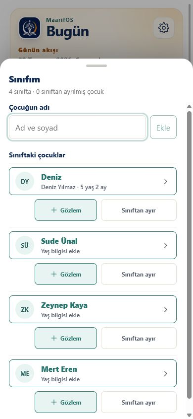
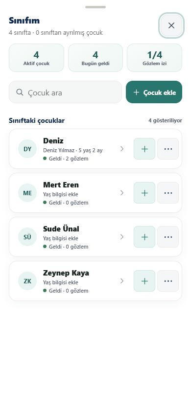
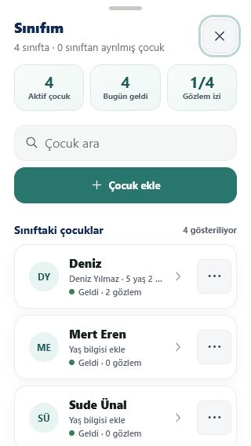
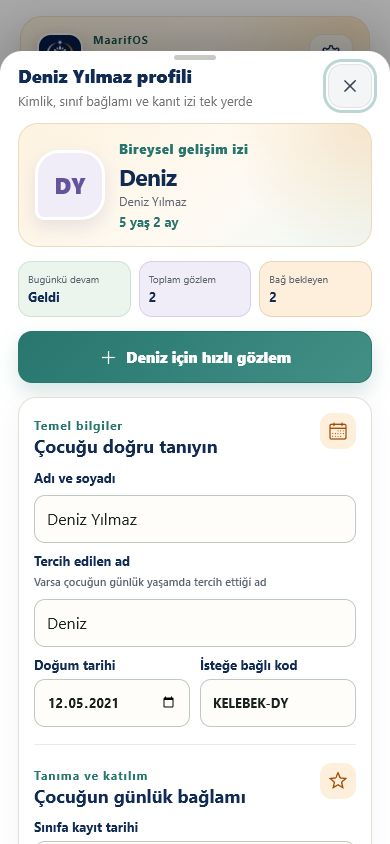

# MaarifOS Premium Mobil UX Denetimi

Tarih: 29 Temmuz 2026  
Kapsam: native PWA telefon görünümü, geri davranışı, kaydırma/tıklama kararlılığı,
alt panel katmanları, safe-area, alt navigasyon, sınıf/öğrenci listesi ve çocuk
profili.

## Sonuç

Kritik mobil sorunlar giderildi. Profil → sınıf listesi → Bugün ekranı geri
sırası artık aynı uygulama URL'si içinde ilerliyor; native PWA modunda dikey
kaydırma ve atalet tarayıcıya devrediliyor; tam ekran sınıf listesi arama, özet,
birincil hızlı gözlem ve kontrollü ikincil işlem hiyerarşisiyle yeniden
tasarlandı. Tam yayın kapısı **160/160** testle geçti.

## Önce / sonra kanıtı

### Önce: tekrarlanan ve eş ağırlıklı işlemler

Her çocuk satırının altında iki büyük işlem tekrarlanıyor, veri ekleme formu
sürekli açık kalıyor ve hassas “Sınıftan ayır” eylemi birincil işlem kadar
görünür oluyordu.

### Sonra: öğretmen çalışma listesi

Liste artık sınıf özeti, Türkçe arama, isteğe bağlı çocuk ekleme, tek satırlı
profil özeti, 44 px hızlı gözlem ve ikincil işlem menüsünden oluşuyor.
“Sınıftan ayır” yalnız ikincil menüde ve geçmiş kayıtların korunacağı
bilgisiyle sunuluyor.

### En dar doğrulanmış telefon görünümü

320 px genişlikte arama ve ekleme eylemi dikey yerleşiyor; ikincil menü hızlı
gözlem erişimini korurken yatay taşma veya hedef çakışması oluşmuyor.

### Çocuk profili

Profil, açık kapatma eylemi ve güvenli panel katmanıyla sınıf listesinden
ayrılıyor; telefon geri işlemi profilden sınıf listesine dönüyor.

## Denetim puanları

| Alan | Önce | Sonra | Kanıt |
|---|---:|---:|---|
| Bilgi hiyerarşisi | 5/10 | 9/10 | Özet, arama, profil ve ikincil işlemler ayrıldı |
| Mobil gezinme | 3/10 | 9/10 | Aynı URL'de profil → sınıf → ana ekran geçmişi |
| Kaydırma/tıklama kararlılığı | 4/10 | 9/10 | Native `pan-y`, tarayıcı ataleti, hayalet tıklama regresyonu |
| Dokunma hedefleri | 6/10 | 9/10 | Görünür temel hedeflerde en az 44×44 px |
| Dar ekran dayanıklılığı | 5/10 | 9/10 | 320/360/390/430 px otomatik matris |
| Sınıf listesi profesyonelliği | 4/10 | 9/10 | Tek satırlı kart, arama, özet ve kontrollü arşiv |
| Veri güvenliği | 9/10 | 10/10 | Arşivleme silme yapmıyor; geçmiş kayıt korunuyor |

## Kullanıcı akışı sağlık kontrolü

1. 🟢 **Uygulamayı açma:** Native PWA gerçek viewport'u kullanıyor; telefon
   çerçevesi veya yatay taşma yok.
2. 🟢 **Sınıfım'a girme:** Tam ekran panel açılıyor, alt navigasyon ve önceki
   panel tıklama katmanının altında kalıyor.
3. 🟢 **Listeyi kaydırma:** Native dikey kaydırma, tekerlek/dokunma ataleti ve
   kaydırma sonrasında tıklama doğrulandı.
4. 🟢 **Çocuk profiline girme:** Profil bağımsız panelde açılıyor; kapatma
   düğmesi görünür ve erişilebilir.
5. 🟢 **Telefon geri işlemi:** Profil → Sınıfım → Bugün sırası aynı URL'de
   çalışıyor; ilk geri işleminde uygulamadan çıkılmıyor.
6. 🟢 **Arama ve çocuk ekleme:** Türkçe küçük harf eşleştirmesi çalışıyor;
   ekleme formu yalnız açıkça istendiğinde görünür oluyor.
7. 🟢 **Sınıftan ayırma / geri alma:** Hassas işlem ikincil menüde; kayıt
   silinmiyor ve daraltılabilir arşivden geri alınabiliyor.
8. 🟢 **Çevrimdışı yeniden açılış:** Üretim service worker'ı ve kalıcı profil
   soğuk başlangıcı ağsız durumda geçti.

## Uygulanan teknik düzeltmeler

- Native `MobileScroll`, özel pointer/atalet katmanını devre dışı bırakıp
  dikey hareketi tarayıcıya devrediyor.
- Bottom sheet içerikleri `pan-y`, overscroll containment, güvenli katman
  sırası ve çıkışta `pointer-events: none` kullanıyor.
- Tam ekran paneller safe-area ve dinamik viewport birimleriyle çalışıyor.
- Flow başlıkları native safe-area değerini CSS ortamından alıyor.
- Uygulama yüzeyleri `history.pushState` / `popstate` sözleşmesiyle geri
  sırasına bağlandı.
- Alt navigasyon safe-area dâhil sabit yüksekliğe, 44 px üzeri hedeflere ve
  içerik alt boşluğuyla eşleşen geometriye getirildi.

## Doğrulama

- `npm run test:quality`: **160/160 geçti**
  - Auth: 14/14
  - Domain/migration: 83/83
  - Runtime, IndexedDB ve mobil E2E: 52/52
  - PWA sözleşmesi: 5/5
  - Sites worker: 4/4
  - Üretim PWA/offline: 2/2
- Runtime bütünlük kilidi: 33/33 korumalı dosya.
- Üretim build: 542 modül, JS 687.92 kB / 202.35 kB gzip, CSS 76.24 kB /
  14.28 kB gzip.
- Ek mobil kanıt: 320×568, 360×800, 390×844 ve 430×932 görünümlerinde yatay
  taşma yok; görünür hedeflerde çakışma veya 44 px altı temel düğme yok.

## Kalan riskler ve kanıt sınırı

- Otomatik ve canlı testler Chromium tabanlı telefon viewport'larında yapıldı.
  Gerçek iOS Safari, Android Chrome, Gboard ve fiziksel safe-area davranışı için
  mağaza/kurulu PWA adayı fiziksel cihazda ayrıca kabul testinden geçirilmelidir.
- Ana JS paketi ham boyutta Vite'ın 500 kB uyarı eşiğini aşıyor; gzip boyutu
  mevcut 250 kB ürün bütçesinin altında. İşlevsel engel değildir, fakat sonraki
  performans turunda route/özellik bazlı code-splitting değerlendirilmelidir.
- Görsel regresyon ve Axe otomasyonu henüz kalite kapısına bağlı değildir;
  mevcut kanıt DOM, hedef geometrisi, canlı ekran görüntüsü ve akış E2E
  testlerinden oluşur.

