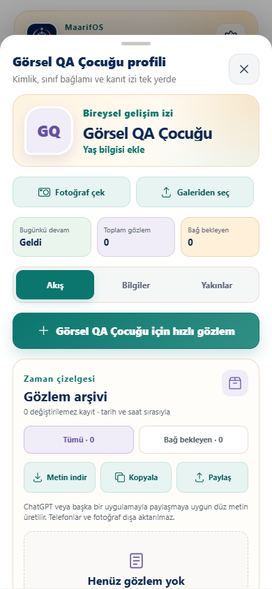
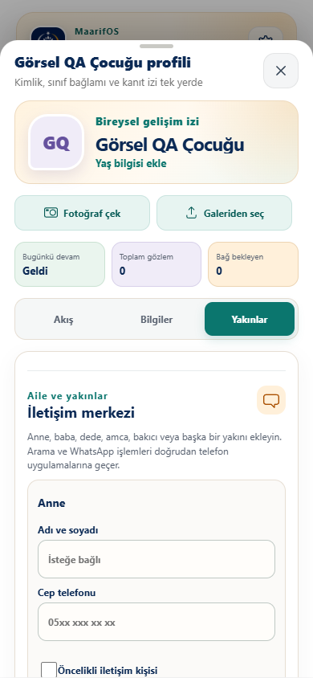
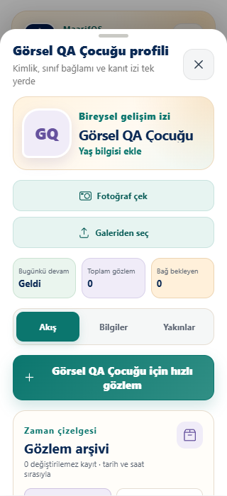

# MaarifOS Öğrenci Hafızası ve İletişim Merkezi Denetimi

Tarih: 29 Temmuz 2026

Sürüm: 0.4.0

Kapsam: öğrenci profili, fotoğraf, aile/yakın iletişimi, tarih-saatli gözlem
arşivi, öğrenci ve sınıf metin aktarımı, uzun gözlem girdisi, dar telefon
yerleşimi, şifreli yedek ve temiz kurulum geri yükleme.

## Sonuç

Öğrenci profilindeki toplam gözlem ve bağ bekleyen sayaçları artık doğrudan
erişilebilir arşiv filtreleri olarak çalışıyor. Profil; Akış, Bilgiler ve
Yakınlar olmak üzere üç çalışma alanına ayrıldı. Öğretmen kameradan fotoğraf
çekebiliyor veya galeriden seçebiliyor, anne/baba ve serbest türde yakınlar
ekleyebiliyor, doğrulanmış numarayı telefon ya da WhatsApp uygulamasına
aktarabiliyor.

Gözlem metni arayüzde kesilmiyor. Kayıtlar İstanbul tarih-saat bandıyla
değişmez zaman çizelgesinde gösteriliyor ve sayfalanıyor. Öğrenci ya da seçili
sınıf gözlemleri tarih aralığı ve ad gösterim tercihiyle UTF-8 düz metin olarak
indirilebiliyor. Telefon numarası ile profil fotoğrafı bu metne eklenmiyor.

## Mobil görsel kanıt

### 390 px öğrenci akışı

### 390 px yakınlar alanı

### 320 px en dar desteklenen görünüm

Görsel kontrolde ilk 320 px denemesinde uzun çocuk adı tek satırda kesiliyordu.
Başlık iki satırlı ve taşmaya dayanıklı hâle getirildi. Profil sekmeleri de
42 px ölçümden 44 px erişilebilir dokunma yüksekliğine yükseltildi.

## Kritik davranış doğrulamaları

- Toplam gözlem ve bağ bekleyen göstergelerinden doğru arşiv görünümüne geçiş.
- Bekleyen gözlem satırından ilgili program bağlama ekranına doğrudan erişim.
- Kamera ve galeri için ayrı dosya girdileri; JPEG, PNG ve WebP dışında
  fail-closed kabul.
- Görselin tarayıcıda yeniden çizilerek EXIF/GPS metadata'sından arındırılması,
  boyutlandırılması ve cihaz içi saklanması.
- Anne, baba, bakıcı ve serbest yakın türleri; tek öncelikli kişi kuralı.
- Telefonların `+90` kanonik biçimine dönüştürülmesi; geçersiz numarada Ara ve
  WhatsApp bağlantısı üretilmemesi.
- Kişi veya fotoğraf kaldırmada profil kaydedilene kadar geri alma.
- 500 karakterin üzerindeki gözlemin başlangıç ve bitişiyle kayıpsız saklanması.
- Öğrenci dışa aktarımında tarih, saat, etkinlik, ham not, bağlam, çocuk sözü ve
  program bağ durumu; telefon ve fotoğrafın dışarıda bırakılması.
- Sınıf dışa aktarımında tarih aralığı, öğrenci seçimi ve tercih edilen/kayıtlı
  ad önizlemesi.
- 30 adet küçültülmüş fotoğraflı öğrenci profilinin parolalı AES-GCM yedeğe
  alınıp temiz veritabanına birebir geri yüklenmesi.
- 320, 360, 390 ve 430 px genişliklerde üç profil sekmesinin tamamında yatay
  taşma olmaması ve temel hedeflerin en az 44 px olması.

## Kalite kapısı

`npm run test:quality`: **168/168 geçti**

- Yetkilendirme ve yerel kullanım: 14/14
- Alan modeli, geçiş ve saf fonksiyonlar: 88/88
- IndexedDB, yedek, mobil ve uçtan uca akışlar: 55/55
- PWA sözleşmesi: 5/5
- Sites worker: 4/4
- Üretim PWA ve çevrimdışı soğuk başlangıç: 2/2
- Runtime bütünlük kilidi: 33/33 korumalı dosya

Üretim paketi 543 modül ile oluşturuldu. JavaScript paketi 712.18 kB ham,
208.94 kB gzip; CSS paketi 87.53 kB ham, 15.84 kB gzip boyutundadır.

## Kanıt sınırı

Tarayıcı otomasyonu Chromium tabanlı telefon viewport'larında yürütüldü.
Gerçek Android Chrome ve iOS Safari üzerinde kamera izni, yerel telefon/WhatsApp
uygulamasına geçiş ve fiziksel geri tuşu davranışı dağıtılan PWA üzerinden
ayrıca kabul testine uygundur.
