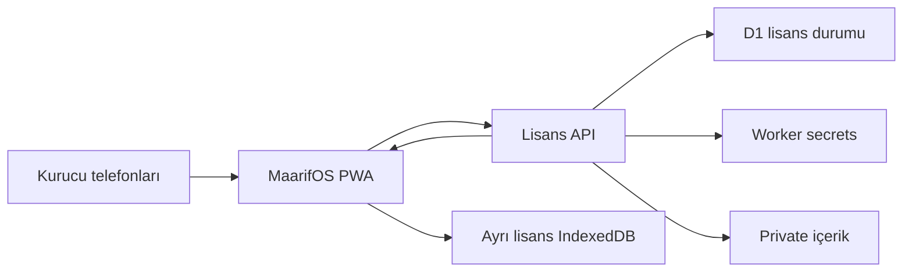

# ADR — Kurucu Premium için iki cihazlı STAFF yetkisi

**Durum:** Kabul edildi; üretim açılışı aşağıdaki yayın kapılarına bağlıdır

**Karar tarihi:** 8 Ağustos 2026

**Kapsam:** Yalnız MaarifOS kurucu iç testi; ticari premium ve genel kullanıcı lisans politikası kapsam dışıdır

## Bağlam

MaarifOS'un kanonik ürün politikası, satın alınmış öğretmen ve kurum yetkilerinde aynı anda tek aktif cihaz öngörür. Kurucu iç testinde ise ürün sahibinin ve Emine Öğretmen'in telefonlarında tam premium plan akışının gerçek cihazlarla sınanması gerekir. Bu iki cihazlık ihtiyaç, ücretli premium ürünün haklarını veya fiyatlandırmasını değiştirmemelidir.

Statik PWA, ortak bir kodun kaç ayrı cihazda kullanıldığını güvenilir ve atomik biçimde sayamaz. İstemci JavaScript'i, özellik bayrakları ve IndexedDB son kullanıcı tarafından değiştirilebilir. Bu nedenle iki cihaz sınırı arayüzde değil, Lisans API ile işlemsel D1 durumunda uygulanır. Mevcut genel mimari için bkz. [`PREMIUM_ENTITLEMENT_ARCHITECTURE.md`](PREMIUM_ENTITLEMENT_ARCHITECTURE.md); bu ADR yalnız kurucu iç testi için dar bir istisna tanımlar.

## Karar

### 1. Ticari politika değişmez

- `purchased` yetkiler ile normal öğretmen/kurum hesaplarının varsayılanı **bir aktif cihazdır**.
- Kurucu erişimi, imzalı grant içinde mevcut `access_mode = "staff-code"` değerini kullanır. İstemciye yeni ve taklit edilebilir bir `founder` erişim modu eklenmez.
- İki cihaz hakkı yalnız sunucudaki `FOUNDER` politikası ve ona ait iki sabit D1 slotuyla tanımlanır. Başka STAFF, promosyon, deneme veya satın alma yetkisine kendiliğinden yayılmaz.
- Kurucu ekranı mağaza satın alma, makbuz doğrulama, iade veya normal premium kilidini atlayan bir frontend bayrağı değildir. Doğrulanmış entitlement yoksa tam plan, değerlendirme ve belge çıktıları kapalı kalır.

### 2. Aktivasyon sırrı sunucu tarafındadır

- Kullanıcıya verilen altı haneli kurucu kodu kaynak koda, Vite ortam değişkenine, public artefakta, Git geçmişine, IndexedDB'ye, yedeğe, telemetriye veya hata kaydına yazılmaz.
- Sunucu yalnız HMAC-SHA-256 doğrulama anahtarı ile beklenen HMAC özetini secret olarak tutar; düz kodu kalıcı saklamaz.
- Kısa kod tek başına güçlü bir kimlik doğrulama faktörü sayılmaz. Güven, iki slot sınırı, kısa ömürlü challenge, cihaz anahtarı ispatı, katı hız sınırı, genel hata yanıtı ve kontrollü aktivasyon penceresinin bileşiminden gelir.
- Kurucu iki cihazı bağlandıktan sonra yeni ilk aktivasyonlar operasyonel olarak kapatılır veya kod secret'ı döndürülür. Kod daha sonra destek kanalında yeniden gösterilmez.

### 3. Cihaz sahipliği ve replay koruması

1. PWA, Web Crypto ile çıkarılamaz bir P-256 ECDSA private key üretir; private key cihazdaki ayrı lisans IndexedDB alanından dışarı çıkarılmaz.
2. PWA, kanonik public JWK'nin SHA-256 parmak iziyle `POST /v1/device/challenge` çağrısı yapar.
3. Sunucu beş dakikalık, tek amaçlı ve tek kullanımlık nonce üretir.
4. Cihaz; nonce, amaç, cihaz parmak izi ve `Idempotency-Key` değerini kendi private key'iyle imzalar.
5. `POST /v1/founder/redeem` exact JSON şeması, public JWK/parmak izi eşliği, kod HMAC'i, challenge süresi/amacı ve cihaz ispatını doğrular.
6. Aynı idempotency anahtarı ile aynı fingerprint'in ağ tekrarı aynı entitlement sonucunu döndürür. Anahtarın farklı istekle tekrar kullanımı ve challenge replay'i genel hata ile reddedilir.

Kanıt dayanakları: `app/src/features/premium-access/device-identity.ts`, `app/src/features/premium-access/challenge-proof.ts`, `app/src/features/premium-access/license-requests.ts`, `license-api/src/validation.mjs`, `license-api/src/crypto.mjs`.

### 4. İki slot işlemsel ve sunucu otoritelidir

- `founder_device_bindings.slot` yalnız `1` veya `2` olabilir; primary key ve cihaz parmak izi unique kısıtları eşzamanlı üçüncü kaydı engeller.
- Aynı aktif cihazın yeniden aktivasyonu yeni slot tüketmez; mevcut binding için idempotent yeniden ihraç yapılır.
- Üçüncü farklı cihaz, kodun doğru olup olmadığını veya dolu slot sayısını açıklamayan `request_rejected` yanıtı alır.
- Slot seçimi, challenge tüketimi, idempotency kaydı ve entitlement üretimi için yarış koşulu testleri zorunludur. D1 kısıtları güvenlik sınırıdır; istemcideki sayaç veya ekran metni değildir.

Kanıt dayanakları: `license-api/migrations/0001_founder_license.sql`, `license-api/migrations/0003_founder_device_tombstones.sql`, `license-api/src/d1-repository.mjs`, `license-api/src/service.mjs`.

### 5. İmzalı entitlement ve içerik bağı

- Lisans API, ES256 ile imzalanmış entitlement üretir. Private signing key yalnız Worker secret/KMS katmanında bulunur; PWA yalnız sabit güvenilir public JWK'leri taşır.
- İstemci; `alg`, `kid`, issuer, audience, cihaz parmak izi, SKU, akademik sürüm, içerik release'i, paket kimliği/sürümü, manifest özeti, süreler ve minimum iptal neslini exact olarak doğrular.
- İçerik public Vite başlangıç bundle'ına veya açık `public/` yoluna konmaz. Yetkili redemption sonrasında private asset binding'den alınır; sunucu ve istemci ham UTF-8 byte uzunluğu ile SHA-256/manifest zincirini doğrular.
- Mevcut Sites hosting yapılandırmasında D1 ve R2 binding'leri `null` olduğundan Lisans API ayrı bir Cloudflare Worker + D1 olarak dağıtılır. PWA API origin'i build-time sabittir; CSP yalnız bu kesin Worker origin'ine, Worker CORS'u yalnız kesin Sites origin'ine izin verir. Origin kontrolü kod ve cihaz doğrulamasının yerine geçmez. Kanıt: `app/.openai/hosting.json`, `license-api/wrangler.jsonc`.
- Yetkili tarayıcı planı gösterebilmek için içeriğin açık hâline erişir. Bu nedenle bu kontrol "kırılamaz DRM" değildir; hedef yanlışlıkla açık yayın, kolay URL kopyalama ve paket kurcalamayı önlemektir.
- Entitlement, cihaz anahtarı ve premium içerik deposu öğretmen verisi yedeğinden ayrıdır. Çocuk, sınıf, gözlem, fotoğraf veya plan verisi Lisans API'ye gönderilmez.

Kanıt dayanakları: `license-api/src/private-bundle.mjs`, `license-api/src/release.mjs`, `app/src/features/premium-access/entitlement.ts`, `app/src/features/premium-access/founder-client.ts`, `app/src/features/premium-access/content-bundle-store.ts`.

### 6. Hız sınırı, hata ve audit

- Challenge ve redeem için IP ile cihaz başına ayrı pencereler kullanılır. IP ve cihaz değerleri audit/rate-limit veritabanına yalnız secret-HMAC takma adlarıyla yazılır.
- Başlangıç tabanı challenge için IP başına 15 dakikada 20 ve cihaz başına günde 30; redeem için IP başına 15 dakikada 5 ve cihaz başına günde 10 istektir. Bu sayılar dağıtık saldırıya karşı tek başına yeterli sayılmaz; iki slot dolduğunda aktivasyon kapısı kapatılır.
- Tüm başarısız redemption nedenleri dışarıda aynı genel hata gövdesine indirgenir; slot, kod varlığı ve doğrulama adımı sızdırılmaz.
- Audit yalnız `request-id`, UTC zaman, İstanbul `civil_date`, olay türü, sonuç, reason code, takma adlı IP/cihaz ve içerik release kimliği taşır.
- Ham kod, ham IP, e-posta, telefon, ödeme verisi ve eğitim/çocuk verisi loglanmaz. Observability ve edge log ayarları da bu sözleşmenin parçasıdır.

Kanıt dayanakları: `license-api/src/service.mjs`, `license-api/src/validation.mjs`, `license-api/migrations/0001_founder_license.sql`, `license-api/wrangler.jsonc`.

### 7. İptal ve cihaz değişimi

- Kurucu cihaz değişimi self-servis değildir. Kayıp veya değişen cihaz için yetkili yönetici, hedef slotu açıkça seçerek resetler; diğer slot değişmeden kalır.
- Reset işlemi tek D1 batch'inde eski cihaz parmak izi ile entitlement kimliğini founder-kapsamlı append-only tombstone'a ekler, binding'i pasifleştirir, entitlement iptal neslini artırır, audit kaydı üretir ve slotu yalnız yeni bir cihaz için yeniden kullanılabilir hâle getirir.
- Tombstone'a alınan eski cihaz; doğru PIN taşısa, yeni challenge üretse veya reset öncesi başarılı idempotency isteğini birebir tekrarlasa bile genel `request_rejected` yanıtıyla reddedilir. Sonraki resetler önceki cihaz tombstone'larını silmez veya değiştirmez.
- Kurucu entitlement'ında `refresh_after` **30 gün**, `offline_until` **90 gün** olarak uygulanır. Aynı bağlı cihaz kodu yeniden girerek çevrimiçi yeni entitlement alabilir ve yeni slot tüketmez.
- Admin reset, önceden verilmiş imzalı entitlement'ı çevrimdışı cihazda anında durdurmaz; eski cihaz en çok mevcut tokenın 90 günlük `offline_until` sınırına kadar çalışabilir. Anlık iptal gerekirse online nesil kontrolü ayrıca uygulanmalıdır. Bu kalan risk kurucu iç test istisnasına özgüdür ve ticari `purchased` politikasına emsal olmaz.
- Admin reset/revoke komutu, nesil doğrulaması ve kayıp cihaz kabul testi tamamlanmadan özellik üretime hazır sayılmaz. Doğrudan elle SQL güncellemesi kalıcı işletim prosedürü değildir.

## Güven sınırları

Tarayıcı ve istemci depoları güvenlik otoritesi değildir. CORS ve CSP, tarayıcıdaki origin izolasyonunu güçlendirir; API kimlik doğrulaması yerine geçmez. Gerçek otorite cihaz ispatı, secret doğrulaması, D1 kısıtları ve imzalı entitlement zinciridir.

## Reddedilen seçenekler

| Seçenek | Ret gerekçesi |
|---|---|
| Kodu React/Vite içine sabitlemek | Public bundle ve source map üzerinden alınır; ücretli premium kapısını fiilen bozar. |
| İki kullanımı yalnız localStorage/IndexedDB'de saymak | Depo silinebilir/değiştirilebilir; cihazlar arasında atomik ortak durum yoktur. |
| Kurucu telefonlarında premium özellik bayrağını açmak | Frontend bypass olur; entitlement, cihaz ve release doğrulaması yapılmaz. |
| Kurucu erişimini `purchased` gibi işaretlemek | Ticari hak, makbuz, iade ve cihaz politikasını iç test yetkisiyle karıştırır. |
| Aynı kodu genel STAFF kod sistemine sınırsız açmak | İki cihaz istisnasını bütün personel/promosyon yetkilerine yayar. |
| Cihaz değişimini otomatik üçüncü aktivasyonla yapmak | Çalınmış kodun mevcut iki cihazdan birini sessizce düşürmesine yol açar. |

## Sonuçlar

Olumlu sonuçlar:

- İki gerçek telefon tam premium akışı sınarken ücretli kullanıcıların tek cihaz ve satın alma politikası değişmez.
- Üçüncü cihaz sınırı eşzamanlı isteklerde bile sunucu ve veritabanı tarafından korunur.
- Kod kaynakta bulunmaz; entitlement çalınsa bile bağlı cihaz private key'i olmadan başka cihaza taşınamaz.
- Plan içeriği, öğretmen/çocuk verisi ve lisans telemetrisi birbirinden ayrılır.

Maliyet ve kalan riskler:

- D1, secret yönetimi, imza anahtarı rotasyonu, reset/revoke operasyonu ve alarm sahipliği gerekir.
- Altı haneli kod dağıtık tahmine karşı tek başına zayıftır; iki cihaz bağlandıktan sonra aktivasyon penceresinin kapanması zorunlu savunmadır.
- Yetkili veya ele geçirilmiş bir tarayıcı çalışma anındaki premium içeriği kopyalayabilir.
- Uzun çevrimdışı yetki, kayıp cihaz iptalinin etkisini geciktirir.

## Üretim yayın kapıları

- [ ] Birinci cihaz başarıyla bağlanır ve tam plan/değerlendirme/PDF/DOCX akışı açılır.
- [ ] Aynı cihazın aynı ve yeni ağ tekrarları yeni slot tüketmez.
- [ ] İkinci farklı cihaz başarıyla bağlanır.
- [ ] Eşzamanlı üçüncü ve sonraki cihazlar genel hata ile reddedilir.
- [ ] Yanlış kod, dağıtık hız sınırı, challenge süre aşımı/yanlış amaç ve replay testleri geçer.
- [ ] Token; yanlış issuer, audience, `kid`, cihaz, SKU, release, digest, süre ve iptal neslinde reddedilir.
- [x] Admin reset/revoke yalnız seçili slotu etkiler; eski başarılı idempotency replay'i ve aynı cihazın yeni PIN+proof talebi genel hatayla reddedilir, ardışık reset tombstone'ları korunur, yeni cihaz boşalan slotu artmış iptal nesliyle kullanır (memory repository/API acceptance ve gerçek local D1 migration smoke).
- [ ] `refresh_after = 30 gün` ve `offline_until = 90 gün` sınırları; aynı bağlı cihazın kodla online yeniden yetkilendirilmesi ve reset sonrası eski tokenın kalan risk davranışıyla birlikte test edilir.
- [ ] `purchased` regresyon testi bir aktif cihaz varsayımını korur; mağaza akışında kurucu istisnası görünmez.
- [ ] Public build, source map, Git geçmişi, Worker yapılandırması, loglar ve yedeklerde ham kurucu kodu ile private signing key bulunmaz.
- [ ] Lisans API isteklerinde çocuk/sınıf/plan verisi bulunmadığı ve log taramasında hassas değer olmadığı doğrulanır.
- [ ] Üretim CSP'si yalnız kesin ayrı Lisans API Worker origin'ine izin verir; Worker CORS'u yalnız kesin Sites origin'ini kabul eder; istemci API origin'i build-time sabittir ve dinamik hedef kabul etmez.

## İlgili belgeler

- [`PREMIUM_FOUNDER_THREAT_MODEL.md`](PREMIUM_FOUNDER_THREAT_MODEL.md)
- [`PREMIUM_ENTITLEMENT_ARCHITECTURE.md`](PREMIUM_ENTITLEMENT_ARCHITECTURE.md)
- [`MAARIFOS_V1_KANONIK_URUN_SARTNAMESI.md`](MAARIFOS_V1_KANONIK_URUN_SARTNAMESI.md)
- [`SECURITY_PRIVACY.md`](SECURITY_PRIVACY.md)
