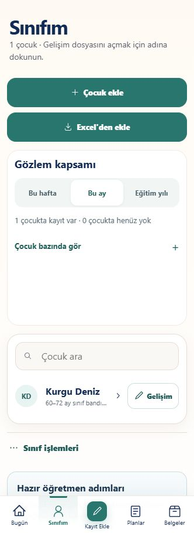
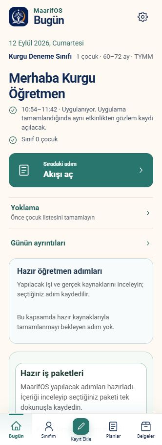
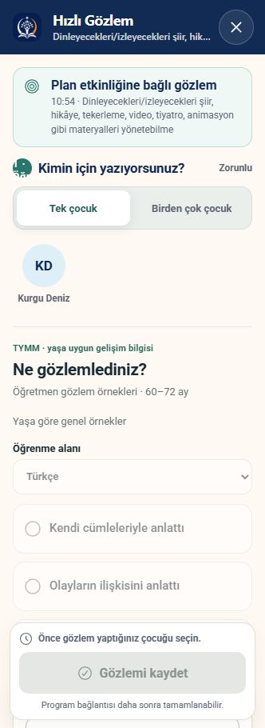
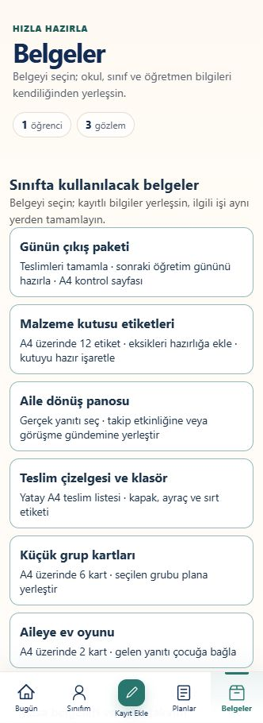

# MaarifOS — öğretmeni yormayan bütünleşik çalışma planı

12 Eylül 2026 · **İnceleme ve öneri; uygulama değişikliği değildir.** Yerel ürün 0.43.0, canlı kayıt 0.41.0/Sites 37. Bu turda uygulama kodu, çocuk kayıtları, hesap bağlantısı ve yayın değiştirilmiyor. Önceki tamamlanmış araçlar korunarak yeni çalışma düzeni planlanıyor.

## 1. Ana karar

MaarifOS'un ana ekranı öğretmenin bugün kullanacağı işlere ayrılmalı. Kurulum ve çocuk yönetimi Sınıfım'da; ayrıntılı dönem planlama Planlar'da; çıktı üretimi ve idare dosyası Belgeler'de olmalı. Aynı iş üç ayrı kuyrukta gösterilmemeli.

Ortak akış: **Hazır içeriği gör → uygun seçeneğe dokun → gerçek kayıt tamamlansın → sonucu aç veya geri al.** Tarih, sınıf, öğretmen ve mevcut kaynaklar otomatik gelir. Açıklama ve ayrıntı isteğe bağlı açılır. Öğretmenin gördüğü olayı veya kişisel değerlendirmesini uygulama uydurmaz; gerçekten uygun hazır ifade seçildiğinde bu seçim öğretmenin kaydı olur.

## 2. Bu turdaki ekran incelemesi

Mevcut in-app browser sekmesi, yaklaşık 332 px genişlik, sentetik tek çocuklu sınıf; 12 Eylül 2026. Salt okunur dört ekran ve aç/kapat gezinmesi incelendi. Form gönderilmedi, dosya paylaşılmadı. Görüntüler bu turda alındı ve yerel kopyaları açılarak doğrulandı. Gerçek öğretmen pilotu, çok çocuklu seçim davranışı, ekran okuyucu uygunluğu ve Office baskısı bu turda ölçülmedi.

| Adım | Durum ve somut bulgu | Karar |
|---|---|---|
| 1 · Sınıfım | Çocuk ekle ve Excel'den ekle burada zaten var. Gözlem kapsamı kartının boş alanı çocuk aramayı aşağı itiyor. | Ekleme araçlarını bu bölümde birleştir; kapsamı tek satır özet yap; çocuk listesini öne al. |
| 2 · Bugün | Üstte 1 çocuk, öneri bölümünde 0 çocuk; yoklama bağlantısı çocuk listesinin tamamlanmasını söylüyor. “Hazır adım yok” kartının altında iki hazır paket var. | Sınıf toplamı ve güne katılan çocuk sayısını ayrı, doğru etiketlerle göster; tarih/üyelik anlamını doğrula. Tek iş listesi kullan; boş kartı kaldır. |
| 3 · Hızlı gözlem | Uzun etkinlik başlığı iki yerde yer kaplıyor; tek çocuk kartı büyük alan kaplıyor; ilk görünümde olay alanı yok. Tek çocuklu sınıf nedeniyle listede bir çocuk bulunması tek başına hata kanıtı değil. | Çocuk seçimini kompakt ve açık yap; önceki çocuk yeni kayda sessizce taşınmasın; uzun kaynak adı ayrıntıda açılsın. |
| 4 · Belgeler | Üst üste altı büyük araç, devamında masa takvimi, ay sonu, sürüm geçmişi ve yeniden çıktı listeleri var. | Kullanım amacına göre kısa giriş ekranı kur; kayıt panolarını kendi işlerine yerleştir, belge çıktısına oradan da eriştir. |

### 1 · Sınıfım

### 2 · Bugün

### 3 · Hızlı gözlem

### 4 · Belgeler

Görsel erişilebilirlik hedefleri: okunur koyu metin; renk yanında yazılı durum; en az 44×44 px dokunma hedefi; metin büyütüldüğünde kaydet düğmesinin içeriği örtmemesi; kaydırma ve klavye altında kaybolmayan eylemler. Bunlar yeni tasarımın kabul hedefleri, mevcut ekran için tam uygunluk iddiası değildir.

## 3. Sınıf oluşturulduktan sonraki ana sayfa

**Üst şerit:** Küçük okul logosu, okul ve sınıf adı; sağda hesap/ayarlar. Altında tarih, “Sınıfta bugün 18 / Kayıtlı 20” gibi anlamı açık bir satır. Büyük selamlama alanı yerine tek satır öğretmen adı. Yanlış tarihli uygulanıyor bilgisi bugünün işi gibi öne çıkarılmaz.

**Birinci alan:** Büyük Hızlı gözlem düğmesi; yanında Yoklama ve Günün planı. Belirli çocuk fotoğrafı veya adı kalıcı ana kahraman yapılmaz. Çocuk seçimi gözlem açılınca başlar.

**İkinci alan:** Şimdi/sırada başlığıyla günün gerçek etkinliği. Kısa öğretmen başlığı; tam TYMM kaynak adı ayrıntıda. Gerçek uygulama düğmesi, gözlem ekleme ve gerekli malzeme aynı bağlamda.

**Üçüncü alan:** “Bugünü tamamla” içinde en fazla üç öncelikli, seçilebilir iş. Örnek: “2 gözlemin yerini seç”, “Yarının 3 malzemesini hazırlığa ekle”, “Aile yanıtını plana yerleştir”. Her kartta somut seçenek ve kaydeden eylem. Daha fazlası ayrı açılır; iş yoksa boş uyarı kartı gösterilmez.

**Dördüncü alan:** Bu hafta: meyve görevi, haftanın çocuğu ve yaklaşan görüşme. Öğretmenin seçtiği iki sabit kısayol. Gün sonu çıkış paketi saat ve iş bağlamına göre görünür; ders ortasında rapor listeleri açılmaz.

**Alt gezinme:** Bugün · Sınıfım · Gözlem · Planlar · Belgeler. “Kayıt Ekle” yerine amacı daha açık “Gözlem”. Takvim Planlar altında; meyve/haftanın çocuğu Sınıfım altında, aynı takvimin filtreleriyle çalışır. Masaüstünde aynı yapı yan menü ve iki sütun olarak kullanılabilir.

Sınıf henüz yoksa kurulum adımları görünür. Sınıf kurulduktan sonra boş olsa bile çocuk ekleme için Sınıfım'a götüren kısa bir eylem yeterlidir; ana ekran tekrar kurulum formuna dönmez.

## 4. Ders sırasında hızlı gözlem

Hedef: **Gözlem → çocuk → gerçekten görülen davranış → Kaydet**, normal durumda dört dokunuş; 10–15 saniye pilot hedefi. Bu süre henüz ölçülmüş ürün sonucu değildir.

- Çocuklar kısa ad kartlarıyla; arama ve sınıf grubu filtresi aynı panelde. Yalnız ilk çocuğu otomatik seçme yok. Son kullanılanlar istenirse kısayol olur, yeni gözlem kendiliğinden aynı çocuğa yazılmaz.
- O anki etkinlik ve tarih görünür kısa etiketlerdir. “Bugün / Dün / Tarih seç” ve sonradan tarih düzeltme vardır; olay tarihiyle kayıt zamanı ayrı korunur. Ders dışı olay da girilebilir.
- Bağlama uygun 4–6 hazır gözlem ifadesi gösterilir. Uygun ifade yoksa “Kısa not” açılır; klavyenin diktesi isteğe bağlı kullanılabilir. Sürekli ortam dinleme veya çocukların topluca ses kaydı varsayılan değildir.
- Hazır ifade gerçekten yaşanan olayı karşılıyorsa uzun açıklama zorunlu olmaz. Genel gelişim hedefi, gerçekleşmiş olay gibi otomatik işaretlenmez.
- “Birden çok çocuk” ayrı açık seçimdir; her çocuk için gözlenen farklılık gerekiyorsa kısa düzeltme yapılır. Bir çocuğa ait davranış bütün sınıfa yayılmaz.
- Kaydet sonrası kısa “Kaydedildi · Geri al · Sıradaki çocuk” görünür. Başlık, mevcut etkinlik ve kaynak bağlantısı biliniyorsa aynı kayıt işleminde tamamlanır. Belirsizse en ilgili birkaç seçenek ve tümünü ara sunulur; listede ilk kaynak kendiliğinden doğru sayılmaz.
- Ders modu açılınca rapor, hesap ve yönetim önerileri geri çekilir. Kalıcı yerel kayıt internet ve bulut yanıtını beklemez. Ayrıntı paneli ana gözlem yolunu uzatmaz.

## 5. Meyve günü ve getirme sırası

Mevcut takvimde `fruit_day` türü zaten bulunuyor. Yeni iş; bu genel etkinliğe çocuk ataması, dengeli sıra, sabit gün ve revizyon geçmişi kazandırmak. Haftanın çocuğu için ayrı görev türü aynı takvim altyapısını kullanır.

Varsayılan öneri, çocuğun hangi gün meyve getirme sırasının olduğunu gösteren **sınıf görev çizelgesi**. İstenirse sadece ortak meyve gününü gösteren basit takvim ayrı amaç olarak seçilebilir; ürün beslenme veya sağlık kararı üretmez.

**İlk oluşturma:** Ay → haftanın günleri → görev alacak çocuklar → gün başına kişi sayısı → Dengeli dağıt. Çocuklar kayıtlı sınıftan gelir; önceki ayın ayarları sonraki ay hazır gelir. Öğretmen yalnız istisnaları değiştirir.

Dağıtım kuralları:

- Okul takvimindeki uygun günler, çocukların sınıfa katılma/ayrılma tarihleri, kapalı günler ve sabit atamalar dikkate alınır.
- Önceki aylardan kalan görev sayıları korunur. Önce henüz sıra gelmeyen, sonra en az görev alan çocuk; eşitlikte en uzun süredir görev almayan. Eşit adaylar için karıştırma yapılabilir. Aynı taslağı tekrar açmak yeniden kura çekmez.
- “Yeni ayı dengeli karıştır” yalnız yeni ayın uygun boş yerlerini düzenler. Önceki ay veya gerçekleşmiş görevler değişmez. Her çocuğun o ay görev alması mümkün değilse açık kapasite bilgisi gelir: örneğin 20 çocuk ve 8 yer için “Gün başına kişiyi artır / Gün ekle / Kalanları sonraki aya öncelikli taşı”.
- Ay içinde “İki çocuğun gününü değiştir”, “Bu günü ertele”, “Yalnız kalan günleri yeniden dağıt”, “Bu atamayı sabitle” hazır işlemlerdir. Geçmiş görevler yeniden dağıtılmaz. Değişiklik önceki/sonraki satırlarla gösterilir ve tek kaydetmeyle tamamlanır.
- Devamsızlık bilgisi hazır erteleme seçeneği üretir; getirmiş/getirmemiş gerçekleşmesi öğretmenin açık kaydıdır. Görev atanması görevin yapıldığı anlamına gelmez.
- Yeni çocuk eklendiğinde kalan uygun yerlere dahil etme önerilir. Ayrılan çocuğun geçmişi korunur, gelecekteki görevleri seçilerek aktarılır.

**Belge:** Üstte okul anteti, “Ekim 2026 Meyve Günü Çizelgesi”, sınıf; ortada tarih/gün/öğrenci veya öğrenci grubu/seçilmiş görev; altta öğretmen adı soyadı ve “Okul Öncesi Öğretmeni”. Telefon ve kimlik bu belgenin veri alanı değildir. Aylık takvim için yatay A4, tarih–isim listesi için dikey A4; normal kapsamda tek sayfa hedefi. Uzun isimler kesilmez; gerektiğinde okunur devam sayfası seçilir.

**Revizyon:** İlk paylaşım v1, değişiklik v2; “15 Ekim'den itibaren geçerli” ve revizyon tarihi. Yenilenen PDF'de değişen günler isteğe bağlı vurgulanır. Önceki paylaşılan PDF sessizce değişmez; güncel dosyayı paylaş eylemi hazırlanır. Uygulama kendiliğinden ailelere göndermez.

## 6. Haftanın çocuğu takvimi

Sınıfın tüm uygun çocuklarına sıra gelen katılım takvimi; başarı veya davranış puanına dayalı sıralama yapılmaz.

**Dönemi seç → uygun çocuklar hazır gelsin → haftalara dengeli yerleştir → takvimi kaydet.** Haftalar okul takviminden gelir; tatil haftası, kısmi hafta ve yeni katılan çocuk için açık seçenekler sunulur. Bir haftada bir çocuk varsayılandır; kapasite yetersizse süreyi uzat, haftada iki çocuk veya kalanları sonraki döneme taşı seçenekleri gelir.

Haftaya dokununca “Çocuğu değiştir / Haftaları değiştir / Ertele / Bu haftayı sabitle / Aile kartı hazırla”. Tamamlanan haftalar yeniden kura çekimine girmez. Planlanan ve gerçekten gerçekleşen hafta ayrı saklanır. Aynı dönemde tüm uygun çocuklara sıra gelmeden tekrarı önleyen denge kuralı vardır.

Çıktılar: dönemlik yatay A4 takvim; aileye verilecek kısa bilgi kartı; sınıf panosu için haftalık A4 afiş. Aile kartında tarih, çocuk ve seçilmiş katılım etkinlikleri hazır gelir. Fotoğraf isteğe bağlıdır. Aynı çocuğun meyve ve haftanın çocuğu görevi aynı haftaya denk gelirse alternatif hafta önerilir; kural öğretmence açılıp kapatılır.

## 7. Belgeler, Excel, Word, PDF ve yazdırma

Belgeler ilk ekranında kullanım amaçları: **Sınıfta kullan / Aileye ver / İdareye sun / Dosyala**. Son kullanılanlar ve öğretmenin sabitledikleri başta. Sürüm geçmişi ayrı açılır. Aile yanıtları Sınıfım'daki aile işlerinde, kutu hazırlığı malzemelerde, çıkış paketi Bugün'de de erişilebilir olur; aynı kayıtlar kullanılır.

Ortak çıktı şeridi: **Excel indir · Word indir · PDF paylaş · Yazdır**; yalnız belgenin gerçekten desteklediği formatlar gösterilir. Önceki kapsam/düzen seçimi korunur, her seferinde sihirbaz açılmaz. İlk seçimde veya kapsam değişince içerik ve düzen görünür olur. İşletim sisteminin alıcı/yazıcı seçim ekranı gerektiğinde açılır; bu ekranın tamamen atlanacağı söylenmez.

Mizanpaj standardı:

- Okulun kendi anteti/logo alanı, belge adı, sınıf ve dönem; altta öğretmen adı, unvan, gerekli imza alanı, sayfa ve revizyon. Belge için okuldan gelmeyen mühür veya resmî onay görseli üretilmez.
- Ekranda mevcut lacivert/turkuaz renkler korunur. Ana eylem tek güçlü renkte; diğerleri sade. Koyu okunur yazı, daha az iç içe kart, dengeli boşluk. Renkli sınıf panosu ve az mürekkepli resmî dosya düzenleri aynı kaynaktan seçilir.
- PDF metni seçilebilir, Türkçe karakterli ve baskıyla aynı içeriktedir. Uzun alanlarda devam başlığı/sayfası, tablo satırlarının bölünmemesi ve yeterli imza boşluğu gözetilir. “Tek sayfa” metni okunmaz küçültmek anlamına gelmez.
- Excel'de **Veri / Yazdırma / Açıklamalar** sayfaları; veri tablosunda filtre, sabit başlık, tarih türü ve seçim listeleri. Kimlik/telefon gerektiği belgelerde metin türünde korunur. Yazdırma alanı, A4 yönü, tekrar eden başlık ve sayfa ölçeği hazırdır. Veri alanında gereksiz birleşik hücre kullanılmaz.
- Word'de gerçek başlık stilleri, tablo başlık tekrarı, paragraf boşlukları ve sayfa düzeni; boşluk karakterleriyle hizalama yapılmaz. Uzun değerlendirme gerektiği kadar devam eder.
- Görsel önizleme ve indirme aynı belge sürümünü kullanır. “Kaynak yenilendi” durumunda güncel belge tek düğmeyle üretilir; eski sürüm erişilebilir kalır.

**Excel'i düzenleyip PDF paylaşma:** Önce uygulama içindeki hızlı tablo düzenleyicisinde gün/çocuk değiştirip aynı kaynaktan Excel ve PDF almak en az emekli yol. Haricî Excel düzenlemesi uygulamayı kendiliğinden değiştirmez. İkinci aşamada MaarifOS şablonunu geri al → yalnız değişen satırları göster → seçili değişiklikleri uygula → güncel PDF oluştur akışı eklenir. Sabit kayıt kimlikleriyle eşleştirme, boş hücre/silme ayrımı, çift satır, eski sürüm ve tarih kontrolü gerekir. Her rastgele Word/Excel dosyasını kusursuz geri okuyacağı vaat edilmez.

## 8. İdare ve Öğretmen Dosyası merkezi

Önceki öneri aynen kapsamda; mevcut ay sonu paketi, planlar, gözlemler, belge geçmişi ve klasör seti birleştirilir. Aynı kayıtlar için ikinci bir bağımsız rapor veritabanı kurulmaz.

| Dönem | İçerik ve normal sayfa hedefi | Hazır tamamlayıcı eylem |
|---|---|---|
| Günlük | Gerçek uygulama, seçilmiş gözlem, uyarlama, aile çalışması ve öğretmen değerlendirmesi; 1–2 dikey A4 | Gözlemi ilgili işe bağla; ertesi güne takip ekle; gün dosyasına koy. |
| Haftalık | Günlere göre planlanan/uygulanan, hazırlıklar ve takip; yatay A4 özet + ekler | Yapılmayanı uygun güne taşı; sonraki haftaya ekle; kanıt seç. |
| Aylık | Çocuk/program/öğretmen değerlendirmesi girdileri, aylık plan ve kontrol çizelgesi; antetli özet + ekler | Kendi değerlendirmesini kaydet; sonraki ay hedef/etkinlik seç; idare paketini oluştur. |
| Dönemlik | Çocuk bazında beceri edinim hazırlığı ve ayrı sınıf özeti | Her çocuk için ilgili gerçek gözlem/ürünleri seç; öğretmenin yargısını ekle; raporu oluştur. |
| Yıllık | Aylar ve dönemler, eğitim/aile-toplum çalışmaları, sürdürülmesi gereken destek ve ihtiyaçlar; 3–5 özet sayfası + tam ekler | Devredilecek işi seç; gelecek yıl hazırlığına taşı; kapak/içindekileri hazırla. |

Tek giriş: **Dönem → amaç → hazır içerik ve somut tamamlama seçenekleri → PDF/Word/Excel/ZIP.** Rapor verisi her zaman gerçek tarih ve kapsamdan gelir. Planlandı, uygulandı, gözlendi ve öğretmen değerlendirmesi birbirinin yerine sayılmaz. Gözlem eksikliği çocuğa başarısızlık puanı verilmez.

MEB'in okul öncesi programındaki Ek 4 Beceri Edinim Raporu çocuk bazlıdır; Ek 18 Aylık Plan Kontrol Çizelgesi aylık planda yer verilen bileşenleri takip eder. Ek 18 tek başına çocuk beceri edinimini göstermez. Haftalık/yıllık özetler önerilen MaarifOS dosyalarıdır, zorunlu resmî form diye sunulmaz. Kaynak: [MEB programı](https://tymm.meb.gov.tr/ogretim-programlari/ders/okul-oncesi), [onaylı PDF](https://tymm.meb.gov.tr/assets/pdf/2024programokuloncesiOnayli.pdf). Önceki ayrıntı: [TYMM idare önerileri](TYMM_IDARE_RAPOR_ONERILERI_2026_09_12.md).

## 9. Google hesabı, yedek ve webde devam

Mevcut kodda Google için durum modeli ve gelecekteki sunucu adaptörü sözleşmesi var; çalışan giriş/Drive yedek/senkronizasyon yok. `src/auth/googleAuthContract.ts`, `src/auth/authMachine.ts` ve `docs/AUTH_GOOGLE_READINESS.md` bunu açıkça ayırıyor.

Öğretmene üç anlaşılır iş sunulmalı:

1. **Google ile giriş:** Aynı öğretmen hesabına erişim. Hesapsız ve çevrimdışı çalışma sürer. Google hesabı kullanmak Gmail kutusunu okuma izni gerektiren bir ürün önerisi değildir.
2. **Drive'a şifreli yedekle:** Hesap bağlandıktan sonra ayrı düğme ve ilk kurulum izni. Uygulama açıkken uygun boş anda değişen yedeği hazırlama, internet gelince gönderme; “Cihaza kaydedildi / Drive'a yedeklendi” ayrı durumlar. Kapalı tarayıcının her zaman arka planda yedekleyeceği vaat edilmez.
3. **Diğer cihazda devam:** Webde aynı hesap → son yedeğin tarih/sınıf özeti → kayıtlı cihazla eşleştir veya kurtarma anahtarıyla aç → sınıfı yükle. Google girişi tek başına yerel şifreyi veya kayıtları taşımaz.

Yedek ile canlı eşitleme ayrı aşamalar olmalı. İlk aşamada güvenilir yedek ve diğer cihazda geri yükleme. Sonra cihaz bazlı değişiklik geçmişiyle gerçek eşitleme: bağımsız kayıtlar birleştirilir; aynı kaydın iki farklı değişikliği sessizce ezilmez, iki somut sürüm arasından seçim yapılır. Çocuk kalıcı silme ve eski çevrimdışı cihazın kayıtları yeniden getirmemesi ayrıca çözülür. Başka Google hesabına geçişte iki öğretmenin sınıfı otomatik birleşmez.

Teknik plan: mevcut BFF sınırına gerçek sağlayıcı bağlamak; sunucuda doğrulanmış kimlik ve güvenli oturum; ilk kez kullanılacak canlı alan adı/callback yapılandırması. Google giriş ve Google API izni ayrı adımlardır. [Google giriş entegrasyonu](https://developers.google.com/identity/gsi/web/guides/integrate), [sunucuda kimlik doğrulama](https://developers.google.com/identity/gsi/web/guides/verify-google-id-token).

Şifreli uygulama yedekleri için Drive'ın uygulamaya özel alanı düşünülebilir. Bu alan normal Drive dosya arayüzünde görünmez ve içindeki dosyalar paylaşılamaz; aileye/idareye verilecek PDF'ler için aynı alan kullanılmaz. Kullanıcı yedeği uygulama içinden görür ve ayrıca bilgisayara indirebilir. Görünür belge klasörü istenirse yalnız uygulamanın oluşturduğu/seçilen dosyalara yönelik ayrı yetki değerlendirilir. [Drive uygulama verisi](https://developers.google.com/workspace/drive/api/guides/appdata), [Drive yetki kapsamları](https://developers.google.com/workspace/drive/api/guides/api-specific-auth).

Şifreleme anahtarı kurtarma tasarımı bu aşamanın parçasıdır: Google şifresi yedek şifresi sayılmaz; Google erişiminin kesilmesi veya cihaz kaybında geri yükleme senaryosu test edilir. Çocuk verisinin buluta aktarımı etkinleştirilmeden önce kurumun veri saklama/paylaşma koşulları somut olarak ele alınır. Bu planlama görevi herhangi bir hesabı bağlama veya dosya yükleme işlemi yapmaz.

## 10. Önceki tamamlanan araçlarla bütünleşme

| Mevcut araç | Yeni yerleşim ve ortak kayıt |
|---|---|
| Gözlem tarihi/başlığı/kaynak bağlantısı | Hızlı gözlemin kaydet ve tamamla akışına bağlanır. |
| Günlük, haftalık, aylık plan ve omurga | Tek takvim ve hazır yerleştirme seçeneklerini besler. |
| Günün çıkış paketi/teslim çizelgesi | Bugün sonunda erişim; aynı yoklama, teslim ve hazırlık kaydı. |
| Küçük grup kartları | Günün etkinliğinden grup seç; gerçek plana yerleştir; kart al. |
| Aile oyun kartı/dönüş panosu | Sınıfım → Aile işleri; yanıtı gerçek plan veya görüşmeye aktar. |
| Malzeme kutusu etiketleri | Sınıfım → Malzemeler; aynı hazırlık listesi ve merkez stokları. |
| Klasör kapak/ayraç/ZIP | İdare dosyası son adımı; seçilen gerçek eklerden içerik. |
| Sınıf listesi/PDF/Excel/Word | Aynı antet, alan seçimi, sürüm ve çıktı şeridi. |
| Ağır rehber dosyalarının çıkarılması | Hafif kaynak metinleri korunur; yeni raporlar ana ekran açılışında yüklenmez. |

## 11. Uygulama sırası ve somut kabul

| Sıra | İş paketi | Bitmiş sayılma koşulu |
|---|---|---|
| 1 | Ana ekran doğruluğu + görev sırası + hızlı gözlem | Çocuk toplamı/gün kapsamı tutarlı; tek görev listesi; yanlış çocuğa sessiz kayıt yok; 320/390 px ekranda normal hazır gözlem dört dokunuş; gerçek yerel kayıt ve geri alma. |
| 2 | Ortak sınıf takvimi + meyve + haftanın çocuğu | Tatil ve üyelik doğru; kapasite eksikliği eyleme dönüşüyor; yeni ay geçmişi karıştırmıyor; değişim/erteleme/sabitleme ve gerçek Excel/PDF çıktısı. |
| 3 | Ortak belge düzeni + aylık idare dosyası | Seçim tüm formatlarda aynı; uzun isimler kayıpsız; gerçek Excel/Word baskısı; revizyon geçmişi ve kapak/ek paketi. |
| 4 | Günlük/haftalık/dönemlik/yıllık raporlar | Aynı gerçek kaynaklardan türeme; Ek 4/Ek 18 ayrımı; dönem sınırları; gözlem/uygulama ayrımı; boş kayıt için somut seçenekler. |
| 5 | Google giriş + şifreli Drive yedeği + webde geri yükleme | Gerçek hesapla yetki/iptal/kota/kesinti; anahtar kurtarma; kayıt ve dosya eşliği; hesapsız kullanım korunur. |
| 6 | Cihazlar arası eşitleme + Excel değişikliklerini geri alma | Eşzamanlı değişiklik, kalıcı silme, hesap değiştirme ve eski sürüm birleştirmesi kanıtlanır; gizli üzerine yazma yok. |

İlk iki paket ders sırasında günlük yükü azaltır. Raporlarda ilk öncelik aylık idare dosyasıdır. Google/eşitleme, veri modeli ve kayıt doğruluğu tamamlandıktan sonra açılır; salt düğme eklenmesi bitmiş giriş/yedekleme sayılmaz.

Performans kabulü: ana sayfa yalnız günlük veriyi okur; kapalı rapor/çıktı panelleri çalışmaz; aynı kayıt sonrası yenilemeler birleşir. Düşük/orta cihazda soğuk açılış ve tekrar açılış ayrı ölçülür. Gözlem düğmesinin tepkisi, formun hazır olması, yerel kaydın kalıcılaşması ve PDF üretimi ayrı sürelerdir. Kritik hedefler gerçek cihaz pilotundan önce tamamlandı diye raporlanmaz.

## 12. Ek olarak yapardım

- **Yarın hazır mı?** Tek kart: plan, malzeme, küçük grup, meyve görevi ve aile kartı. Aynı hazırlık maddesi tekrar eklenmez.
- **Toplu tarih kaydırma:** Tatil/okul kapanışında yalnız seçilmiş gelecekteki işleri yeni uygun günlere taşı; kaydırmadan önce değişen listeyi göster.
- **Sınıf panosu paketi:** Meyve, haftanın çocuğu ve aylık takvim aynı antetle tek PDF paketi; hangi ay/sürüm olduğu her sayfada anlaşılır.
- **Yeni ayı hazırla:** Geçen ayın düzeni gelir, yeni tarihler ve dengeli görevler hazırlanır; önceki gerçek kayıtlar aynen kalır.
- **Sade ekran tercihi:** Öğretmenin seçtiği iki kısayol ve ders modu; yeni modül eklendikçe ana ekran uzamaz.

Kalıcı tasarım ilkesi: **Her yeni özellik öğretmene yeni form doldurtmak yerine mevcut kayıttan hazırlanmış bir sonraki işi tamamlatmalı.**

## 13. Salt okunur kaynak incelemesinin planı destekleyen bulguları

MARİF'in bu turdaki bağımsız kaynak incelemesi; uygulama kodu ve test değişikliği yapmadan tamamlandı:

- `app/src/features/simple-experience/SimpleClassroomScreen.tsx:89,94,101`: Çocuk/Excel ekleme zaten Sınıfım'da; gelişim kapsamı çocuk listesinden önce. Sınıf/yıl yönetimi de aynı yerde en fazla iki dokunuşla erişilebilir olmalı.
- `app/src/features/simple-experience/SimpleTodayScreen.tsx:284` ve `simple-today-model.ts:111`: Başlık öğrenci koleksiyonundan, eylem uyarısı yoklama toplamından geliyor. Gün kapsamı sıfır olması “çocuk eklenmemiş” diye yorumlanmamalı; kayıtlı ve o güne uygun çocuklar ayrı etiketlenmeli.
- `app/src/Prototype.tsx:1533,1861`: Genel gözlem girişi boş çocuk seçimiyle başlıyor; yalnız çocuğun kendi satırından giriş bilinçli önseçim yapıyor. İlk çocuğun otomatik seçildiği bir hata bu incelemede bulunmadı. `:2201,2220` gelişim seçicisinin not alanından önce geldiğini gösteriyor.
- `app/src/features/simple-experience/SimpleDocumentWorkspaceScreen.tsx:290` ve `app/src/Prototype.tsx:10295`: Ek araçlar ve büyük paneller standart çıktıların önüne eklenmiş. Uzun sayfayı yeni bir kart daha ekleyerek büyütmek yerine mevcut işlerin girişleri yeniden düzenlenmeli.
- `app/src/core/domain/calendar.ts:6,27` ve `app/src/features/calendar/academic-calendar.ts:110`: Genel takvim mevcut; görev çizelgesi için çocuk kimliği, zaman dilimi, kilit, sürüm ve kaynak değişikliği denetimi ayrıca tasarlanmalı. Ad-soyad kalıcı kimlik yerine kullanılmamalı.
- `app/src/features/day-closure/teacher-day-closure.ts:42`, `app/src/features/documents/month-end-package.ts:20`: Gün kapanışı ve ay sonu kaynak envanteri zaten var. Raporlar aynı kaynaklardan hazırlanmalı; haftalık/aylık alt toplamlar toplanıp aynı olay iki kez sayılmamalı. PDF/Excel/Word aynı kapsam ve sürümü kullanmalı.
- `app/src/Prototype.tsx:3554` ve `app/src/auth/googleAuthContract.ts:3,32`: Google bağlantısı hâlen gelecek özelliği. Giriş sözleşmesinin veri aktarmayan sınırı korunmalı; isteğe bağlı şifreli yedek ayrı açık veri aktarım hizmeti olarak tasarlanmalı.

Kaynak satırları 12 Eylül 2026 çalışma kopyasına aittir; ileride kod değiştikçe konumlar değişebilir. Bu kaynak incelemesi görsel bulguları destekler; yeni özelliklerin uygulanmış olduğunu göstermez.
