# MaarifOS Mega Eleştiri Raporu

**Tarih:** 17 Ağustos 2026

**İncelenen yüzey:** Yerel mobil uygulama, `390×844`, `native=1`, pilot plan erişimi

**Rapor türü:** Sistemsel kurgu + ürün mantığı + teknik mimari + etkileşim + mizanpaj + ergonomi + erişilebilirlik + pedagojik planlama + değerler eğitimi + dünya karşılaştırması
**Hüküm:** **Gerçek çocuk verisiyle üretim pilotu için NO-GO; kontrollü kurgu veri geliştirme pilotu için GO.**

---

## 1. Yönetici hükmü

MaarifOS karışmış bir kod deposu değildir; fakat **ürünün öğretmene sunduğu karar modeli parçalanmıştır**. Sistem, kayıt bütünlüğü, fail-closed doğrulama, yedekleme, gözlem ham metninin korunması ve öğretmen onayı gibi zor alanlarda ciddi bir omurga kurmuştur. Buna karşılık öğretmenin günlük deneyiminde şu sorunlar aynı anda görünmektedir:

1. Aynı iş birden fazla kartta tekrar edilir.
2. Düğmeler teknik olarak çalışsa da sonuç görünür alana gelmez; bu nedenle “tıklanmıyor” hissi oluşur.
3. Yıl, ay, hafta ve gün aynı görsel ağırlıkla uzun bir listede sunulur.
4. Hazırlık dönemi, etkin eğitim yılı ve öğretim günü mantığı her yüzeyde aynı kaynaktan okunmaz.
5. Yalnız Eylül insan incelemeli içeriğe yaklaşırken Ekim–Haziran, ayrıntılı yayımlanmış plan yerine öğretmen taslak omurgasıdır.
6. Değerler pedagojisi güçlü bir etik niyete sahiptir; fakat çocuk sesi, aile/toplum katkısı ve yerel sınıf bağlamı henüz birinci sınıf kayıt değildir.
7. Güvenlik dili, cihaz içi PIN ile gerçek “veri kasası/at-rest şifreleme” arasındaki farkı yeterince açık anlatmaz.

Bu nedenle sorun “birkaç buton düzeltme” değildir. Gereken dönüşüm şudur:

> **MaarifOS, kayıt ekranları toplamından öğretmenin gününü yöneten; bağlamı doğru okuyan; tek sonraki işi gösteren; çocuk kanıtını plana, değerlendirmeye ve belgeye aynı kimlik zinciriyle bağlayan bir çalışma işletim sistemine dönüşmelidir.**

---

## 2. İnceleme yöntemi ve kanıt sınırı

Bu rapor aşağıdaki kanıtları birlikte kullanır:

- Yerel uygulamada gerçek mobil tıklama, form açma, rota geçişi ve erişilebilirlik ağacı incelemesi.
- Aynı turda alınmış 12 görsel kanıt.
- Güncel kaynak kod, veri modeli, plan servisleri, IndexedDB, yedekleme ve test sözleşmesi incelemesi.
- `typecheck`, `lint`, runtime bütünlük kontrolü ve 601 testlik migration/domain paketi.
- MEB Türkiye Yüzyılı Maarif Modeli okul öncesi ve Erdem–Değer–Eylem kaynakları.
- Te Whāriki, EYLF V2.0, NAEYC DAP, OECD Learning Compass, CASEL, UNESCO GCED ve WCAG 2.2 karşılaştırması.

### Kanıtın dürüst sınırı

- Bu tur fiziksel Android/iPhone testi değildir.
- VoiceOver/TalkBack ve yüzde 200 zoom tam kabulü yapılmamıştır.
- Yerel kurgu veri durumu incelenmiştir; gerçek öğretmen haftası ve gerçek sınıf pilotu değildir.
- 601 yeşil test; kullanıcının bir düğmeden sonra doğru yeri görmesini, formun anlaşılmasını veya öğretmen yükünü kanıtlamaz.
- Güncel çalışma ağacında henüz commitlenmemiş değişiklikler vardır; yerel vNext ile canlı yayımlanmış sürüm aynı kabul edilmemelidir.

---

## 3. Canlı yolculuk: adım adım ürün sağlığı

| No | Yüzey | Sağlık | Canlı hüküm |
|---:|---|---|---|
| 1 | Planlar | Orta | Dört düzey açık; fakat ana hedef ile araçlar arasında öncelik zayıf, sayfa uzun. |
| 2 | Bugün – hafta | Zayıf | Beş gün faydalı; metrikler yoğun, aynı görev başka kartlarda tekrar ediyor. |
| 3 | Bugün – ilk görünüm | Zayıf | “Sıradaki iş” doğru fikir; “Şimdi” aynı yoklama ve plan bilgisini hemen tekrar ediyor. |
| 4 | Sınıfım | Orta | Görev merkezi yaklaşımı doğru; metin hatası ve tekrar eden yoklama yüzeyi güveni azaltıyor. |
| 5 | Kayıt Ekle | İyi | Dört seçenek anlaşılır, dokunma hedefleri uygun, dil nettir. |
| 6 | Gözlem | Orta | Nötr gözlem dili ve tekli/çoklu seçim iyi; altta kalan ikinci dialog erişilebilirlik sorunu. |
| 7 | Belgeler | Orta | Hazır/eksik modeli güçlü; plan sayacı mevcut 10 aylık grafikle uyuşmuyor. |
| 8 | Ayarlar | Zayıf | Güncelleme, sınıf, kilit, veri, yedek ve sıfırlama tek dev sheet içinde. |
| 9 | Plan Kütüphanesi | Orta | Güçlü kimlik ve yıl omurgası; “doğrulandı” dili insan inceleme durumunu aşırı güçlü sunuyor. |
| 10 | Mart plan alanı | Zayıf | 10 ay ve 44 hafta düz listede; tekrar eden aynı adlı düğmeler karar ve erişilebilirlik yükü yaratıyor. |
| 11 | Aylık değerlendirme tıklaması | Kritik | Düğme çalışıyor fakat form aşağıda açılıyor; odak/scroll taşınmadığı için “buton çalışmadı” görünümü oluşuyor. |
| 12 | Aylık değerlendirme formu | Zayıf | Pedagojik kapsam geniş; tek mobil formda çocuk+11 program+12 öğretmen ölçütü aşırı yük. |

### 3.1 Görsel kanıtlar

#### 1 — Planlar

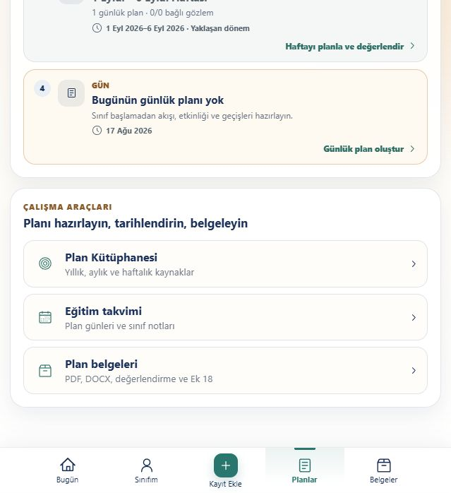

#### 2 — Bugün / haftalık görünüm

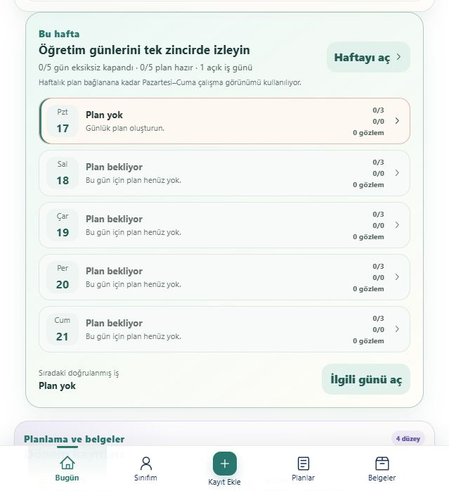

#### 3 — Bugün / ilk mobil görünüm

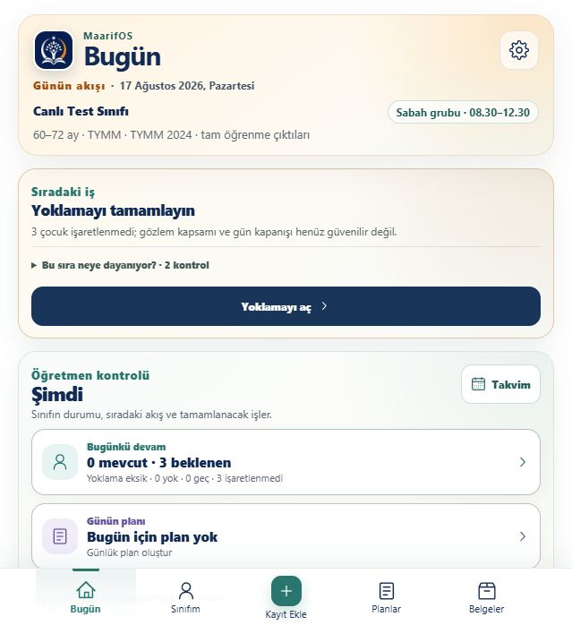

#### 4 — Sınıfım

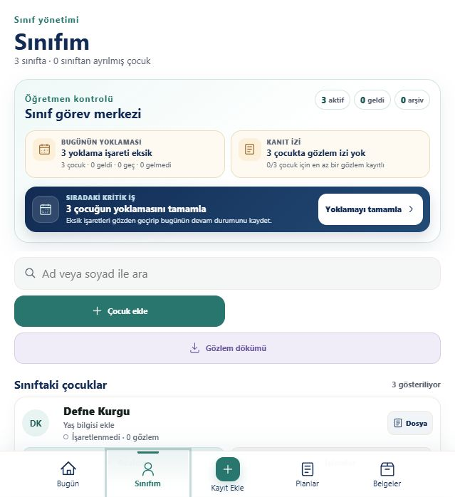

#### 5 — Kayıt Ekle

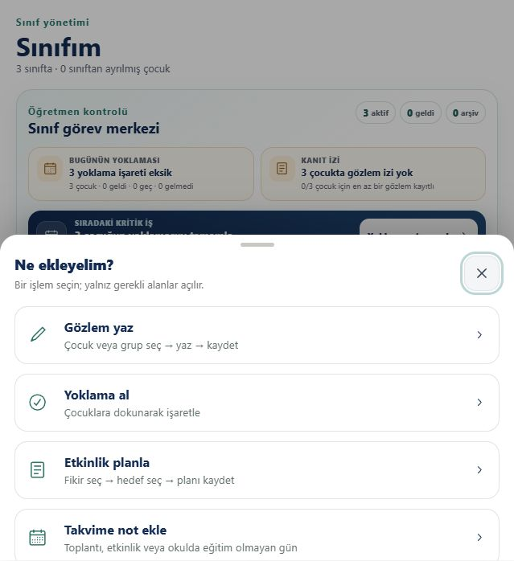

#### 6 — Gözlem formu

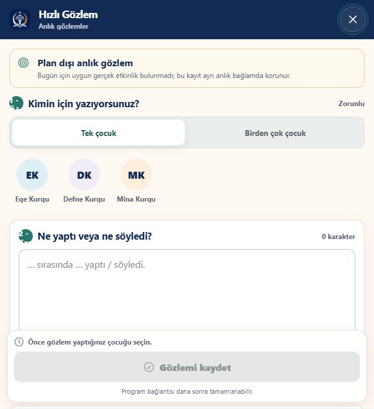

#### 7 — Belgeler

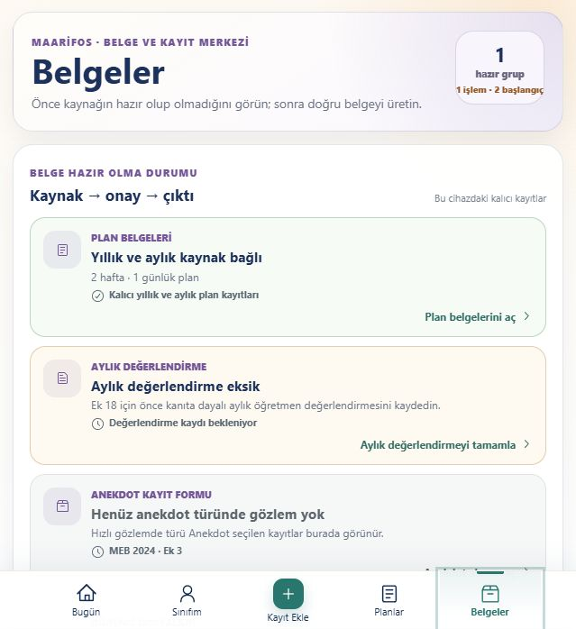

#### 8 — Ayarlar

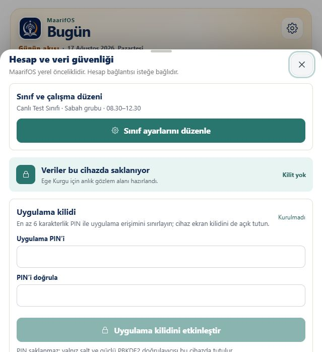

#### 9 — Plan Kütüphanesi

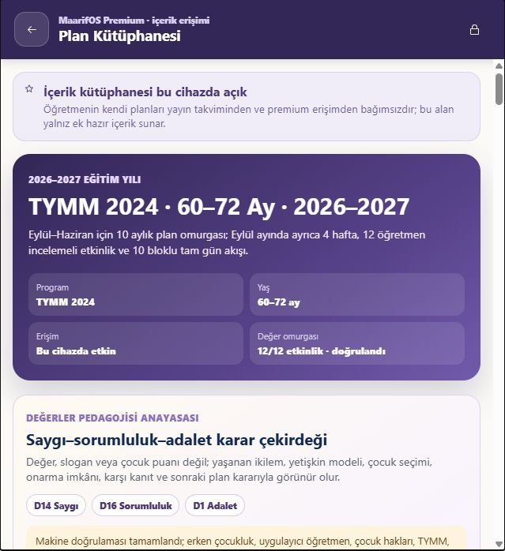

#### 10 — Mart plan alanı

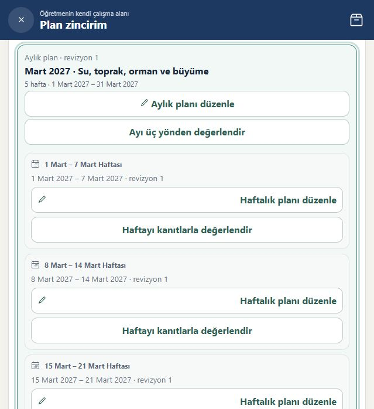

#### 11 — Tıklama sonrası görünür değişiklik yok

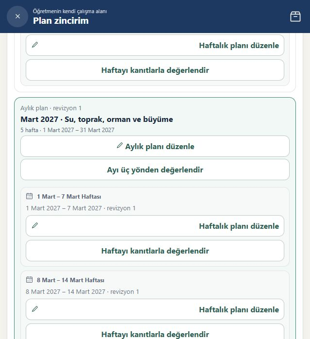

#### 12 — Aşağıda açılan gerçek form

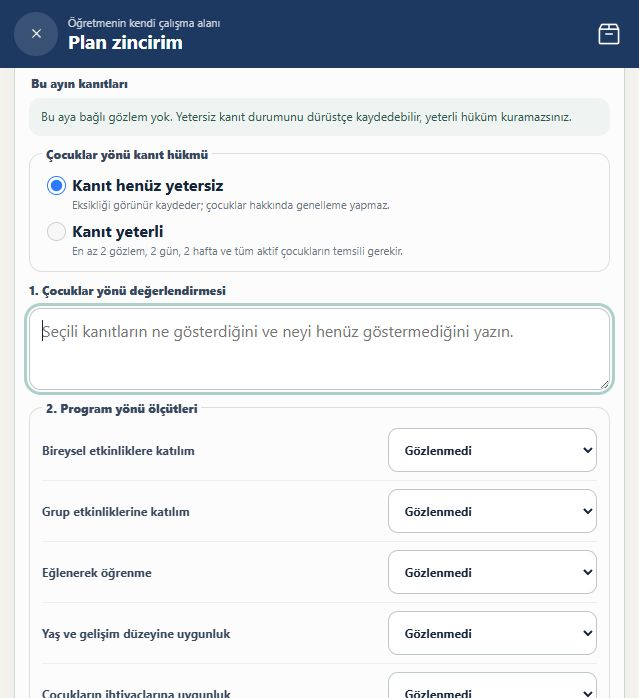

---

## 4. Kritik bulgular: P0

P0, gerçek öğretmen/çocuk pilotunu durduran veya temel ürün vaadini yanlış gösteren sorundur.

### P0-01 — Eğitim yılı ve “bugün” durumu tek otoriteden yönetilmiyor

17 Ağustos tarihinde plan başlangıcı 1 Eylül olarak görünürken Bugün yüzeyi 3/3 yoklama ve gün kapanışı isteyebilmektedir. Hazırlık dönemi, aktif sınıf ve öğretim günü aynı operasyonel durum makinesinden türetilmelidir.

**Çözüm:** `AcademicOperationalContext` tek kanonik servis olmalı. Bütün yazma CTA’ları ve Bugün kartları şu exact alanları kullanmalı: `civilDate`, `academicYearState`, `isTeachingDay`, `classScheduleState`, `writeAllowed`, `reasonCode`. Hazırlıkta yalnız kurulum/planlama; aktif öğretim gününde yoklama/uygulama; tatil veya kapanmış dönemde salt-okunur görünüm.

### P0-02 — “Tıklanmayan buton” kök sorunu: sonuç görünür alana taşınmıyor

“Ayı üç yönden değerlendir” düğmesi state’i değiştiriyor; form aynı uzun sayfanın daha aşağısında render oluyor. Odak düğmede kalıyor, scroll değişmiyor, başlık anons edilmiyor. Kullanıcı haklı olarak düğmenin çalışmadığını düşünüyor.

**Çözüm:** Aylık/haftalık değerlendirme ayrı route veya modal çalışma yüzeyi olmalı. Tıklamada:

1. route/state değişimi,
2. form başlığına programatik odak,
3. `aria-live` kısa durum mesajı,
4. geri dönüşte kaynak aya/haftaya focus restore,
5. kaydedilmemiş değişiklik koruması uygulanmalı.

### P0-03 — 10 ay varmış gibi görünse de ayrıntılı yayımlanmış içerik tüm yıl değildir

Yıllık iskelet 10 ay/44 hafta gösterir; ancak gerçek insan incelemeli etkinlik paketi esas olarak Eylül’dedir. Ekim–Haziran başlık/taslak omurgası, tamamlanmış profesyonel içerik paketi değildir.

**Çözüm:** Her ay için ayrı imzalı ve insan onaylı release ölçütü: 4–5 hafta, günlük/tam-gün akış örnekleri, farklılaştırma, çocuk katılımı, aile/toplum uzantısı, değer kanıt senaryosu, öğretmen denetim imzası. Hazır olmayan ay “plan taslağı” diye görünmeli; “yayımlandı/hazır” denmemeli.

### P0-04 — Makine doğrulaması ile insan/pedagojik onay aynı dilde sunuluyor

Kodda durum `machine_validated_pending_human_review` iken arayüz “12/12 doğrulandı” diyebiliyor. Bu, teknik şema doğrulamasını pedagojik uygunluk onayı gibi gösterebilir.

**Çözüm:** Üç ayrı rozet: `Şema doğrulandı`, `Program uzmanı onayladı`, `Okul öncesi öğretmeni sahada gözden geçirdi`. Son iki imza yoksa gerçek çocuk uygulamasına açılmamalı; yalnız kurgu/pilot filigranı kullanılmalı.

### P0-05 — Canlı IndexedDB kayıtları at-rest şifreli değildir

Kayıtlar IndexedDB’ye `structuredClone(record)` ile açık nesne olarak yazılır. AES-GCM, dışa aktarılan yedekte güçlüdür; cihaz içi canlı depo aynı şey değildir. PIN ekran kilidi, şifreli kasa değildir.

**Çözüm:** Şifreli gölge DB, anahtar yönetimi, migration, crash recovery, rollback ve clean-restore tasarımı tamamlanana kadar gerçek çocuk verisi pilotu NO-GO. Ayarlar metni “uygulama kilidi” ile “veri şifreleme”yi açıkça ayırmalı.

### P0-06 — Plan takvimi ile değerlendirme öğretim-günü takvimi ayrışıyor

Yıllık taslak haftaları takvim Pazartesi/Pazar parçalarıyla üretildiği için tek günlük hafta gibi yapılar oluşabilir. Haftalık değerlendirme ise resmî öğretim-günü resolver’ı kullanır. Planlama ve değerlendirme farklı takvim semantiğiyle çalışmamalıdır.

**Çözüm:** Yıllık/aylık/haftalık grafiğin tek kaynağı `TeachingCalendarResolver` olmalı. Resmî tatil, uyum haftası, öğretmen çalışma günü, sınıf programı, yerel tatil ve özel okul takvimi provenance ile aynı resolver’dan gelmeli.

### P0-07 — Belgeler read-modeli plan grafiğinin tamamını temsil etmiyor

Belgeler ekranı “2 hafta · 1 günlük plan” gösterebilirken Planlar yüzeyinde 10 ay/44 hafta vardır. Seçili dönem açıklanmıyorsa bu tutarsızlık güveni bozar.

**Çözüm:** Belge hazırlık ekranında exact kapsam görünmeli: `Eylül 2026 / 2 hafta / 1 günlük plan` veya `2026–2027 tüm yıl`. Kaynak kimlik grafiği, seçili revizyon ve eksik halka listesi kullanıcıya sunulmalı.

### P0-08 — İç içe dialog erişilebilirlik ağacında birlikte kalıyor

Kayıt Ekle’den gözleme geçildiğinde “Ne ekleyelim?” dialogu altta kalırken “Gözlem ve değerlendirme akışı” dialogu açılıyor. İki dialog erişilebilirlik ağacında eşzamanlı bulunabiliyor.

**Çözüm:** Önce chooser transition kilidiyle kapatılmalı, sonra observation dialogu açılmalı. Alttaki yüzey `inert`/unmounted olmalı; focus yalnız aktif dialog içinde kalmalı; Escape/Geri bir önceki anlamlı yüzeye dönmeli.

### P0-09 — Öğretmene tek kanonik çalışma haftası uçtan uca kanıtlanmış değil

Parça testleri çok güçlüdür; ancak aynı sınıfta beş gün boyunca gerçek UI’den yoklama → plan → uygulama → gözlem → program bağı → kapanış → haftalık karar → belge → offline reload → şifreli backup → temiz restore zinciri henüz üretim kabulü değildir.

**Çözüm:** Kurgu Öğretmen Haftası tek serial gerçek UI senaryosu; hiçbir servis seed yazımı olmadan. Exact kimlikler beş gün, offline reload ve clean-profile restore boyunca korunmalıdır.

### P0-10 — Değerler içeriği kullanıma açılmadan önce pedagojik yönetişim eksik

Değer D-kodları, eşleştirme ve kanıt alanı vardır; ancak bir değerin sınıfta nasıl güvenle ele alınacağına dair insan onayı, karşı-kanıt, kültürel bağlam ve çocuğun reddetme/alternatif seçme hakkı her ay için yayın kapısı değildir.

**Çözüm:** Değer planı yayın kapısı: program uzmanı + okul öncesi uzmanı + sınıf öğretmeni + çocuk hakları/etik kontrolü. Puanlama, karakter etiketi, çocuk karşılaştırması ve otomatik “değerli/değersiz davranış” hükmü kalıcı olarak yasaklanmalıdır.

---

## 5. Yüksek öncelikli bulgular: P1

### P1-01 — Bugün ekranında karar rekabeti

`Sıradaki iş`, `Şimdi`, taşıma işleri, beş günlük hafta, dönem kayıtları ve gün kapanışı aynı ekranda aynı anda karar ister.

**Çözüm:** Tek baskın eylem + tek neden; altında kompakt hafta. Diğer dönem/rapor yüzeyleri bağlama göre açılmalı. Aynı veri ikinci kez görünüyorsa yeni karar üretmelidir.

### P1-02 — Aylık değerlendirme formu öğretmen iş yükünü aşırı büyütüyor

Çocuk anlatısı, 11 program ölçütü, 12 öğretmen ölçütü, yansıtma ve öneri tek mobil akışta yer alıyor.

**Çözüm:** Dört adımlı sihirbaz:

1. Kanıt ve kapsam,
2. Çocuklar,
3. Program,
4. Öğretmen ve sonraki ay.

Otomatik taslak yalnız kaynak kanıttan gelsin; öğretmen onayı olmadan kaydolmasın. Yetersiz kanıt için 60 saniyelik kısa kayıt yolu sunulsun.

### P1-03 — 10 aylık/44 haftalık düz liste

Aylar ve haftalar aynı sayfada açıldıkça motor yük, scroll kaybı ve yanlış hafta işlemi riski artar.

**Çözüm:** Yıl genel bakış → seçili ay → seçili hafta. Aynı anda yalnız bir ay açık; hafta detayları gerektiğinde açılır. Kalıcı ay seçimi ve “bugünkü haftaya dön” eylemi olmalı.

### P1-04 — Tekrarlanan düğmeler bağlamsız erişilebilir ad taşıyor

“Haftalık planı düzenle” ve “Haftayı kanıtlarla değerlendir” onlarca kez aynı adla bulunuyor.

**Çözüm:** Görünür metin kısa kalabilir; accessible name exact bağlam taşımalı: “8–14 Mart haftalık planını düzenle”.

### P1-05 — Ayarlar bilgi mimarisi aşırı geniş

Sınıf/çalışma düzeni, PIN, uygulama kurulumu, sürüm, yerel depolama, yedek, geri yükleme ve yerel lisans tek sheet içindedir.

**Çözüm:** Dört route: `Sınıf ve takvim`, `Gizlilik ve kilit`, `Yedek ve geri yükleme`, `Uygulama ve sürüm`.

### P1-06 — Güvenlik metni fazla güven veriyor

“Yerel kasa” ve PIN görsel dili, at-rest şifreleme yokken gerçek kasa algısı yaratabilir.

**Çözüm:** “Bu cihazda saklanır”, “Uygulama kilidi”, “Şifreli yedek” ve “Cihaz içi veri şifreleme durumu” ayrı satırlar olmalı.

### P1-07 — Sınıfım metin mantığı hatalı

“3 sınıfta · 0 sınıftan ayrılmış çocuk” yerine “3 çocuk sınıfta · 0 çocuk ayrıldı” gibi doğal Türkçe gerekir.

### P1-08 — Plan dışı gözlem fazla kolay bir kaçış yolu

Planlı etkinlik varsa global gözlem otomatik doğru bağlamı önermeli; plan dışı yol bilinçli ikinci seçenek olmalıdır. Aksi halde kanıt zinciri parçalanır.

### P1-09 — Öğretmen üretimi ile sistem varsayılanı ayrımı görünür değil

Sistem 10 blok taslağı üretebilir; öğretmen gözden geçirince teacher-confirmed olur. Belge “otomatik üretilmemiştir” dememeli; “sistem taslağı öğretmen tarafından gözden geçirilmiştir” demelidir.

### P1-10 — Günlük 10 blok ile gerçek etkinlik bağı eksik/örtük

Gerçek activity’nin hangi akış bloğunda gerçekleştiği exact `flowBlockId` ile taşınmalıdır. Gözlem → activity → flow block → daily → weekly zinciri belgede izlenebilir olmalıdır.

### P1-11 — Belge ailesi bir arşiv dökümü gibi davranıyor

Günlük, haftalık, aylık ve birleşik belge ayrı kapsam, önizleme ve onay yüzeyi istemektedir. Teknik UUID ve İngilizce enum ana gövdede değil denetim ekinde olmalıdır.

### P1-12 — Fiziksel erişilebilirlik kabulü eksik

WCAG testleri ve DOM sözleşmeleri yararlıdır; fakat gerçek VoiceOver/TalkBack, 320 px, yüzde 200 zoom, haricî klavye ve tek elle kullanım ölçülmemiştir.

### P1-13 — Büyük bileşenler değişiklik riskini artırıyor

`Prototype.tsx` yaklaşık 12 bin satır; ana plan ve premium ekranları yaklaşık 2 bin satardır. UI state, persistence, navigation ve ürün politikası aynı dosyada birleştiğinde “bir butonu düzeltme” başka akışı bozabilir.

**Çözüm:** Route-level controller, domain command, query/read-model, form state ve presentation katmanları ayrılmalı. Prototype yalnız shell/orchestration olmalı.

### P1-14 — Yerel bundle büyüklüğü ve mobil başlangıç maliyeti

Güncel yerel build ana JS’i yaklaşık 715 kB minified / 186 kB gzip seviyesindedir. Düşük segment telefonlarda parse/evaluate süresi ve memory baskısı izlenmelidir.

**Çözüm:** Planlar, Belgeler, Premium ve Ayarlar route-level lazy load; doküman üreticileri download anında yüklenmeli.

### P1-15 — Çocuk sesi ve aile/toplum katkısı kayıt modelinde tali

İçerik metninde seçim ve katılım vardır; fakat plan oluştururken çocuğun merakı/sorusu, aileden gelen bağlam ve topluluk kaynağı yapılandırılmış girdiler değildir.

**Çözüm:** İsteğe bağlı ve onaylı `childVoice`, `familyContribution`, `communityResource`, `localInquiryQuestion` kayıtları; çocuk verisini dışa göndermeden öğretmen kontrolünde.

---

## 6. P2 iyileştirmeleri

1. Kart gölgeleri ve pastel yüzey sayısı azaltılmalı; hiyerarşi renk yerine boşluk/başlıkla kurulmalı.
2. Küçük gri yardımcı metinler kontrast ve punto açısından 320 px/yüzde 200 için yeniden ölçülmeli.
3. Aynı sayfada “hazır”, “doğrulandı”, “yayında”, “kuruldu” terimleri sözlükle ayrılmalı.
4. Uzun formlarda sticky başlık: `Ay / adım / kaydedilme durumu / çıkış`.
5. Her kayıtta “son kaydedildi”, “taslak”, “doğrulandı”, “yenileme gerekli” durumları aynı tasarım tokenlarını kullanmalı.
6. Boş durumlar yeni kart eklemek yerine birincil görev içinde çözüme bağlanmalı.
7. Kapanış ve değerlendirme yüzeylerinde tarih/saat öğretmen diliyle; teknik kimlikler ayrıntı çekmecesinde gösterilmeli.

---

## 7. Erişilebilirlik denetimi

[WCAG 2.2](https://www.w3.org/TR/WCAG22/) odağın görünür ve örtülmemiş olmasını, anlamlı odak sırasını, yeterli hedef boyutunu, reflow’u ve durum mesajlarının programatik olarak algılanmasını ister.

| Alan | Risk | Gerekli kabul |
|---|---|---|
| Odak yönetimi | Aylık form açılıyor ama odak taşınmıyor | Başlığa focus + anons + geri focus restore |
| Modal semantiği | İki dialog aynı anda accessibility tree’de | Tek aktif dialog, alttaki yüzey inert/unmounted |
| Tekrarlı kontrol adları | Onlarca aynı “Haftayı değerlendir” adı | Tarih/ay bağlamlı accessible name |
| Reflow | 10 ay, 44 hafta ve uzun form | 320×568 ve %200 zoom’da yatay scroll 0 |
| Hedef boyutu | Küçük disclosure/ikon kontroller | En az 44×44 CSS px ürün standardı |
| Durum mesajı | Kaydetme/tıklama sonucu görünür değil | Tek, kısa `role=status`; hata `role=alert` |
| Form hatası | Toplam süre/eksik alanlar dağınık | Alanla ilişkili `aria-describedby`, hata özeti |
| Bilişsel yük | 23+ ölçüt tek sayfa | Stepper, otomatik taslak, bölüm özeti, sonra devam |
| Ekran okuyucu | Metrikler aria-hidden olabilir | Düğme adı durum ve sayacı anlamlı biçimde taşımalı |

**Release kapısı:** VoiceOver Safari + TalkBack Chrome; yüzde 200 zoom; haricî klavye; reduced-motion; high-contrast; Türkçe anons okunabilirliği.

---

## 8. Teknik ve sistemsel mimari eleştirisi

### Güçlü taraflar

- Kimlik, scope ve provenance doğrulamaları birçok mutasyonda fail-closed çalışır.
- Gözlemin ham metni değerlendirmeden ayrıdır.
- Program bağı öğretmen onayı taşır.
- Backup/restore ve tamper reddi güçlüdür.
- Gelecek plan, günlük plan ve carry-forward yaşam döngüsü büyük ölçüde açık modellenmiştir.
- Premium içerik ile öğretmenin kendi kayıtlarının ayrıştırılması yönünde doğru adımlar vardır.

### Kök mimari sorunlar

1. **Birden fazla takvim otoritesi:** sivil tarih, eğitim yılı, öğretim günü, sınıf programı ve paket takvimi aynı resolver’dan gelmez.
2. **Birden fazla ürün gerçekliği:** öğretmen planı, premium paket, teacher-owned outline ve belge read-modeli aynı grafiği farklı kapsamlarla görür.
3. **Bileşen-monolit:** state, navigation, persistence, entitlement ve form rendering aynı dosyada.
4. **Source test aşırı ağırlığı:** regex/şema testleri gerçek odak, scroll ve görünür sonucu yakalayamaz.
5. **At-rest tehdit sınırı açık:** yedek şifreli, canlı veri açık.
6. **Yayın yönetişimi eksik:** machine-validated içerik öğretmen kullanımına çok yakın sunuluyor.

### Hedef teknik mimari

```text
AcademicOperationalContext
  ├── TeachingCalendarResolver
  ├── ActiveClassroomContext
  └── WritePolicy

TeacherCommandCenter
  ├── NextActionResolver
  ├── TeacherPlanGraph
  ├── EvidenceGraph
  ├── EvaluationGraph
  └── DocumentReadModel

Commands (write)
  ├── create/revise plan
  ├── attendance/application
  ├── observation/link
  ├── close day
  └── evaluate week/month

Queries (read)
  ├── Today
  ├── Classroom
  ├── Plans
  └── Documents
```

Her command şu ortak sonucu dönmelidir: `{commitStatus, recordIds, refreshStatus, userMessage, recoveryAction}`. Commit olmuş kayıt, read-model yenilenemedi diye “kaydedilemedi” denmemelidir.

---

## 9. Planlama mantığı: olması gereken ürün modeli

### 9.1 Yıllık plan

- Aktif eğitim yılı exact başlangıç/bitiş tarihine bağlı.
- 10 öğretim ayı; tatil/uyum/öğretmen çalışma günleri provenance ile.
- Öğretmenin yerel öncelikleri, çocukların ilgileri ve aile/toplum kaynakları.
- İnsan onaylı hazır içerik ile öğretmen taslağı açıkça ayrılır.

### 9.2 Aylık plan

- 4–5 gerçek öğretim haftası.
- Ayın soru/inceleme odağı.
- Değer, beceri, kavramsal hedef ve farklılaştırma.
- Çocuk sesi ve yerel bağlam girdisi.
- Ay bitmeden “nihai aylık değerlendirme” yerine ara görünüm.

### 9.3 Haftalık plan

- Exact öğretim günü kümesi.
- Günlük planların tamlığı ve çakışma durumu.
- En az gerekli kanıt kapsamı.
- Öğretmen kararı: sürdür/uyarla/değiştir.
- Sonraki haftaya öneri otomatik uygulanmaz; öğretmen kabulü gerekir.

### 9.4 Günlük plan

- Sınıf çalışma süresine bağlı esnek bloklar.
- 10 sabit bölüm pedagojik omurga olabilir; zorunlu 50 alanlık form olmamalı.
- Önceki günden/haftadan kopyala + fark önizlemesi.
- Gerçek activity exact flow block’a bağlı.
- Planlı, opsiyonel, atlandı ve spontane durumları gerçek süre hesabında ayrılır.

### 9.5 Değerlendirme

- Gözlem sayısı tek başına yeterlilik değildir.
- Aktif çocuk kapsamı, farklı gün/hafta, öğretmen onaylı program bağı ve gün kapanışı birlikte okunmalıdır.
- Yetersiz kanıt kaydı kısa, dürüst ve hızlı olmalıdır.
- Nihai ay değerlendirmesi ay kapanışından önce kaydedilmemelidir.

---

## 10. Maarif Modeli ve değerler eğitimi eleştirisi

MEB okul öncesi programı; çocuğun özelliklerine, bölge/okul/sınıf bağlamına göre farklılaştırmayı, kapsayıcılığı ve beceri–eğilim–değer bütünlüğünü vurgular ([MEB Okul Öncesi Programı](https://tymm.meb.gov.tr/upload/program/2024programokuloncesiOnayli.pdf)). Erdem–Değer–Eylem modeli, değeri yalnız sözel bilgi değil eyleme dönüşen bütüncül bir yapı olarak ele alır ([MEB Sosyal Alanlar](https://tymm.meb.gov.tr/upload/kitap/sosyal-alan.pdf)).

### MaarifOS’un güçlü değer yaklaşımı

- Çocuğa puan/değer skoru vermiyor.
- Karakter etiketi ve çocuk karşılaştırması üretmiyor.
- Ham gözlem ile öğretmen yorumunu ayırıyor.
- Onarım, karşı-kanıt ve öğretmen yansıtması fikrini destekliyor.
- Değer kanıtını sonraki plan fırsatına bağlamaya çalışıyor.

### Eksik olan pedagojik zincir

Değer kaydı yalnız D-kodu seçimi olmamalıdır. Kanonik zincir:

```text
Durum / ikilem
→ çocuğun sesi ve seçimi
→ yetişkin modeli ve çevre düzenlemesi
→ çocuğun eylemi
→ sonuç / onarım
→ karşı-kanıt
→ öğretmen yansıtması
→ sonraki fırsat
```

### Zorunlu etik sınırlar

- “Bu çocuk saygılıdır/saygısızdır” gibi kişilik hükmü yok.
- Değer puanı, rozet ligi ve çocuk sıralaması yok.
- Tek olaydan genelleme yok.
- Aile/toplum katkısı açık rıza olmadan dışa aktarılmaz.
- AI/otomasyon çocuğa moral/ahlaki hüküm vermez.
- Öğretmen her eşleştirmeyi düzenleyebilir, reddedebilir ve gerekçe yazabilir.

---

## 11. Dünya örnekleriyle karşılaştırma

| Çerçeve | Güçlü ilke | MaarifOS durumu | Gereken |
|---|---|---|---|
| [Te Whāriki](https://tewhariki.tahurangi.education.govt.nz/te-whariki/our-curriculum/principles/5637145232.c) | Güçlendirme, bütüncül gelişim, aile/toplum, ilişkiler | İlişki ve bütüncüllük var; aile/toplum tali | Yerel örülen sınıf programı, aile/toplum katkı kaydı |
| [EYLF V2.0](https://www.acecqa.gov.au/sites/default/files/2023-01/EYLF-2022-V2.0.pdf) | Oyun temelli öğrenme, intentionality, çocuk sesi, eleştirel yansıtma | Öğretmen yansıtması var; çocuk sesi yapılandırılmış değil | Child voice, inquiry question, environment/material planı |
| [NAEYC DAP](https://www.naeyc.org/resources/position-statements/dap/contents) | Güçlü yön, bireysellik, bağlam, aile ve gözlem | Ham gözlem güçlü; bağlamsal aile/yerellik zayıf | Öğrenme öyküsü ve bağlam katmanı |
| [OECD Learning Compass](https://www.oecd.org/en/data/tools/oecd-learning-compass-2030.html) | Agency/co-agency, iyi oluş, bilgi-beceri-tutum-değer | Değer ve eylem var; ortak ajans görünür değil | Çocuk seçimi + öğretmen/aile ortak karar izi |
| [CASEL](https://casel.org/fundamentals-of-sel/what-is-the-casel-framework/) | Beş sosyal-duygusal yetkinlik ve sistemik yaklaşım | Bazı ölçütlerde örtüşme; sistemik aile/toplum az | Program haritası, aile/sınıf/okul katmanları |
| [UNESCO GCED](https://www.unesco.org/en/global-citizenship-peace-education/need-know) | Bilişsel, sosyal-duygusal, davranışsal; çeşitlilik ve eylem | Yerel değer eylemi güçlü; küresel/çeşitlilik katmanı sınırlı | Yaşa uygun aidiyet, çeşitlilik, adalet ve bakım senaryoları |

### Dünya düzeyinde ayırt edici hedef

MaarifOS’un üstünlüğü “en çok planı sunmak” olmamalıdır. Üstünlük şu olmalıdır:

> **En az öğretmen yüküyle, çocuğu puanlamadan, aynı kanıtı doğru bağlam ve kimlikle plana, yansıtmaya, aile iletişimine ve resmî belgeye taşıyan; offline ve gizlilik öncelikli okul öncesi çalışma sistemi.**

---

## 12. Mega dönüşüm planı

### Dalga A — Ürün gerçeğini düzelt (0–14 gün)

1. Eğitim yılı/öğretim günü tek context.
2. Tıklama sonucu focus/route/scroll sözleşmesi.
3. İki dialog yarışını kapat.
4. Plan/Belge kapsam sayacı driftini kapat.
5. Machine-validated ve human-approved metinlerini ayır.
6. Ekim–Haziran’ı “taslak omurga” olarak dürüst etiketle.

**Kabul:** tüm kritik CTA’lar tıklamadan en geç 300 ms sonra görünür durum/rota değiştirir; “çalışmadı” oranı 0/50 görev.

### Dalga B — Öğretmen komuta merkezi (15–30 gün)

1. Bugün’i tek sonraki iş + neden + kompakt hafta yap.
2. Aynı yoklama/plan/bağ/kapanış bilgisini tekrar etmeme kuralı.
3. Sınıfım’ı çocuk listesi + kanıt açığı + son kayıt merkezine indir.
4. Ayarlar’ı dört route’a böl.

**Kabul:** 10 öğretmen; doğru ilk eylemi bulma median ≤10 sn, P90 ≤20 sn; yanlış ilk dokunma ≤%5.

### Dalga C — Gerçek plan işletim sistemi (31–60 gün)

1. Yıllık/aylık/haftalık/günlük tek graph.
2. TeachingCalendarResolver her düzeyde.
3. Günlük flow block ↔ activity exact link.
4. Dünden/haftadan getir + fark önizleme + otomatik süre dengeleme.
5. Haftalık/aylık değerlendirmeyi ayrı çalışma yüzeyine taşı.

**Kabul:** İlk günlük plan P90 ≤5 dk; sonraki gün planı P90 ≤90 sn; duplicate=0; yanlış scope=0.

### Dalga D — Tüm yıl içerik ve değer yönetişimi (61–90 gün)

1. Ekim–Haziran her ay insan onaylı içerik.
2. MEB provenance + çocuk ajansı + aile/toplum + yerel inquiry.
3. Değer kanıt zinciri ve etik review.
4. Her ay için gerçek öğretmen saha incelemesi.

**Kabul:** 10/10 ay imzalı; placeholder=0; machine-only içerik çocuk uygulamasına açılmaz.

### Dalga E — Güvenlik ve gerçek pilot (paralel, release blocker)

1. At-rest şifreleme threat model ve migration.
2. Gerçek Android/iPhone offline kill/reload.
3. Şifreli backup → temiz profil restore.
4. VoiceOver/TalkBack/%200 zoom.
5. Beş günlük kurgu hafta, sonra anonimleştirilmiş öğretmen pilotu.

**Kabul:** veri kaybı=0; duplicate=0; exact ID korunumu=%100; ciddi/kritik erişilebilirlik hatası=0.

---

## 13. Ölçülebilir kalite kapıları

| Ölçüt | Hedef |
|---|---:|
| İlk doğru işin bulunması | median ≤10 sn, P90 ≤20 sn |
| Günlük yoklama | ≤30 sn |
| Hızlı gözlem | median ≤25 sn, P95 ≤45 sn |
| Gün kapanışı | median ≤60 sn, P90 ≤90 sn |
| Sonraki gün planı | P90 ≤90 sn |
| CTA görünür geri bildirimi | ≤300 ms |
| Yanlış/ölü tıklama | 0/50 kritik görev |
| Yatay taşma | 0, 320 px ve %200 zoom |
| Ciddi/kritik a11y | 0 |
| Offline/reload duplicate | 0 |
| Backup/restore exact ID | %100 |
| İnsan onaysız yayımlanmış ay | 0 |
| Gerçek çocuk verisi plaintext | 0 |

---

## 14. Zorunlu test matrisi

### Gerçek UI

- Yeni eğitim yılı oluştur/değiştir/aktif et.
- Hazırlık → ilk öğretim günü → tatil → dönem kapanışı.
- Planlar’da her ay/hafta butonuna tıkla; görünür hedef ve focus doğrula.
- Gözlem chooser → dialog → geri → chooser history/focus.
- Beş gün öğretmen haftası; servis seed yok.
- Aylık yetersiz kanıt kısa yol ve yeterli kanıt tam yol.
- Günlük/haftalık/aylık/birleşik belge preview/download/reopen.

### Teknik

- Calendar resolver property tests.
- Plan graph/read-model exact kapsam parity.
- Content review signature negative tests.
- At-rest encrypted record/migration/crash recovery.
- Two-tab stale write and commit/read-refresh separation.
- Service worker offline deep-link and version upgrade.

### Erişilebilirlik

- Focus order ve focus restore.
- Tek aktif dialog.
- Tarihli accessible names.
- 320×568, %200 zoom, keyboard-only.
- VoiceOver/TalkBack gerçek cihaz.
- Hata özeti ve status announcement.

---

## 15. Son karar

### 15.1 Uygulama kontrol noktası — 17 Ağustos 2026

Bu raporun ilk kritik düzeltme dalgası yerel çalışma ağacında uygulandı. Bu bölüm,
rapordaki bütün risklerin kapandığı anlamına gelmez; yalnız aşağıdaki maddelerin
kod ve yerel tarayıcı kanıtını kaydeder.

| Bulgudan eyleme | Güncel durum | Kanıt |
|---|---|---|
| Yeni eğitim yılına erken operasyonel geçiş resmî başlangıç tarihini değiştiriyordu. | `IMPLEMENTED_UNVERIFIED` | Resmî `startDate` değişmeden ayrı `operationalStartDate` tutuluyor; öğrenci kayıt başlangıçları yeniden yazılmıyor; eski erken-başlatılmış kayıtlar kontrollü migration ile ayrıştırılıyor. |
| Hafta/ay değerlendirme düğmesi çalışıyor fakat form uzun listenin altında kayboluyordu. | `IMPLEMENTED_UNVERIFIED` | Tıklama hedefi tarihli erişilebilir ada kavuştu; form görünür alana kayıyor, programatik odak alıyor ve kapanınca tetikleyiciye dönüyor. Aylık değerlendirme tek 2.430 px form yerine üç ilerlemeli adıma ayrıldı. |
| Gözlem seçicisi ile gözlem formu aynı anda iki dialog olarak kalabiliyordu. | `IMPLEMENTED_UNVERIFIED` | Başarılı bağlam çözümünden sonra seçici kapanıyor; kanıt formu tek aktif dialog olarak açılıyor; geri dönüşte seçici ve odağı geri geliyor. |
| Plan/Belge sayacı seçili ayı bütün yıl gibi sunabiliyordu. | `IMPLEMENTED_UNVERIFIED` | Belge çalışma alanı aynı akademik yıl grafiğindeki tüm ay, hafta ve günlük planları sayıyor. |
| Plan Kütüphanesi yalnız Eylül demosu gibi görünüyordu; diğer aylar “Henüz yayımlanmadı” diyordu. | `IMPLEMENTED_UNVERIFIED` | Eylül–Haziran için 10 işlem düğmesi var; Eylül hazır sağlayıcı içeriğini açıyor, diğer aylar öğretmenin tam-yıl plan alanına odaklanıyor. “Henüz yayımlanmadı” sayısı yerel canlı turda sıfır. Bu, Ekim–Haziran için insan incelemeli sağlayıcı içeriğinin tamamlandığı anlamına gelmez. |
| Makine eşlemesi insan onayı gibi algılanabiliyordu. | `PARTIAL` | Görünür metin “makine eşlemesi tamamlandı” olarak düzeltildi. Çok-rollerli, imzalı insan incelemesi Ekim–Haziran için hâlâ yayın kapısıdır. |

Yerel doğrulama özeti:

- Özellik/migration testleri: `604/604` geçti.
- Yedekleme/geri yükleme veri matrisi: `33/33` geçti.
- TypeScript typecheck, policy lint ve korumalı runtime bütünlüğü geçti.
- Generic production build geçti. Kurucu lisans istemcisi ihtiyaç anında ayrı
  yüklendi; ana başlangıç parçası `613,98 kB` ham / `157,95 KiB` gzip oldu ve
  `180 KiB` sıkıştırılmış parça bütçesi geçti. Vite'ın ham `500 kB` uyarısı,
  düşük donanım fiziksel performans ölçümü yapılana kadar izlenmeye devam eder.
- 390×844 yerel in-app browser turunda 10/10 ay ve 44 hafta görünür; aylık üç
  adımın odak/scroll akışı, Ekim yönlendirmesi ve tek-dialog gözlem geçişi gerçek
  tıklamayla doğrulandı.

Hâlâ `NO-GO` bırakan sınırlar:

1. Canlı IndexedDB kayıtları at-rest şifreli değildir; gerçek çocuk verili pilot yapılamaz.
2. Ekim–Haziran sağlayıcı içeriği çok-rollerli insan incelemesiyle imzalanmış değildir.
3. İki fiziksel telefon, VoiceOver/TalkBack, %200 zoom ve 320×568 cihaz kabulü tamamlanmamıştır.
4. Aynı öğretmen haftasının production offline kill/reload ve temiz profil restore zinciri tamamlanmamıştır.
5. Bu yerel vNext henüz commit/push/deploy kanıtı değildir.

Bu nedenle ilk dalga önemli P0 kullanılabilirlik kopukluklarını kapatır; ürünün
tamamını `VERIFIED` veya “dünyanın en iyi uygulaması” ilan etmez.

### 15.2 Uygulama kontrol noktası — plan çalışma alanı

İkinci yerel dalga, Planlar ekranında görülen üç doğrudan kullanılabilirlik
kusurunu kapattı:

1. **44 haftalık kontrol duvarı:** On ayın bütün haftaları aynı anda açılmıyor.
   Eylül–Haziran on aylık özet korunuyor; yalnız seçilen ay genişliyor. Ay
   değiştirildiğinde önceki ay kapanıyor. Düzenleme, üç yönlü değerlendirme ve
   haftalık değerlendirme eylemleri seçili ayda görünür kalıyor.
2. **Yanlış “bugün” dili:** Operasyon resmî tarihten önce açılmışsa 17 Ağustos
   plan günü gibi gösterilmiyor. Planlar “İlk öğretim gününün planını hazırlayın”
   diyor ve formu kaynak haftanın 1 Eylül tarihine açıyor.
3. **Formun ortasına otomatik atlama:** Etkinlik adı `autoFocus` davranışı
   kaldırıldı. Form başlığı odak alıyor, iç kaydırma `0` konumunda başlıyor ve
   ilk 10-blok çalışma alanı görünür oluyor. Kaydetme durumu akış içeriğinin
   boşluk bırakmasına neden olmadan ekran altına sabitlendi.

Yerel in-app browser kabulünde 10 ay düğmesinden yalnız biri `aria-expanded=true`
kaldı; Eylül→Ekim geçişi önceki ayı kapattı; Ekim değerlendirme formu tek
ilerlemeli panel ve doğru programatik odakla açıldı. İlk günlük plan CTA'sı 1
Eylül 2026 bağlamını gösterdi. Son regresyon kapısı özellik/migration `604/604`,
typecheck, policy lint, runtime bütünlüğü, build ve sıkıştırılmış bundle bütçesi
olarak geçti. Ana giriş parçası kurucu lisans istemcisinin ihtiyaç anında ayrı
yüklenmesiyle `157,95 KiB` gzip'e indi; ham `500 kB` uyarısı fiziksel düşük
donanım performans kabulü tamamlanana kadar performans borcu olarak izleniyor.

### 15.3 Uygulama kontrol noktası — Plan Kütüphanesi gerçek tıklama ve kaydırma turu

Kullanıcının bildirdiği “Önce Eylül paketini ve yıllık omurgayı sınıfa ekleyin”
alanı temiz bir sınıfta yeniden üretildi. Eski yüzeyde işlem gerçekten
tamamlanmasına rağmen uzun sayfa aynı yerde kaldığı için sonuç görünmüyor ve
kurulum düğmesi çalışmamış gibi algılanıyordu. Ayrıca `Planları aç` callback'i
doğrudan tıklama olayına bağlandığında olay nesnesi başlangıç bölümü sanılıp
kütüphane yanlışlıkla `Değerlendirme ve belge` bölümünde açılabiliyordu.

Bu turda:

1. `Planları aç` yalnız exact `overview` komutu gönderiyor; bilinmeyen başlangıç
   değeri fail-safe olarak `Yıllık omurga`ya düşüyor.
2. Kurulum dili “Eylül paketi + yıllık omurga” yerine doğru sözleşmeyi söylüyor:
   yalnız Eylül'ün 4 hafta/12 etkinlik hazır içeriği eklenir, öğretmenin
   Eylül–Haziran omurgası değiştirilmez.
3. Kurulum sonucu aynı panele kaydırılıyor, panel programatik odak alıyor ve
   `aria-live` durum mesajı veriyor.
4. Tek 8.800 px kontrol duvarı üç çalışma bölümüne ayrıldı; Eylül'ün dört haftası
   varsayılan kapalı ayrıntı kartlarıdır. Yatay lens şeridi grid'e çevrildi ve
   içerik alanında yatay kaydırma kapatıldı.
5. Haftalık ve aylık kaydetme düğmeleri pasifken “çalışmıyor” gibi kalmıyor;
   eksik gözlem, kanıt özeti, öğretmen yansıtması ve sonraki ay önerisi görünür
   `Kaydetmek için kalanlar` listesinde ve `aria-describedby` ilişkisinde yer alıyor.

Gerçek yerel tarayıcı ölçümü:

- Kurulum öncesi aktif panel: `Yıllık omurga`.
- Kurulum: gerçek tıklama → `4 hafta · 12 etkinlik · sürüm 3.0.0`.
- Sonuç paneli: odak `true`, görünür üst konum yaklaşık `74,9 px`.
- Yıllık panel kaydırma yüksekliği `2.480 px`; Eylül kapalı-hafta paneli
  `1.639 px`; önceki uzun kontrol duvarı yaklaşık `8.800 px` idi.
- İçerik genişliği: `745/745 px`; yatay taşma `0`.
- Eylül hafta kartları: `4`, başlangıçta açık kart `0`; gerçek tıklamayla açık
  kart `1`; ilk haftada iki ana tam-gün plan eylemi ve bir haftalık değerlendirme
  eylemi görünür.
- Tam-gün plan formu gerçek CTA ile açıldı; `10` blok, kaynak hafta, ana/alternatif
  etkinlik ve hedef/çocuk kapsamı görünür. İç kaydırma `0 → 1.570 → 2.216/max`
  hareket etti; alttaki kaydetme eylemi her konumda görünür kaldı.
- Ekim–Haziran için `9` ayrı `Bu ayı planla` eylemi var; Ekim tıklaması öğretmenin
  premiumdan bağımsız `Plan zincirim` alanına ulaştı. Bu, dokuz aya hazır
  sağlayıcı içeriği uydurulduğu anlamına gelmez.

Otomasyon kanıtı:

- Premium feature/export/read-only matrisi `23/23` geçti.
- Pixel 7 + iPhone 14 premium tam-gün mobil kabulü `2/2` geçti.
- Pixel 7 + iPhone 14 kalıcı aylık değerlendirme ve Ek 18 PDF/DOCX/reload kabulü
  `2/2` geçti.
- Kurucu istemci + salt-okunur entitlement matrisi `21/21` geçti.
- TypeScript typecheck, policy lint, korumalı runtime `36/36`, production build
  ve bundle bütçesi geçti. Ana giriş parçası `157,95 KiB` gzip'tir.

Görsel kanıtlar:

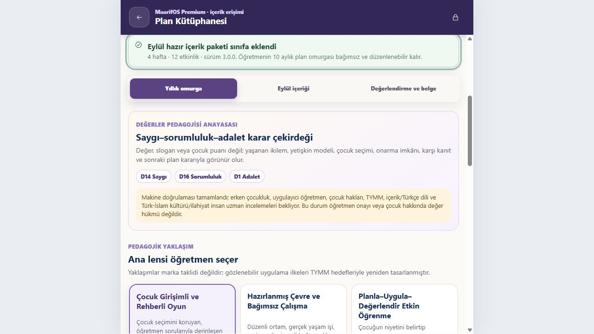

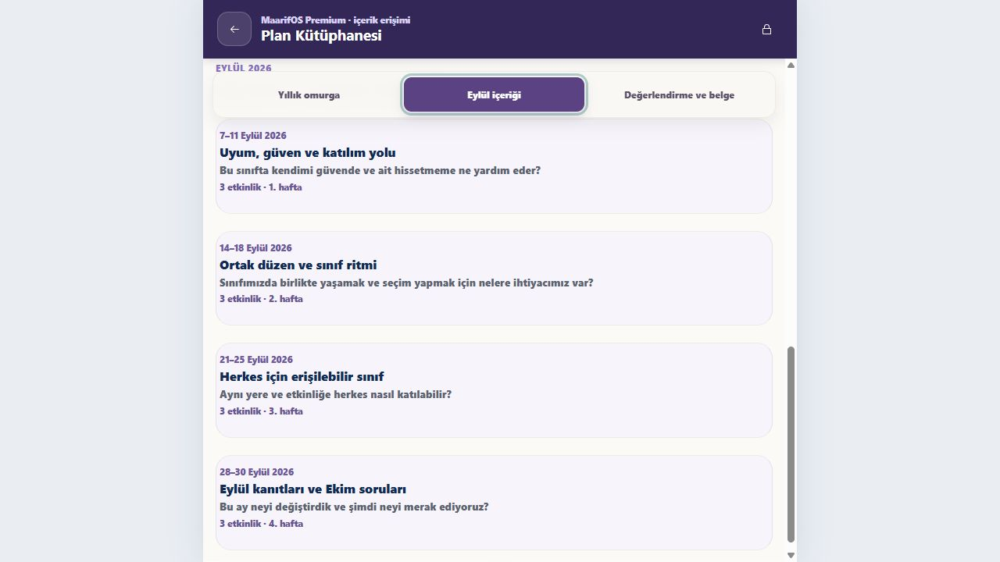

Bu düzeltme Plan Kütüphanesi'nin tıklama/geri bildirim/kaydırma kopukluğunu
kapatır; fakat bütün ürün için fiziksel telefon, yüzde 200 zoom, ekran okuyucu,
production offline ve at-rest şifreleme kapılarını kapatmaz.

MaarifOS’un en güçlü yanı, zor ve görünmez altyapı işlerini ciddiye almasıdır. En zayıf yanı ise bu gücü öğretmenin zihinsel modeline sade bir şekilde aktaramamasıdır. Bugünkü ürün, çok sayıda doğru parçaya sahip; fakat aynı anda çok fazla şeyi göstermekte, bazı teknik başarıları pedagojik/yayın başarısı gibi sunmakta ve kullanıcının tıklama sonrası nereye bakacağını yeterince yönetmemektedir.

Öncelik yeni kart eklemek değil; **tek gerçeklik, tek takvim, tek plan grafiği, tek sonraki iş ve tek kanıt zinciri** kurmaktır. Bu kapılar kapanmadan “dünyanın en mükemmel okul öncesi uygulaması” iddiası erken olur. Bu kapılar kapandığında ise MaarifOS; gizlilik, offline çalışma, öğretmen sahipliği, değerleri puanlamama ve resmî belge izlenebilirliği kombinasyonuyla gerçekten ayırt edici olabilir.

---

## 16. Kaynaklar

- [MEB Türkiye Yüzyılı Maarif Modeli Okul Öncesi Eğitim Programı](https://tymm.meb.gov.tr/upload/program/2024programokuloncesiOnayli.pdf)
- [MEB Erdem–Değer–Eylem / Sosyal Alanlar](https://tymm.meb.gov.tr/upload/kitap/sosyal-alan.pdf)
- [MEB Okul Öncesi Tanıtım Broşürü](https://tymm.meb.gov.tr/upload/brosur/tegm-brosuru.pdf)
- [Te Whāriki principles](https://tewhariki.tahurangi.education.govt.nz/te-whariki/our-curriculum/principles/5637145232.c)
- [Te Whāriki curriculum](https://tewhariki.tahurangi.education.govt.nz/te-whariki-online/our-curriculum/te-wh-riki/te-wh-riki-early-childhood-curriculum-document/5637184332.p)
- [EYLF V2.0](https://www.acecqa.gov.au/sites/default/files/2023-01/EYLF-2022-V2.0.pdf)
- [NAEYC Developmentally Appropriate Practice](https://www.naeyc.org/resources/position-statements/dap/contents)
- [OECD Learning Compass 2030](https://www.oecd.org/en/data/tools/oecd-learning-compass-2030.html)
- [CASEL Framework](https://casel.org/fundamentals-of-sel/what-is-the-casel-framework/)
- [UNESCO Global Citizenship and Peace Education](https://www.unesco.org/en/global-citizenship-peace-education/need-know)
- [WCAG 2.2](https://www.w3.org/TR/WCAG22/)
