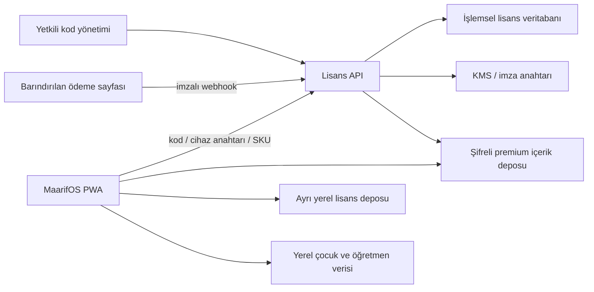

# Premium Kod, Deneme ve Çevrimdışı Yetki Mimarisi

**Durum:** Uygulama sözleşmesi, sürüm 1.0
**Güven sınırı:** Lisans servisi hiçbir çocuk, sınıf, gözlem, fotoğraf, plan metni veya kullanıcı yedeği kabul etmez.

## 1. Mimari hüküm

MaarifOS’un statik PWA kodu tek başına benzersiz kodu güvenilir biçimde tüketemez. İstemci kodu ve IndexedDB kullanıcı tarafından değiştirilebilir; aynı kodun başka cihazda kullanılmasını engelleyecek ortak ve atomik bir otorite yoktur. Bu nedenle çekirdek uygulama yerel/hesapsız kalırken yalnız premium yetki için küçük bir çevrimiçi servis eklenir.



`LDB` ve `CDB` ayrı veri alanlarıdır. Lisans modülü çocuk verisi domain modellerini import edemez. Bu sınır otomatik egress testleriyle korunur.

## 2. Bileşenler

### PWA lisans istemcisi

- Cihazda çıkarılamaz Web Crypto anahtar çifti üretir.
- Kod kullanma, deneme başlatma, yetki yenileme ve cihaz aktarımını yönetir.
- Sunucu imzalı yetki belgesini gömülü açık anahtarla çevrimdışı doğrular.
- Yalnız kullanıcının yetkili olduğu içerik manifestlerini indirir.
- Paket indirildikten sonra satın alınmış içeriği çevrimdışı açar.
- Yetki kaybolsa bile kullanıcının kendi planını, gözlemini, yedeğini veya dışa aktarımını kilitlemez.

### Lisans API

- Tek kullanımlık kod tüketimini atomik yapar.
- Denemeyi güvenilir UTC zamanı ile başlatır.
- SKU grant’lerinden imzalı cihaz yetkisi üretir.
- Cihaz limitini, transferi, kurtarmayı, iade/iptal neslini ve audit olaylarını yönetir.
- Çocuk verisi için alan veya serbest metin kabul etmez; kesin JSON şeması dışındaki payload’ı reddeder.

### Kod yönetimi

- Rol tabanlı erişim ve çok faktörlü kimlik doğrulama kullanır.
- `FULL`, `SINGLE_SKU`, `TRIAL`, `PROMO_GIFT`, `STAFF` batch’leri üretir.
- Ham kodu yalnız üretim anında bir kez gösterir; sonradan geri okunamaz.
- Batch sahibi, amaç, SKU grant’leri, son kullanım, adet ve üretim nedeni audit edilir.

### Ödeme

Ödeme alınacaksa kart verisi MaarifOS veya Lisans API’ye gelmez; PCI kapsamını küçülten barındırılmış ödeme sayfası kullanılır. Yetki yalnız sağlayıcının imzalı ve replay korumalı `captured` webhook’u doğrulandıktan sonra oluşturulur. Kullanıcının elindeki önceden üretilmiş benzersiz kodlarla açma, ödeme entegrasyonundan bağımsız çalışabilir.

## 3. Kod biçimi ve saklama

### Üretim

- CSPRNG ile en az 128 bit rastgelelik
- İnsan girişine uygun Crockford Base32
- Yazım hatasını erken yakalayan checksum
- Örnek gösterim: `MRF-7K3M-P9XD-4WQH-8T2N-R6CV-JY5B-Z`
- Prefix ve ayraçlar güvenlik sağlamaz; gerçek güvenlik rastgele payload’dadır.

Kod içine fiyat, öğretmen adı, e-posta, sıralı batch numarası veya tahmin edilebilir SKU yazılmaz.

### Sunucu saklama

Normalize edilmiş ham kod:

`code_digest = HMAC-SHA-256(server_pepper, normalized_code)`

olarak saklanır. `server_pepper` KMS/secret store’dadır. Ham kod veritabanı, telemetry, hata takibi, access log veya destek ekranına yazılmaz. Arayüz yalnız son dört karakteri gösterir.

### Yaşam döngüsü

`generated → issued → redeemed → revoked/expired`

Kod kullanma, koşullu tek satır güncelleme ve unique constraint içeren tek DB transaction’ıdır. Aynı cihazdan ağ tekrarı aynı `Idempotency-Key` ile aynı sonucu döndürür; başka cihazdan ikinci kullanım genel bir hata verir ve kodun var olup olmadığını açıklamaz.

## 4. Yetki modeli

### Sunucu nesneleri

```text
ProductSku
  sku, program, ageProfile, academicRelease, status

PriceBook
  sku, currency, salePriceMinor, taxInclusive, validFrom, validTo
  referencePriceMinor?, referenceBasis?, referencePriceEvidenceId?

LicenseCodeBatch
  id, kind, grants[], expiresAt?, createdBy, purpose, count

LicenseCode
  id, batchId, codeDigest, state, issuedAt, redeemedAt?, entitlementId?

Entitlement
  id, principalId, grants[], deviceLimit=1, releasePolicy
  createdAt, revocationGeneration, legalTermsVersion

DeviceBinding
  id, entitlementId, publicKeyThumbprint, state, generation
  activatedAt, lastSeenAt?, transferredAt?

TrialGrant
  id, principalId, academicRelease, deviceThumbprint, sku
  startedAt, expiresAt, switchCount<=1

ContentRelease
  id, sku, version, manifestDigest, minAppVersion, publishedAt, state

LicenseAuditEvent
  id, occurredAtUtc, civilDate, pseudonymousPrincipal, eventType
  sku?, result, reasonCode, requestId
```

Fiyat değerleri kuruş cinsinden tamsayıdır. Dış sözleşmede ondalık gerekiyorsa kanonik string kullanılır; `float` kullanılmaz.

### İmzalı cihaz yetkisi

```text
ver, iss, aud, jti, entitlement_id
anonymous_principal_id / account_id?
device_key_thumbprint
grants[{sku, content_release_id, access_mode}]
iat, nbf, refresh_after, offline_until
archive_access_after
revocation_generation, legal_terms_version, kid
```

İlk uyumluluk tabanı, tarayıcı Web Crypto desteği güçlü olan **ES256 / P-256** olacaktır. Format algoritma çevikliğini korur; güncel hedef tarayıcı matrisi doğrulandığında Ed25519 eklenebilir. Özel kriptografi tasarlanmaz. İmza private key’i yalnız KMS/HSM’dedir; uygulamada güncel ve önceki public key’ler bulunur. Kaynaklar: [W3C Web Cryptography API](https://www.w3.org/TR/WebCryptoAPI/), [RFC 7515 — JWS](https://www.rfc-editor.org/rfc/rfc7515), [RFC 7519 — JWT](https://www.rfc-editor.org/rfc/rfc7519).

### Çevrimdışı politika

- İlk kod kullanımı ve ilk deneme aktivasyonu çevrimiçidir.
- Satın alınmış içerik indirildikten sonra normal öğretmen kullanımı için sürekli internet gerekmez.
- İmzalı yetki, satın alınan akademik sürümü aktif yıl boyunca düzenleme/üretim modunda açar.
- Akademik yıl desteği bittikten sonra satın alınan sürüm ve kullanıcının türettiği planlar kalıcı salt okunur/arşiv erişiminde kalır.
- Uygulama internete çıktığında yetki nesli ve içerik güncellemesi yenilenir.
- Süresiz çevrimdışı cihazda iade/iptal veya çalıntı cihaz erişimini anında kesmenin mümkün olmadığı ürün riski kabul edilir. Daha sık zorunlu online kontrol öğretmen deneyimi ve çevrimdışı ilkeyi zedeler.

## 5. Üç günlük deneme güveni

Deneme tam `72 saat` sürer ve kullanıcı “Denemeyi başlat” eylemini açıkça verdiği anda sunucu UTC’siyle başlar.

Yetki şu zamanları taşır:

- `serverStartedAt`
- `expiresAt`
- `lastTrustedServerTime`
- `maxObservedWallClock`
- oturum içi monotonic zaman başlangıcı

Cihaz saati geriye alınırsa kalan süre artmaz. Uygulama şüpheli saat farkında denemeyi uzatmak yerine kısa bir çevrimiçi doğrulama ister. IndexedDB/site verisinin tamamen silinmesi tarayıcıda sabit donanım kimliği bırakmadığı için yeniden denemeyi tek başına engelleyemez; bu nedenle sunucu, doğrulanmış kurtarma kimliği ve cihaz public-key sinyalini birlikte kullanır. Fingerprinting yapılmaz.

Deneme bittiğinde:

- premium kaynaktan yeni plan oluşturma ve toplu içerik dışa aktarma kapanır,
- kullanıcının kendi düzenlediği plan okunabilir kalır,
- gözlem, öğrenci, yoklama, fotoğraf, yedek ve dışa aktarım aynen çalışır,
- satın alma/kod kullanma sonrası plan kaldığı yerden devam eder.

## 6. API sözleşmesi

```text
GET  /v1/catalog
POST /v1/device/challenge
POST /v1/trials/activate
POST /v1/codes/redeem
POST /v1/entitlements/refresh
POST /v1/transfers/begin
POST /v1/transfers/complete
POST /v1/recovery/rotate
POST /v1/recovery/claim
GET  /v1/content/{sku}/{version}/manifest
POST /v1/webhooks/payment
POST /v1/admin/code-batches
```

Tüm yazma istekleri:

- `Idempotency-Key`,
- exact request/response şeması,
- TLS,
- parametrik SQL,
- generic kullanıcı hatası + iç reason code,
- request-id,
- boyut ve hız limiti

kullanır.

Örnek kod kullanma isteği yalnız şu teknik alanları taşır:

```json
{
  "code": "MRF-…",
  "challengeId": "uuid-v4",
  "proofSignature": "ES256-base64url",
  "devicePublicKeyJwk": {},
  "deviceKeyThumbprint": "sha256:…",
  "appVersion": "0.7.0",
  "idempotencyKey": "uuid"
}
```

`proofSignature`; sunucunun tek kullanımlık 256 bit nonce değerini, işlem amacını, cihaz parmak izini ve idempotency anahtarını cihazdaki çıkarılamaz P-256 private key ile bağlar. Challenge kısa ömürlüdür; yanlış amaç, süre aşımı ve replay sunucuda reddedilir. Kod transit sırasında zorunlu olarak görünür; request body hiçbir katmanda loglanmaz.

### Uygulanan istemci güvenlik tabanı — 4 Ağustos 2026

- ES256 imzalı entitlement; issuer, audience, cihaz, iptal nesli ve exact içerik release bağlarıyla doğrulanır.
- P-256 cihaz private key'i çıkarılamaz biçimde ayrı lisans IndexedDB alanında tutulur; RFC 7638 uyumlu açık anahtar parmak izi hesaplanır.
- Kod/deneme DTO'ları exact alan, tip, uzunluk, UUID, sürüm, public JWK ve yeniden hesaplanan thumbprint kontrolünden geçer; iç içe eğitimsel veri alanları reddedilir.
- Challenge proof istemcide üretilebilir; raw kod, token, kurtarma sırrı ve cihaz private key'i normal MaarifOS yedeğine girmez.
- Paket kurma, premium etkinlik hazırlama ve çıktı alma her işlem anında exact paket/akademik sürüm ve karar süresiyle tekrar denetlenir.

Bu taban sunucu otoritesi değildir. Kodun atomik tüketimi, challenge'ın tek kullanımlılığı, hesap/yıl başına deneme, cihaz transferi, mağaza makbuzu doğrulaması, iptal nesli ve KMS imzası gerçek Lisans API + işlemsel veritabanında tamamlanmadan satış ve deneme kapalı kalır.

## 7. Cihaz aktarımı ve kurtarma

### Hesapsız varsayılan

Aktivasyon sonunda kullanıcıya 256 bit tek kullanımlık kurtarma sırrı verilir. Sunucuda yalnız digest’i saklanır. Kullanıcı bunu parola yöneticisine kaydetmeye veya kurtarma dosyasını indirmeye yönlendirilir.

### İsteğe bağlı hesap

E-posta/Google ile kurtarma ileride eklenirse OAuth token’ı PWA storage’a konmaz. BFF, `HttpOnly`, `Secure`, `SameSite` cookie kullanır. Lisans hesabı çekirdek MaarifOS kullanımı için zorunlu değildir.

### Aktarım

1. Yeni cihaz challenge üretir.
2. Kullanıcı hesabını veya kurtarma sırrını doğrular.
3. Sunucu cihaz limitini kontrol eder.
4. Gerekirse kullanıcı eski cihazı seçip devre dışı bırakır.
5. `revocationGeneration` artırılır ve yeni cihaza yeni yetki verilir.
6. Eski çevrimdışı cihaz, elindeki offline süre bitene kadar çalışabilir; bu açık artık risktir.

Normal MaarifOS yedeği ham kodu, kurtarma sırrını, entitlement tokenını veya cihaz private key’ini içermez. Yeni cihazda çocuk verisi yedeği ayrı geri yüklenir, lisans ayrı kurtarılır.

## 8. Premium içerik dağıtımı

Premium planlar Vite başlangıç bundle’ına, `public/` klasörüne veya herkesin indirebildiği açık TypeScript kataloglarına eklenmez.

Her `ContentRelease` şunlara sahiptir:

- SKU ve semantik içerik sürümü
- minimum uygulama sürümü
- dosya/chunk boyutları ve SHA-256 digest’leri
- kaynak/provenance özeti
- değişiklik notu
- manifest imzası ve `kid`
- geri çekilmiş sürüm/downgrade bilgisi

İçerik AES-256-GCM ile paketlenebilir; içerik anahtarı cihaz public encryption key’ine standart bir key-wrapping mekanizmasıyla sarılır. Service worker yalnız ciphertext cache’ler. Açık premium içerik ortak Cache Storage’a yazılmaz. Manifest, chunk, sürüm, cihaz ve digest doğrulaması başarısızsa paket atomik olarak reddedilir.

Bu bir “kırılamaz DRM” değildir. Yetkili tarayıcı içeriği göstermek için çözmek zorundadır ve kararlı bir saldırgan çalışma anındaki açık içeriği yakalayabilir. Hedef; yanlışlıkla açık dağıtımı, toplu kod paylaşımını, kolay URL kopyalamayı ve paket kurcalamayı önlemektir.

## 9. Hız sınırları ve audit

Başlangıç politikası:

| İşlem | Başlangıç limiti |
|---|---:|
| Kod kullanımı | IP başına 5 / 15 dakika; cihaz başına 10 / gün |
| Deneme | principal + academicRelease başına 1; tek paket değişimi; cihaz anahtarı başına 1 |
| Yetki yenileme | cihaz başına 60 / saat |
| Cihaz aktarımı | 3 / 30 gün; sonrası destek incelemesi |
| Admin batch | rol ve ikinci onay ile sınırlı |

Audit kaydı yalnız pseudonymous principal/device, UTC + `civil_date`, olay türü, SKU, sonuç, reason code ve request-id içerir. Ham kod, e-posta, ham IP, ödeme kartı, VKN/TCKN veya çocuk verisi loglanmaz. Hız sınırı için IP gerekirse edge’de kısa ömürlü HMAC sayaç olarak tutulur. KVKK veri minimizasyonu ve saklama süresi sözleşmeyle belirlenir: [KVKK temel ilkeleri](https://www.kvkk.gov.tr/Icerik/4189/Kisisel-Verilerin-Islenmesine-Iliskin-Temel-Ilkeler), [veri güvenliği yükümlülükleri](https://www.kvkk.gov.tr/Icerik/2040/Veri-Guvenligine-Iliskin-Yukumlulukler).

## 10. Fiyat ve hukuki kayıt modeli

Fiyat kartı şu alanlar geçerli değilse “yerine/indirim” göstermez:

```text
currency = TRY
salePriceMinor
taxInclusive
validFrom / validTo
referencePriceMinor?
referenceBasis?
referencePriceEvidenceId?
campaignTermsVersion
legalApprovalId
```

Ödeme öncesi satıcı bilgileri, vergiler dahil toplam, ifa biçimi, lisans süresi, cihaz sayısı, teknik uyumluluk, dijital koruma, cayma/iade koşulları ve ödeme yükümlülüğü gösterilir. Kullanıcı onayı zaman damgası ve belge hash’iyle saklanır. “İade yok” gibi ayıplı içerik haklarını ortadan kaldıran genel ifade kullanılmaz.

Türkiye’de güncel sınıflama, KDV, e-Arşiv, ETBİS ve mesafeli sözleşme metinleri satıştan önce hukukçu ve mali müşavir tarafından imzalı kapıdan geçirilir. Dijital ürünün vergi oranı kod içine varsayım olarak gömülmez.

## 11. Zorunlu test matrisi

### Kod ve eşzamanlılık

- 100 eşzamanlı kullanım isteğinde tek redemption
- Aynı cihaz ve idempotency key ile güvenli retry
- Başka cihazda replay reddi
- Yanlış, bozuk, süresi geçmiş ve revoked kodlarda bilgi sızdırmayan hata
- Brute-force hız sınırı ve kademeli gecikme

### Yetki

- Bozuk imza, yanlış `aud`, `kid`, cihaz thumbprint ve sürüm reddi
- Public key rotasyonu
- Uçak modunda tam uygulama yeniden açılışı
- İade/iptal nesli ve eski çevrimdışı cihaz artık riski
- Cihaz limiti, transfer, recovery rotation

### Deneme

- Tam 72 saat sınırları
- saat geri/ileri alma
- yeniden başlatma ve site verisi silme davranışı
- Türkiye saat gösterimi ile UTC otoritesinin ayrılması
- bitişte kullanıcı verisi ve dışa aktarımın açık kalması

### İçerik

- manifest/chunk/digest/key kurcalama reddi
- yanlış cihaz ve yanlış SKU reddi
- downgrade ve yarım indirme rollback’i
- atomik sürüm güncelleme
- çevrimdışı cache açılışı

### Gizlilik ve satış

- Tüm lisans fetch payload’larında çocuk/sınıf/gözlem alanı bulunmadığını kanıtlayan egress testi
- Log taramasında ham kod, e-posta ve çocuk verisi sıfır
- fiyat geçmişi, kampanya süresi, KDV gösterimi ve hukuk belge hash’i
- ödeme webhook imzası, timestamp ve event replay testi

## 12. Uygulama entegrasyon sırası

1. ADR: lisans süresi, cihaz sayısı, çevrimdışı süresi, kurtarma ve satış kanalı
2. `license-api` + işlemsel DB + KMS iskeleti
3. Admin kod batch üretimi ve atomik redemption
4. PWA cihaz anahtarı, entitlement doğrulama ve ayrı lisans deposu
5. Bir TYMM SKU için imzalı manifest ve çevrimdışı paket
6. 72 saat deneme ve saat kurcalama testleri
7. Transfer/kurtarma
8. Barındırılmış ödeme ve hukuki ön bilgilendirme
9. Güvenlik, veri çıkışı ve yük testleri
10. Kademeli pilot ve feature flag
