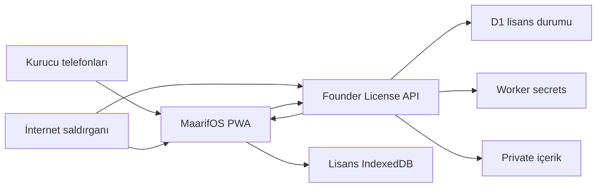

# MaarifOS Kurucu Premium İki Cihaz — Tehdit Modeli

**İnceleme tarihi:** 8 Ağustos 2026

**Kapsam sürümü:** `license-api/` ve `app/src/features/premium-access/` çalışma ağacı

**Durum:** Repo-temelli ilk model; yüksek öncelikli yayın kapıları kapanmadan üretim onayı değildir

## Executive summary

En önemli risk, altı haneli kurucu kodunun internetten dağıtık biçimde tahmin edilerek iki cihaz slotunun saldırgan tarafından ele geçirilmesidir. Mevcut tasarım bu riski cihaz başına P-256 ispatı, HMAC doğrulama, IP/cihaz hız sınırı, D1'de iki sabit slot ve genel hata yanıtıyla azaltır; ancak global aktivasyon penceresi/kod rotasyonu olmadan kısa kod hâlâ yüksek öncelikli bir hedeftir. İkinci önemli tema kayıp cihazın iptali ve slot değişimidir: uzun çevrimdışı entitlement, reset sonrası eski cihazın kullanımını gecikmeli sonlandırabilir. İmza/HMAC secret'larının korunması, private içeriğin public build'e girmemesi ve Lisans API'ye hiçbir çocuk/sınıf/plan verisinin ulaşmaması diğer kritik güven sınırlarıdır.

## Scope and assumptions

İncelenen üretim/runtime yolları:

- `license-api/src/`, `license-api/migrations/0001_founder_license.sql`, `license-api/migrations/0003_founder_device_tombstones.sql`, `license-api/wrangler.jsonc`
- `app/src/features/premium-access/`
- PWA ağ/cache sınırı için `app/worker/index.js` ve `app/public/sw.js`
- Politika kanıtı için `docs/MAARIFOS_V1_KANONIK_URUN_SARTNAMESI.md` ve `docs/PREMIUM_ENTITLEMENT_ARCHITECTURE.md`

Kapsam dışı:

- App Store/Google Play ödeme, makbuz, iade ve ticari `purchased` üretim backend'i
- Genel STAFF/promosyon kod batch yönetimi ve 72 saatlik deneme servisi
- MaarifOS'un yerel öğretmen/çocuk veri modelinin lisans dışındaki bütün saldırı yüzeyi
- Cloudflare hesabı, geliştirici bilgisayarı ve CI'ın genel tehdit modeli; yalnız bu akışa taşıdığı secret/artefakt riski dahildir

Ürün sahibi tarafından doğrulanmış bağlam:

- PWA internete açık olacak; kurucu hakkı yalnız ürün sahibi ile Emine Öğretmen'in iki telefonuna verilecek.
- Ücretli `purchased` premium ve genel kullanıcıların tek cihaz politikası değişmeyecek.
- Kurucu grant'i `staff-code` kalacak; iki cihaz sınırı yalnız server-side `FOUNDER` politikası olacak.
- Öğretmen ve çocuk verisi cihazda kalacak, Lisans API'ye gönderilmeyecek.
- Cihaz değişimi self-servis olmayacak; açık yetkili işlemiyle admin reset gerekecek.
- Mevcut Sites hosting yapılandırmasında D1/R2 binding'leri `null` olduğu için Lisans API ayrı bir Cloudflare Worker + D1 olarak dağıtılacak. PWA'daki API origin'i build-time sabit olacak; uygulama CSP'si ve API CORS'u yalnız bu kesin HTTPS origin çiftine izin verecek. Kanıt: `app/.openai/hosting.json`, `license-api/wrangler.jsonc`.
- Kurucu entitlement'ı 30 günde refresh gerektirecek ve çevrimdışı kullanım en çok 90 gün olacak. Aynı bağlı cihaz kodla online yeniden yetki alabilecek; admin reset önceden verilmiş offline tokenı anında geçersizleştirmeyecek.

Riski en çok değiştiren açık mühendislik soruları:

- İki ilk cihaz bağlandıktan sonra aktivasyon endpoint'ini kapatan operasyonel kontrol ve secret rotasyonu nasıl uygulanacak?
- İmza anahtarı Cloudflare secret olarak mı yoksa ayrı KMS/HSM ile mi yönetilecek; rotasyon ve acil iptal sahibi kim olacak?

## System model

### Primary components

- **MaarifOS PWA:** Aktivasyon kodunu alır, cihaz P-256 anahtarını üretir, challenge'ı imzalar, entitlement ile içerik zincirini doğrular ve ayrı IndexedDB depolarında saklar. Kanıt: `app/src/features/premium-access/founder-client.ts`, `device-identity.ts`, `entitlement.ts`, `license-store.ts`.
- **Statik site Worker/CDN:** PWA kabuğunu servis eder ve CSP uygular. Service worker, `/api/` ve `/auth/` yollarını cache dışında tutar. Kanıt: `app/worker/index.js`, `app/public/sw.js:isSensitivePath`.
- **Ayrı Founder License API Worker:** Sites hosting'den ayrı, D1 binding'li Worker yalnız challenge ve founder redeem POST yüzeylerini açar; exact JSON, exact CORS allowlist, kod HMAC'i, cihaz proof'u, idempotency ve entitlement imzasını yürütür. Başlangıç limitleri challenge için IP başına 20/15 dakika ve cihaz başına 30/gün; redeem için IP başına 5/15 dakika ve cihaz başına 10/gündür. Kanıt: `license-api/src/service.mjs:API_PATHS`, `enforceRateLimits`, `parseAllowedOrigins`; `license-api/src/release.mjs:API_LIMITS`; `license-api/wrangler.jsonc`.
- **D1 lisans veritabanı:** Challenge tüketimi, iki cihaz binding'i, eski cihazlar için append-only founder tombstone'ları, idempotency tokenı, rate-limit bucket'ı ve audit olaylarının ortak otoritesidir. Kanıt: `license-api/migrations/0001_founder_license.sql`, `license-api/migrations/0003_founder_device_tombstones.sql`, `license-api/src/d1-repository.mjs`.
- **Worker secret katmanı:** Kod HMAC anahtarı/özeti, rate-limit HMAC anahtarı ve ES256 private signing JWK'sini sağlar. Kanıt: `license-api/src/service.mjs:requireConfigText`, `issueEntitlement`.
- **Private asset binding:** Release metadatası, manifest ve içerik JSON'unu public Vite bundle dışında tutar; API servis etmeden önce byte uzunluğu ve SHA-256 zincirini doğrular. Kanıt: `license-api/src/private-bundle.mjs`, `license-api/src/release.mjs`.

### Data flows and trust boundaries

- **İnternet → Statik PWA:** HTML/JS/CSS, HTTPS. Kod public ve saldırgan tarafından incelenebilir kabul edilir; CSP script ve bağlantı origin'lerini sınırlar. Frontend özelliği güvenlik otoritesi değildir. Kanıt: `app/worker/index.js:CONTENT_SECURITY_POLICY`.
- **Kurucu telefonu → ayrı Lisans API Worker:** Altı haneli kod, public JWK, cihaz parmak izi, challenge proof'u, uygulama sürümü ve idempotency anahtarı; HTTPS POST/JSON. API origin'i build-time sabittir; PWA CSP'si yalnız o Worker origin'ine bağlantı verir, Worker yalnız kesin Sites origin'ini CORS allowlist'e alır. İstemci ayrıca `credentials: omit`, `no-store`, `redirect: error` ve exact şema kullanır. Kanıt: `app/src/features/premium-access/founder-client.ts:secureApiOrigin`, `postExactJson`; `license-api/src/validation.mjs:parseAllowedOrigins`; `license-api/wrangler.jsonc`.
- **Lisans API → D1:** Challenge, rate counter, idempotency sonucu, iki cihaz slotu ve takma adlı audit; parametrik D1 sorguları. Primary/unique/check kısıtları üçüncü slotu ve aynı cihazın mükerrer binding'ini engeller. Kanıt: `license-api/src/d1-repository.mjs:SQL`, migration.
- **Lisans API → Worker secrets:** HMAC ve ES256 private key yalnız işlem anında okunur; istemciye veya D1'e private key dönmez. Repo yalnız secret değişken adlarını içermelidir. Kanıt: `license-api/src/service.mjs:issueEntitlement`, `handleFounderRedeem`.
- **Lisans API → Private assets:** Metadata, manifest ve içerik bytes; Worker binding fetch'i. Exact release kimliği, manifest digest'i, içerik SHA-256'sı ve byte uzunluğu doğrulanır. Kanıt: `license-api/src/private-bundle.mjs:loadPrivateContentBundle`.
- **Lisans API → PWA:** ES256 entitlement ve doğrulanmış içerik JSON'u; HTTPS JSON. İstemci public key, issuer, audience, cihaz, SKU/release/manifest ve süreleri doğrulamadan kaydetmez. Kanıt: `app/src/features/premium-access/founder-client.ts:verifiedAccessFor`, `entitlement.ts:verifyPremiumEntitlement`.
- **PWA → cihaz IndexedDB:** Çıkarılamaz P-256 private CryptoKey, entitlement ve içerik bundle'ı ayrı lisans depolarına yazılır; normal öğretmen yedeğinin parçası değildir. Tarayıcı profiline yerel erişimi olan kötü amaçlı yazılım ayrı bir tehdittir. Kanıt: `device-identity.ts`, `license-store.ts`, `content-bundle-store.ts`.

#### Diagram

## Assets and security objectives

| Asset | Why it matters | Security objective (C/I/A) |
|---|---|---|
| Kurucu aktivasyon kodu ve HMAC secret'ları | Ele geçirilirse iki slot saldırgan cihazlarla doldurulabilir | C, I |
| ES256 private signing key | Ele geçirilirse sahte cihaz/release entitlement'ları üretilebilir | C, I |
| İki cihaz slotu ve binding durumu | Kurucu hakkının sınırı ve cihaz değişiminin otoritesidir | I, A |
| Cihaz P-256 private key'i | Entitlement'ı fiziksel tarayıcı profiline bağlayan sahiplik kanıtıdır | C, I |
| İmzalı entitlement ve iptal nesli | Premium erişimin kapsam, cihaz, release ve süre kararını taşır | I, A |
| Premium plan içeriği ve manifest zinciri | Ücretli fikrî içerik ile plan bütünlüğünü korur | C, I, A |
| D1 idempotency/challenge/rate kayıtları | Replay, yarış ve brute-force savunmasını sağlar | I, A |
| Takma adlı audit olayları | Olay inceleme ve kötüye kullanım tespiti sağlar | I, A |
| Çocuk/sınıf/gözlem/plan verisi | Lisans servisinin hiç almaması gereken hassas eğitim verisidir | C, I |
| Public PWA yapılandırması ve trusted JWK'ler | Yanlış issuer/origin/key pin'i erişimi açabilir veya sistemi durdurabilir | I, A |

## Attacker model

### Capabilities

- İnternetten API'ye doğrudan istek atabilir, `Origin` başlığını taklit edebilir ve dağıtık IP/cihaz kimlikleri kullanabilir.
- Public JavaScript, endpoint yolları, release kimlikleri, public JWK ve altı haneli kod formatını inceleyebilir.
- Kendi tarayıcısında JavaScript'i, IndexedDB'yi, saati ve istek gövdelerini değiştirebilir; çok sayıda P-256 cihaz anahtarı üretebilir.
- Bir kurucu telefonuna fiziksel veya zararlı yazılım erişimi kazanırsa tarayıcı profili içindeki yetkiyi kullanmaya veya premium içeriği çalışma anında kopyalamaya çalışabilir.
- Yanlış yapılandırılmış CI, Worker logu, secret veya private asset yayınından yararlanabilir.

### Non-capabilities

- TLS, SHA-256, HMAC-SHA-256 veya P-256/ES256'yı kriptografik olarak kırabildiği varsayılmaz.
- Dürüst cihazdaki `extractable: false` CryptoKey'i Web Crypto API üzerinden doğrudan export edemez; ancak ele geçirilmiş cihazda anahtarı imza için kullanan kod çalıştırabilir.
- Cloudflare hesabına, D1 admin yetkisine, CI secret'larına veya kurucu telefonlarına başlangıçta erişimi olduğu varsayılmaz; bu ayrı ayrı ayrıcalık yükseltme önkoşuludur.
- Lisans API üzerinden çocuk verisine erişemez; API'nin böyle bir veritabanı veya alanı olmadığı varsayılır.

## Entry points and attack surfaces

| Surface | How reached | Trust boundary | Notes | Evidence (repo path / symbol) |
|---|---|---|---|---|
| `POST /v1/device/challenge` | Public internet, JSON | İnternet → Lisans API | Origin, exact iki alan, 8 KiB sınır, amaç, cihaz/IP rate limit | `license-api/src/service.mjs:handleChallenge`; `validation.mjs:validateChallengeRequest` |
| `POST /v1/founder/redeem` | Public internet, JSON | İnternet → Lisans API | Kod, P-256 proof, challenge, idempotency ve iki slot kararı | `service.mjs:handleFounderRedeem`; `validation.mjs:validateFounderRedeemRequest` |
| PWA aktivasyon formu | Kurucu telefonundaki UI | Kullanıcı → PWA | Kod istemcide kalıcı saklanmamalı veya loglanmamalı | `app/src/features/premium-plans/FounderPremiumActivationPanel.tsx`; `founder-client.ts` |
| Entitlement doğrulama | API yanıtı veya IndexedDB | Ağ/yerel depo → PWA | Public JWK, issuer/audience, cihaz, release, süre, saat geri alma | `app/src/features/premium-access/entitlement.ts:verifyPremiumEntitlement` |
| Lisans IndexedDB | Yerel tarayıcı profili | PWA → cihaz deposu | Private CryptoKey, token ve açık içerik; normal yedekten ayrıdır | `device-identity.ts`; `license-store.ts`; `content-bundle-store.ts` |
| Private asset binding | Worker runtime binding | Lisans API → içerik deposu | Yanlış public deployment veya digest zinciri kırılması riski | `license-api/src/private-bundle.mjs` |
| D1 admin/reset | Onay metinli yönetici betiği ve Cloudflare D1 API tokenı | Operatör → Cloudflare D1 API | Tek batch'te eski cihazı append-only tombstone'a alır, seçili slotu pasifleştirir ve iptal neslini artırır; yüksek ayrıcalıklıdır | `license-api/scripts/deactivate-founder-slot.mjs`; `founder_device_bindings`; `founder_device_tombstones` migration |
| Worker secrets/config | Deploy/Cloudflare yönetimi | Operatör/CI → Worker | Signing key, HMAC key/digest, allowed origin ve issuer | `license-api/wrangler.jsonc`; `service.mjs:requireConfigText` |
| Edge/Worker observability | Cloudflare işletimi | İstek → log/telemetri | Gövde ve ham IP/kod hiçbir katmanda tutulmamalı | `license-api/wrangler.jsonc:observability`; `service.mjs:safeAudit` |

## Top abuse paths

1. **İki slotu ele geçirme:** Saldırgan altı haneli kod alanını dağıtık IP'lerden dener → geçerli tahmini yeni P-256 anahtarıyla bağlar → bir veya iki slotu kurucu telefonlarından önce doldurur → gerçek kullanıcı premium erişimi alamaz ve içerik saldırgana açılır.
2. **Yarışla üçüncü cihaz:** Saldırgan aynı doğru kodla eşzamanlı çok sayıda redeem gönderir → uygulama katmanındaki "önce say sonra ekle" yarışını hedefler → D1 kısıtları/claim mantığı zayıfsa ikiden fazla binding oluşur → kurucu istisnası paylaşılabilir premium kapısına dönüşür.
3. **Challenge replay:** Saldırgan geçerli redeem isteğini yakalar → nonce veya idempotency anahtarını başka cihaz/fingerprint ile tekrarlar → doğrulama sırası veya fingerprint bağı eksikse yeni entitlement alır.
4. **Signing secret ele geçirme:** Yanlış deploy/CI/log yapılandırması private JWK'yi sızdırır → saldırgan istediği cihaz ve release için ES256 token imzalar → bütün istemci tarafı premium denetimini geçer.
5. **Kayıp cihazı yaşamda tutma:** Kurucu cihazı kaybolur → admin slotu resetler → eski token 90 günlük `offline_until` sınırına kadar online nesil kontrolü olmadan çalışabilir → iptal kararı gecikmeli uygulanır.
6. **Private içeriği toplu çıkarma:** Yetkili veya ele geçirilmiş cihaz redeem olur → API yanıtındaki açık JSON'u veya IndexedDB bundle'ını kopyalar → plan içeriği uygulama dışında dağıtılır. Cihaz bağı token taşımayı engeller, açık içeriğin kopyalanmasını tamamen engellemez.
7. **Kod/log sızıntısı:** Edge gözlemlenebilirliği, hata izleme veya destek ekranı request body'yi kaydeder → ham kod operatör veya üçüncü taraf log sistemine düşer → slot ele geçirme saldırısı kolaylaşır.
8. **Yanlış origin/key yapılandırması:** App CSP ayrı Lisans API origin'ini engeller veya istemci yanlış issuer/JWK ile build edilir → gerçek telefonlarda aktivasyon durur; daha kötü durumda saldırganın kontrolündeki origin/key pin'lenirse sahte yanıtlar güvenilir olur.

## Threat model table

| Threat ID | Threat source | Prerequisites | Threat action | Impact | Impacted assets | Existing controls (evidence) | Gaps | Recommended mitigations | Detection ideas | Likelihood | Impact severity | Priority |
|---|---|---|---|---|---|---|---|---|---|---|---|---|
| TM-001 | Uzak, dağıtık saldırgan | Endpoint ve altı haneli format public; kod bilinmiyor | Kod uzayını dağıtık deneyip iki slotu kendi anahtarlarına bağlar | Yetkisiz premium, gerçek iki telefon için erişim kaybı | Kod, slotlar, içerik | Kod HMAC'i; IP/cihaz rate limit; iki D1 slotu; genel hata (`service.mjs:enforceRateLimits`, migration) | Global kod/aktivasyon-window sayacı ve iki bağlamadan sonra otomatik kapanış kanıtlanmış değil; IP/device takma adları döndürülebilir | İlk kullanım için kısa bakım penceresi; global founder-attempt bütçesi; edge bot/WAF; iki slot dolunca endpoint kill switch; kod secret rotasyonu; alarm | Hata oranı, benzersiz IP/device HMAC artışı, slot claim olayı, limit sonrası deneme | Orta: yerel limitler maliyeti artırır ama 1 milyonluk uzay dağıtık saldırıya küçüktür | Yüksek | high |
| TM-002 | Uzak saldırgan veya istemsiz eşzamanlı kullanım | Doğru kod; paralel çok cihaz | Yarış koşuluyla üçüncü binding oluşturmaya çalışır | İki cihaz politikasının aşılması | Slot bütünlüğü | Slot `CHECK`, PK ve unique; `INSERT OR IGNORE` (`0001_founder_license.sql`, `claimFounderDevice`) | D1 gerçek ortamda yüksek eşzamanlılık testi henüz yayın kanıtı değildir; challenge önce tüketilirken kısmi hata davranışı incelenmeli | 50+ eşzamanlı farklı cihaz acceptance testi; bağlama işlemini tek D1 transaction/stored procedure semantiğinde tut; invariant metriği `active <= 2` | `COUNT(active)>2` kritik alarm; constraint/insert conflict metriği | Düşük: DB kısıtları güçlü | Yüksek | medium |
| TM-003 | Ağ tekrarını veya istemciyi kontrol eden saldırgan | Geçerli challenge/redeem örneği | Challenge, proof veya idempotency anahtarını farklı istek/cihazla tekrarlar | Fazladan entitlement veya yanlış cihaza bağlama | Challenge, idempotency, slot | 5 dk TTL; amaç/cihaz bağı; P-256 proof; request fingerprint; same-request kontrolü (`service.mjs`, `d1-repository.mjs:claimChallenge`) | Kısmi DB hatası ve idempotency token saklaması arasındaki crash senaryoları ayrıca sınanmalı | Failure-injection testleri; idempotency kaydını challenge/binding ile atomik commit et; aynı anahtar/farklı body her zaman genel 403 | Replay reason code, aynı challenge'a farklı fingerprint, idempotency conflict alarmı | Düşük | Yüksek | medium |
| TM-004 | CI/Cloudflare hesabını ele geçiren saldırgan veya yanlış yapılandırma | Worker secret/deploy yetkisi | ES256 private JWK veya HMAC secret'larını okur/değiştirir | Sahte entitlement, kod doğrulama kontrolü veya toplu yetki ihlali | Signing key, HMAC secret'ları, bütün premium yetkiler | Secret değerleri repo config'inde yok; `kid` ve public-key pin'i var; generic errors (`wrangler.jsonc`, `service.mjs:issueEntitlement`) | KMS/HSM, rotasyon runbook'u ve secret erişim denetimi repo kanıtında yok; private JWK JSON secret olarak import ediliyor | En az ayrı Cloudflare secret; mümkünse KMS/HSM signing; dar CI rolleri; iki kişili rotasyon; eski/yeni `kid` geçişi; secret scanner | Secret erişim/deploy audit'i; bilinmeyen `kid`; beklenmeyen token hacmi | Düşük: ayrıcalıklı erişim gerekir | Yüksek: tüm founder yetkisini sahteleştirir | high |
| TM-005 | Tokenı veya yerel profili çalan saldırgan | Kurucu cihazına yerel erişim ya da token kopyası | Tokenı başka cihazda kullanır, saati geri alır veya CryptoKey'i imza oracle'ı gibi kullanır | Yetkisiz cihaz kullanımı veya sürenin uzaması | Token, cihaz private key'i, çevrimdışı erişim | Exact cihaz thumbprint; non-extractable P-256 key; max observed wall clock; imza/release/süre kontrolleri (`device-identity.ts`, `entitlement.ts`) | Non-extractable, ele geçirilmiş cihazda anahtar kullanımını engellemez; platform güvenli donanım attestation yok | Cihaz ekran kilidi; kısa founder offline süresi; online refresh; yerel erişim tehdidini kullanıcı prosedüründe belirt; gelecekte platform attestation değerlendirmesi | Saat geri alma durumu, olağandışı refresh, reset sonrası eski thumbprint isteği | Orta | Orta | medium |
| TM-006 | Kayıp cihaz sahibi veya eski cihazı ele geçiren kişi | Geçerli offline token; admin reset yapılmış | Eski entitlement'ı offline kullanmayı veya doğru PIN/idempotency replay ile yeniden entitlement almayı dener | İptalin en çok 90 gün gecikmesi veya resetin aşılması | Slot, tombstone, iptal nesli, erişilebilirlik | Token 30 günde refresh, 90 günde offline sonu taşır; operator batch'i eski thumbprint+entitlement'ı append-only tombstone'a alıp slotu pasifleştirir ve nesli artırır; service idempotency lookup'tan önce, repository ise claim içinde tombstone'u reddeder; yeni cihaz pasif slotu aynı artmış nesille alır (`0003_founder_device_tombstones.sql`, `service.mjs`, `deactivate-founder-slot.mjs`, `d1-repository.mjs`) | Reset anlık offline revocation değildir; önceden imzalı offline token 90 gün çalışabilir | Reset UI/runbook'unda 90 günlük kalan riski göster; anlık iptal gerekirse online nesil kontrolü; tombstone/audit dışa aktarımını değişmez ikinci sisteme aktar | Generic tombstoned redeem sayısı; nesil uyuşmazlığı; pasif/yeniden bağlanan slot metriği; admin reset audit'i | Orta: cihaz değişimi olağan | Yüksek | high |
| TM-007 | Yetkili kullanıcı, ele geçirilmiş telefon veya kötü amaçlı eklenti | Bir cihaz meşru entitlement almış | API yanıtı/IndexedDB'deki açık content JSON'u çıkarıp dağıtır | Premium içerik gizliliği ve fikrî mülkiyet kaybı | Private içerik | İçerik public build'de değil; auth sonrası gelir; exact digest/release doğrulaması (`private-bundle.mjs`, `founder-client.ts:validateContentBundle`) | İçerik istemciye açık JSON olarak gelir ve IndexedDB'de açık saklanır; DRM sınırı doğaldır | Kalan riski kabul et; toplu indirme alarmı; cihaz bazlı izlenebilir release makbuzu; gerekirse cihaz anahtarına sarılmış içerik anahtarı; public artefakt taraması | Release başına indirme hacmi, aynı binding'den anomali, public URL sızıntı taraması | Orta | Orta | medium |
| TM-008 | Yanlış deploy veya yapılandırmayı değiştiren saldırgan | CSP/origin/issuer/JWK build ayarına erişim | Sabit Worker origin'ini CSP'de engeller ya da güven kökünü saldırgan değerine çevirir | Aktivasyon kesintisi; güven kökü değişirse sahte entitlement | PWA config, trusted keys, erişilebilirlik | API exact HTTPS origin; Worker exact Sites-origin CORS allowlist; JWK ve issuer/audience pin'i; Sites hazırlığı aynı production Vite env'indeki exact HTTPS origin'i doğrulayıp sabit CSP'ye enjekte eder, geçersiz ayarda eski Worker artefaktını kaldırarak fail-closed kapanır (`founder-client.ts`, `service.mjs:parseAllowedOrigins`, `wrangler.jsonc`, `prepare-sites-build.mjs`, `sites-worker.test.mjs`) | Gerçek kanonik origin/public JWK henüz canlı ortama bağlanıp iki telefonda canary olarak doğrulanmadı; CSP ihlal telemetrisi yok | Build-time config sözleşmesini release kapısı olarak koru; CORS negatif-origin testleri; public JWK fingerprint release manifesti; iki kurucu telefonunda canary aktivasyon testi | CSP violation report, reddedilen Origin sayısı, config hash drift, aktivasyon hata oranı | Düşük-Orta | Orta | medium |
| TM-009 | Operatör, observability sağlayıcısı veya hata yolu | Request body/ham header loglama açılmış | Kodu, ham IP'yi, tokenı ya da private JWK'yi loglara taşır veya audit arızasıyla saldırı izini kaybettirir | Slot ele geçirme, gizlilik ihlali ve tespit kaybı | Kod, token, secret, audit | Uygulama request body loglamıyor; generic hata; audit yalnız HMAC IP/device ve reason code (`service.mjs:safeAudit`, `auditEvent`) | Edge/observability gövde politikası repo tarafından bütünüyle kanıtlanamaz; observability açık; `safeAudit` yazma hatasını bilinçli olarak sessizce yutar | Body logging'i kapat; alan bazlı redaction; secret/token/code canary taraması; kısa saklama; audit erişim rolü; audit write-failure için secretsiz sayaç ve alarm | Otomatik log DLP testi; audit beklenen/gerçek olay mutabakatı; her release'te kod/token/private-key pattern taraması | Düşük-Orta | Yüksek | high |
| TM-010 | Kötü amaçlı istemci | Lisans API'ye key adlarıyla veri enjekte edebilir | Çocuk/sınıf/gözlem bilgisini lisans payload'ına veya audit'e sokar | Hassas eğitim verisinin merkezi servise çıkması | Çocuk ve sınıf verisi | Exact request şeması, 8 KiB sınır, yasak eğitim alanı taraması; audit sabit alanlı (`validation.mjs:readExactJson`, `assertNoEducationalFields`) | Yasak kelime listesi tek başına tam DLP değildir; güven exact şemaya dayanır | Exact şemayı genişletirken privacy review zorunlu; request body asla audit'e kopyalanmasın; eğitim verili negatif test corpus'u | Audit kolon şeması drift kontrolü; DLP canary testleri | Düşük | Yüksek | medium |
| TM-011 | Ayrıcalıklı D1 operatörü veya ele geçirilmiş deploy rolü | D1 yazma/admin erişimi | Binding, idempotency veya audit satırını değiştirir; slotu sessiz açar | Yetkisiz cihaz, olay örtme, hizmet kesintisi | D1 durum ve audit | SQL parametrik; DB constraints; request-id audit (`d1-repository.mjs`, migration) | Admin RBAC, immutable audit export ve yedek erişim politikası repo içinde tanımlı değil | En az ayrıcalık; prod D1 yazmayı deploy rolünden ayır; admin reset'i imzalı/auditli araçla yap; dışa aktarılan append-only güvenlik audit'i | D1 admin audit'i, binding değişimi ile API olayı mutabakatı | Düşük | Yüksek | high |
| TM-012 | Uzak saldırgan | Public challenge/redeem endpoint'i | Büyük sayıda geçersiz istekle D1 write/rate bucket maliyeti ve aktivasyon kesintisi yaratır | Founder aktivasyonu ve Worker/D1 kullanılabilirliği | API, D1, kurucu erişimi | 8 KiB request sınırı; IP/device rate limit; yalnız iki route ve POST (`validation.mjs`, `service.mjs`) | Dağıtık saldırı ve rate-limit tablosu temizliği/TTL işi belirtilmemiş; her deneme D1 write yaratır | Cloudflare edge rate limit/WAF; global devre kesici; expired bucket/challenge retention job; maliyet alarmı | D1 write, 429, worker CPU ve error-rate eşikleri | Orta | Düşük-Orta | medium |

## Criticality calibration

- **Critical:** İnternet önkoşuluyla bütün premium güven kökünü veya hassas çocuk verisini geniş çapta kaybettiren durum. Örnekler: private signing key'in public bundle'a girmesi; frontend'de geçerli kurucu kodunun hardcode edilmesiyle sınırsız entitlement; Lisans API'nin çocuk gözlem veritabanına yetkisiz erişim vermesi.
- **High:** İki gerçek kullanıcıyı doğrudan etkileyen yetki ele geçirme, uzun süreli iptal başarısızlığı veya ayrıcalıklı secret kaybı. Örnekler: dağıtık PIN tahminiyle iki slotu doldurma; kayıp cihaz resetinin çalışmaması; HMAC/signing secret'larının CI loguna sızması.
- **Medium:** Güçlü önkoşul, sınırlı kapsam veya geri döndürülebilir hizmet etkisi taşıyan durum. Örnekler: challenge replay denemesi; yetkili cihazdan içerik çıkarma; CSP/origin drift'i nedeniyle aktivasyon kesintisi.
- **Low:** Kolay engellenen, hassas veri/kalıcı yetki kaybı yaratmayan gürültülü olay. Örnekler: bilinmeyen route taraması; genel hata yanıtından yalnız endpoint varlığını öğrenme; tek IP'den hızla rate-limit'e giren kaba denemeler.

Risk sıralamasını en çok etkileyen varsayımlar; aktivasyon penceresinin iki cihazdan sonra kapanması, Worker secret'larının gerçekten secret/KMS katmanında bulunması, admin reset ile iptal neslinin uygulanması ve çocuk verisinin Lisans API'den tamamen ayrı kalmasıdır.

## Focus paths for security review

| Path | Why it matters | Related Threat IDs |
|---|---|---|
| `license-api/src/service.mjs` | Kod doğrulama, rate limit, challenge sırası, entitlement üretimi ve genel hata politikasının ana choke point'i | TM-001, TM-003, TM-004, TM-009, TM-012 |
| `license-api/src/d1-repository.mjs` | İki slot yarışı, challenge claim ve idempotency atomikliğini uygular | TM-002, TM-003, TM-006, TM-011 |
| `license-api/migrations/0001_founder_license.sql`, `0003_founder_device_tombstones.sql` | PK/unique/check kısıtları ile append-only eski-cihaz reddi ve reset/revocation veri modelinin güvenlik tabanıdır | TM-002, TM-006, TM-011 |
| `license-api/src/crypto.mjs` | HMAC karşılaştırması, P-256 proof ve ES256 imza uygulamasıdır | TM-003, TM-004, TM-005 |
| `license-api/src/validation.mjs` | Exact şema, boyut, JWK ve eğitim verisi ayrımını uygular | TM-001, TM-003, TM-010, TM-012 |
| `license-api/src/private-bundle.mjs` | Private içeriğin release/digest bütünlüğünü ve public olmayan kaynağını denetler | TM-007 |
| `license-api/src/release.mjs` | Rate limit, challenge TTL ve özellikle çevrimdışı yetki süresini belirler | TM-001, TM-006, TM-012 |
| `license-api/scripts/deactivate-founder-slot.mjs` | Seçili cihaz slotunun admin resetini ve iptal nesli artışını gerçekleştirir | TM-006, TM-011 |
| `license-api/wrangler.jsonc` | D1/private asset binding, allowed origin, observability ve secret isimleri deploy güven sınırıdır | TM-004, TM-008, TM-009 |
| `app/.openai/hosting.json` | Sites hosting'de D1/R2 binding olmadığını ve ayrı lisans Worker'ı kararının altyapı gerekçesini kanıtlar | TM-008 |
| `app/src/features/premium-access/founder-client.ts` | API origin'i, kod taşıma, response sınırı, bundle doğrulama ve atomik yerel kaydın merkezidir | TM-005, TM-007, TM-008, TM-010 |
| `app/src/features/premium-access/entitlement.ts` | İmza, issuer/audience, cihaz, release, zaman ve iptal nesli doğrulamasıdır | TM-004, TM-005, TM-006, TM-008 |
| `app/src/features/premium-access/device-identity.ts` | Non-extractable P-256 cihaz anahtarının oluşturma ve yükleme güvenliğini belirler | TM-003, TM-005 |
| `app/src/features/premium-access/license-store.ts` | Token, claim ve wall-clock kaydının yerel bütünlüğü/temizlenmesidir | TM-005, TM-006 |
| `app/src/features/premium-access/content-bundle-store.ts` | Açık premium içeriğin cihazda kalıcı saklandığı alandır | TM-007 |
| `app/worker/index.js` | Üretim CSP'sinin Lisans API origin'i ve frontend saldırı yüzeyine etkisidir | TM-008 |
| `app/public/sw.js` | Lisans/API yanıtlarının ortak Cache Storage'a girmemesini sağlar | TM-007, TM-009 |

## Quality check

- [x] Bulunan iki public runtime endpoint'i, PWA aktivasyon girişi, IndexedDB, private asset, D1 admin ve observability yüzeyleri kapsandı.
- [x] İnternet→PWA, PWA→API, API→D1, API→secret, API→private asset ve PWA→IndexedDB güven sınırlarının her biri en az bir tehdide bağlandı.
- [x] Runtime akışı; ödeme, genel CI ve test/dev araçlarından ayrıldı.
- [x] İki kurucu cihaz, `purchased = 1`, server-side FOUNDER policy, yerel eğitim verisi ve admin reset bağlamı modele işlendi.
- [x] Ayrı Worker origin kararı ile 30/90 günlük entitlement politikası işlendi; aktivasyon kapanışı ve secret yönetimi açık soru olarak bırakıldı.
- [x] Ham kurucu kodu, private key veya başka bir secret bu belgeye yazılmadı.
