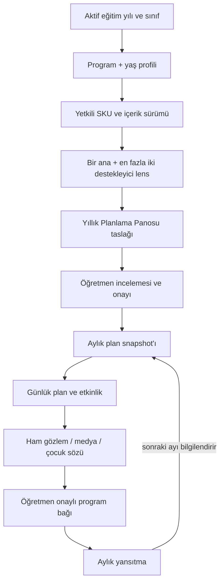

# Premium Plan Merkezi — MaarifOS Entegrasyon Planı

**Durum:** F2 uygulama içi dikey dilim kısmen uygulandı; satış ve gerçek lisans servisi kapalı
**İlke:** Premium özellik mevcut Hediye Alpha’ya eklenmez; feature flag arkasında, çekirdek yerel veri ve yedekleme akışından ayrılmış dikey dilimler hâlinde geliştirilir.

## 1. Mevcut durumdan çıkan kararlar

- Uygulama React + TypeScript + Vite, yerel öncelikli PWA ve IndexedDB mimarisidir.
- Mevcut yönlendirme yalnız `today` ve `classroom` rotalarını kullanıcıya açar; hazır olmayan Premium hedef ana menüde gösterilmez.
- `plans` koleksiyonu hâlen genel `StoredRecord` tipindedir.
- IndexedDB sürümü 4’tür.
- Yedek formatı sürüm 1’dir ve plan doğrulaması özellikle `planType === "daily"` semantiğini ele alır.
- TYMM öğrenme çıktısı matrisi doğrulanmıştır; kullanılacak diğer resmî bileşenlerin kapsam beyanı ayrıca çıkarılmalıdır.
- EÇE/2024 kataloğu `partial` durumundadır; EÇE SKU’ları yayın engellidir.
- Mevcut statik worker lisans kodunun tekil kullanımını sağlayamaz; ayrı Lisans API gerekir.

## 2. Hedef modül sınırları

```text
app/src/features/premium-plans/
├── domain/
│   ├── content-pack.ts
│   ├── annual-planning-board.ts
│   ├── monthly-plan.ts
│   ├── pedagogical-lens.ts
│   └── codecs.ts
├── application/
│   ├── browse-catalog.ts
│   ├── create-annual-board.ts
│   ├── derive-monthly-plan.ts
│   ├── derive-daily-plan.ts
│   └── content-coverage.ts
├── infrastructure/
│   ├── signed-content-repository.ts
│   ├── premium-content-cache.ts
│   └── catalog-adapter.ts
└── presentation/
    ├── PremiumPlanCenter.tsx
    ├── PackageSelector.tsx
    ├── LensSelector.tsx
    ├── AnnualBoardView.tsx
    └── MonthlyPlanReview.tsx

app/src/features/licensing/
├── domain/entitlement.ts
├── application/activate-trial.ts
├── application/redeem-code.ts
├── application/transfer-device.ts
├── infrastructure/license-api-client.ts
├── infrastructure/local-license-store.ts
└── presentation/LicenseGate.tsx

services/license-api/
├── domain/
├── application/
├── infrastructure/
└── api/
```

`premium-plans` lisansın teknik ayrıntısını bilmez; yalnız `EntitlementQuery` arayüzünden “bu SKU kullanılabilir mi?” sorusunu sorar. `licensing` sınıf/öğrenci/plan repository’lerini import edemez.

## 3. Tipli plan union’ı

`EntityMap.plans` genel `StoredRecord` yerine sürümlü bir union olur:

```text
PlanRecord = AnnualPlanningBoardRecord | MonthlyPlanRecord | DailyPlanRecord
```

### `AnnualPlanningBoardRecord`

```text
id, schemaVersion, planType: "annual"
academicYearId, classroomId
periodStart, periodEnd
programProfileSnapshot
ageProfileSnapshot
contentPackSnapshot
teacherPreferredLensId
teacherPreferredSupportingLensIds[]
lensSelectionMode: "preference_only"
monthlySectionIds[]
coverageSummary
status: draft | active | archived
createdAt, updatedAt, revision
```

### `MonthlyPlanRecord`

```text
id, schemaVersion, planType: "monthly"
annualPlanId, academicYearId, classroomId
monthKey: "YYYY-MM"
programProfileSnapshot, ageProfileSnapshot
contentPackSnapshot, sourceAnnualSectionId
curriculumTargetSnapshots[]
calendarContextSnapshot
teacherAdjustments
dailyPlanIds[]
monthlyReflection?
status: draft | review_ready | approved | active | completed | archived
createdAt, updatedAt, revision
```

### `DailyPlanRecord`

Mevcut günlük plan alanlarını korur ve yalnız ek provenance taşır:

```text
annualPlanId?, annualSectionId?, monthlyPlanId?
sourceContentPackSnapshot?
sourceActivityModuleIds[]?
teacherPreferredLensId?
teacherPreferredSupportingLensIds[]?
lensSelectionMode?: "preference_only"
```

Planı kaydederken şablonun gereken bölümleri snapshot alınır. Lisans, içerik güncellemesi veya uzak paket silinmesi kullanıcının tarihsel planının anlamını değiştirmez.

Şablon etkinliğin `primaryLensId` ve `supportingLensIds` alanları içerik
yazarına ait, sürümlü ve değişmez lenslerdir. Öğretmen planındaki
`teacherPreferred*` alanları yalnız yaklaşım tercihini kaydeder; etkinlik
snapshot'ını dönüştürmez ve seçilen yaklaşımın uygulanmış, tanınmış ya da
sertifikalı olduğunu kanıtlamaz. Eski plan `primaryLensId`/
`supportingLensIds` çifti yalnız geriye uyumlu okuma içindir; yeni yazımda
`lensSelectionMode: "preference_only"` zorunludur.
Yıllık/aylık/haftalık tercih güncellemesi sonraki günlük seçimleri yönlendirir;
önceden oluşturulan günlük plan ve etkinlik, oluşturulma anındaki aynı
`teacherPreferred*` tercih snapshot'ını tarihsel provenans olarak korur.

## 4. Veri ve yedek migration kararı

### IndexedDB V5

- `plans` için `by-plan-type`, `by-annual-plan`, `by-monthly-plan`, `by-month-key` indeksleri eklenir.
- V4 günlük plan kayıtları veri kaybı olmadan `DailyPlanRecord` codec’iyle okunur.
- Migration her kaydı değiştirmek zorunda değildir; okuma codec’i eski sürümü destekler, ilk güvenli yazmada yeni sürüme yükseltir.
- Migration öncesi recovery snapshot, migration sonrası kayıt/adet/ilişki doğrulaması zorunludur.

### Backup V2

- V1 backup import desteği korunur.
- V2 plan union’ını discriminator ile doğrular.
- Annual → monthly → daily ilişkilerinde aynı `academicYearId` ve `classroomId` zorunludur.
- Yetim plan ilişkisi, yanlış ay/tarih aralığı veya başka sınıfa çapraz bağ restore başlamadan reddedilir.
- Kullanıcıya ait annual/monthly/daily planlar yedeklenir.
- Yeniden indirilebilir `ContentPack` ciphertext cache’i yedeğe girmez; plan içindeki kaynak snapshot ve manifest kimliği girer.
- Entitlement tokenı, ham kod, recovery secret ve cihaz private key’i çocuk verisi yedeğine girmez.
- Temiz geri yükleme tamamlanmadan mevcut veriye yazılmaz.

## 5. Plan üretim akışı



Yıllık panoda hedef görünmesi `planned` durumudur; çocuk hakkında başarı kanıtı değildir. Günlük plan oluşturulurken aktif çocuk listesi snapshot alınır. Sonradan sınıfa gelen çocuk geçmiş plana otomatik eklenmez.

## 6. İçerik seçme ve denge motoru

Motor üretken yapay zekâ değildir; sürümlü, deterministik ve test edilebilir kurallarla önceden yazılmış içerikleri filtreler/sıralar.

Girdiler:

- SKU/program/yaş profili
- eğitim yılı ve okul günleri
- seçilen ana/destekleyici lensler
- iç/dış mekân imkânı
- süre ve malzeme sınırları
- sınıfın öğretmen tarafından girilmiş erişim/katılım tercihleri
- daha önce planlanan hedef ve etkinlik dengesi

Çıktılar:

- uygun etkinlik adayları ve neden uygun oldukları
- program hedefi snapshot’ları
- yaş/kapsayıcılık uyarlamaları
- materyal ve düşük maliyetli alternatifler
- risk–fayda/güvenlik kontrolü
- aile/toplum katılımı
- gözlem ve öğretmen yansıtma ipuçları

Motor çocuğu puanlamaz, tanı koymaz, “öğrendi/başardı” demez ve öğretmenin onayı olmadan kanıt bağı üretmez.

## 7. UX entegrasyonu

Yeni bir alt menü kalemi eklemek yerine gelecekteki `Planlar` alanından açılır:

`Planlar → Yıllık Plan Merkezi`

Akış:

1. Program sekmesi
2. Yaş profili seçimi
3. Tek Paket ve Tam Paket karşılaştırması
4. Lens ve örnek hafta önizlemesi
5. 3 günlük deneme / kodum var / satın al
6. Çevrimdışı içerik indirme durumu
7. Sınıfa uygula
8. Yıllık pano → aylık plan → günlük plan

Sekiz eş ağırlıklı kartı küçük ekrana yığmak yerine program ve yaş adımlarıyla tek uygun SKU bulunur. Deneme bitişi “3 gün” diye yuvarlanmaz; kesin tarih ve saatle gösterilir. Kod alanı yapıştırmayı ve QR taramayı destekler; hata kodun varlığını açıklamaz.

Kabul matrisi: 320×568 ile 430×932, en az 44×44 dokunma, %200 metin, ekran okuyucu, klavye, düşük bağlantı ve uçak modu.

## 8. Feature flag ve rollback

Flag’ler:

```text
premiumPlanCenter
premiumTrial
premiumCodeRedemption
premiumCheckout
premiumContentDownload
```

- Flag kapalıyken çekirdek uygulama ve mevcut günlük plan akışı aynen çalışır.
- Rota ve bundle lazy-load edilir.
- Premium hata sınırı bütün uygulamayı düşürmez.
- Yeni içerik release’i sorunluysa önceki imzalı sürüme atomik rollback yapılır.
- Rollback kullanıcı plan snapshot’larını silmez.

## 9. Dikey dilimler

### F0 — Ticari ve mimari karar kaydı

- 2026–2027 kalıcı arşiv + yıl içi güncelleme politikası
- 2/3 cihaz limiti
- 72 saat deneme kapsamı
- 30 günlük yükseltme kredisi
- hukuk/muhasebe ve fiyat referansı kapısı
- Lisans API deployment tercihi

**Çıkış:** İmzalı ADR ve hukuk/muhasebe sorumluları.

### F1 — Şema ve yerel plan çekirdeği

- Plan union’ı, codec’ler, IndexedDB V5, Backup V2
- Annual/monthly snapshot ve günlük plana provenance
- Lisans olmadan kullanıcı planının okunması/yedeklenmesi

**Çıkış:** V4→V5 ve Backup V1→V2 fixture testleri, temiz restore.

### F2 — Tek SKU dikey dilimi

- `TYMM-6072`, Eylül 2026
- kapalı pilot, iki uzman incelemeli etkinlik
- açık lens listesi: `guided-play`, `belonging-family-weave`, `accessible-participation`, `prepared-environment`, `emotion-relationship-coregulation`, `plan-act-reflect`
- kod kullanma, imzalı içerik, çevrimdışı açılış
- yıllık panodan aylık ve günlük plana dönüşüm

**Uygulanan:** Uygulama bundle’ı dışındaki pilot kaynak paket, fail-closed exact codec, geliştirici önizleme kapısı, yıllık/aylık kayıt, günlük plan provenance köprüsü, backup allowlist ve ilişki doğrulaması.

**Kalan çıkış kapısı:** Gerçek tek kullanımlık STAFF kod servisi, imzalı/şifreli yayın artefaktı, çevrimdışı entitlement doğrulaması, uzman onay defteri ve gerçek cihaz kabulü. Bunlar tamamlanmadan F2 `IMPLEMENTED` veya satışa hazır sayılmaz.

### F3 — TYMM dört profil

- 36–48, 48–60, 60–72 ve gerçek karma yaş
- 10 aylık haritalar
- 24 lensin tamamı

**Çıkış:** Program bileşen kapsam beyanı, çift uzman incelemesi, iki sınıf pilotu.

### F4 — EÇE katalog ve içerik

- tam kazanım/gösterge aktarımı
- provenance/hash/değişiklik özeti
- üç yaş uyarlaması ve karma yaş yazarlığı

**Çıkış:** `catalogCompleteness = complete`; program karışması sıfır.

### F5 — Tam Paket ve satış

- sekiz SKU grant’i
- yükseltme kredisi
- barındırılmış ödeme, e-Arşiv/fatura ve hukuki ön bilgilendirme
- cihaz transferi/kurtarma ve destek paneli

**Çıkış:** fiyat kanıtı, KDV/sözleşme, webhook, refund ve audit testleri.

### F6 — Kapalı pilot ve kademeli yayın

- 8–12 öğretmen, gerçek mobil cihazlar
- en az bir karma yaş sınıfı
- 10 ardışık okul günü
- support/runbook/rollback tatbikatı

**Çıkış:** P0/P1 olay sıfır, veri kaybı sıfır, yanlış çocuk sızıntısı sıfır, kritik görev tamamlama en az %95.

## 10. Test sahiplikleri

| Alan | Zorunlu kanıt |
|---|---|
| Domain | union codec, program ayrımı, yaş/karma dalı, lens limiti |
| Migration | V4→V5, V1 backup import, V2 round-trip, rollback snapshot |
| Planning | annual→monthly→daily provenance ve tarih/sınıf bütünlüğü |
| Evidence | planlanan hedef ≠ gözlenen/başarı; öğretmen onayı zorunlu |
| Licensing | atomik kod, trial clock, cihaz, transfer, offline token |
| Content | manifest/digest/signature/downgrade/yarım indirme |
| Privacy | lisans egress’inde çocuk alanı sıfır; log taraması |
| UX | mobil matris, erişilebilirlik, %200 metin, çevrimdışı durumlar |
| Sales | fiyat kanıtı, kampanya tarihleri, KDV gösterimi, sözleşme hash’i |

## 11. GO / NO-GO

**GO:** Tek TYMM dikey dilimi gerçek cihazda çevrimdışı açılıyor; annual→monthly→daily→evidence zinciri ve temiz restore kayıpsız; kod replay testi geçiyor; içerik iki uzman ve öğretmen tarafından onaylı.

**NO-GO:** EÇE kataloğu kısmi; çocuk verisi lisans servisine çıkıyor; kullanıcı yedeği premium duvarına takılıyor; içerik public bundle’da; referans fiyat kanıtsız; karma yaş yalnız üç paketin birleşimi; uzman/pilot incelemesi yok.
