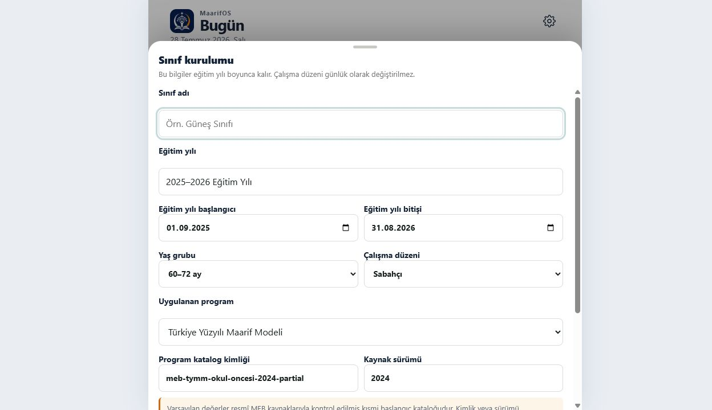
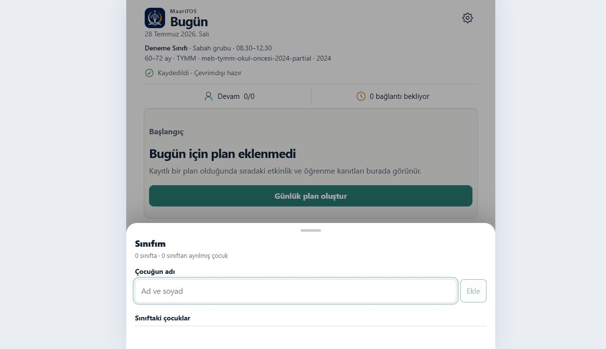
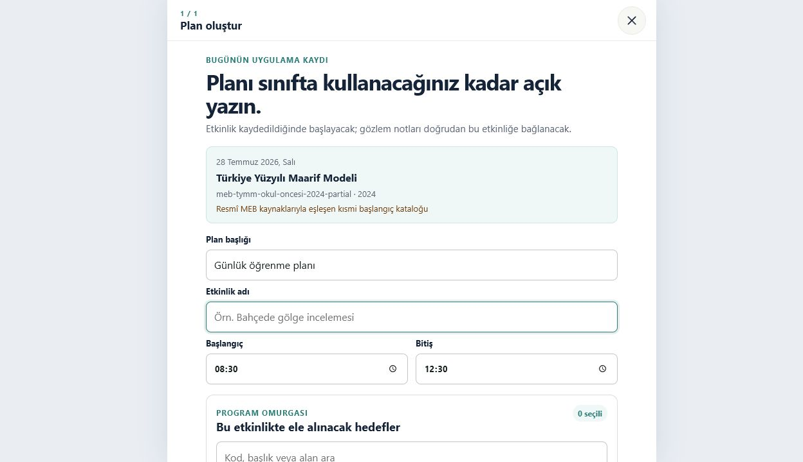
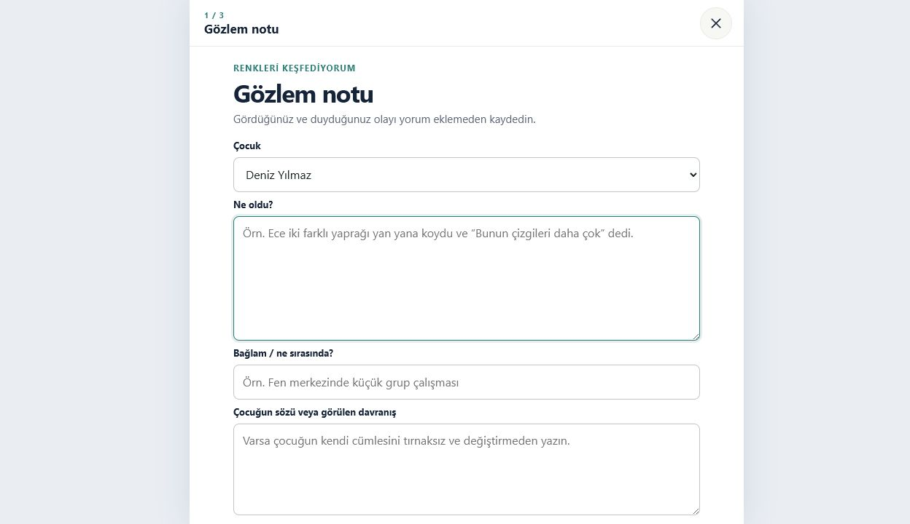
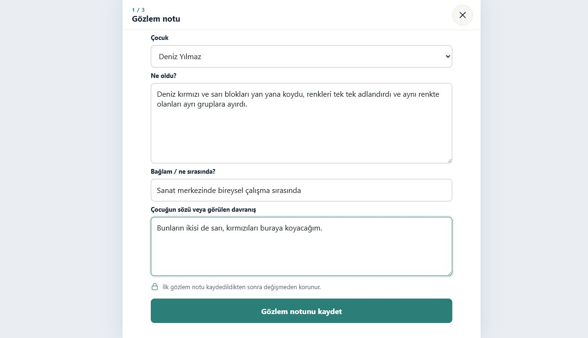
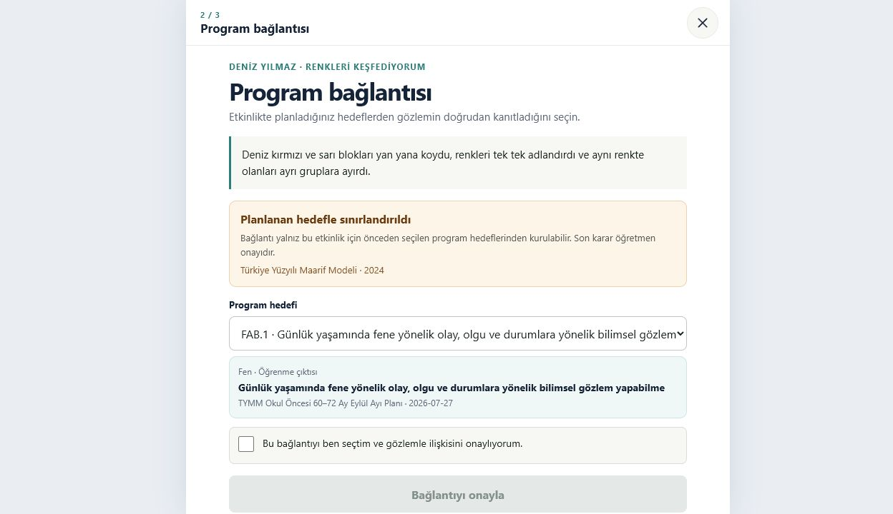
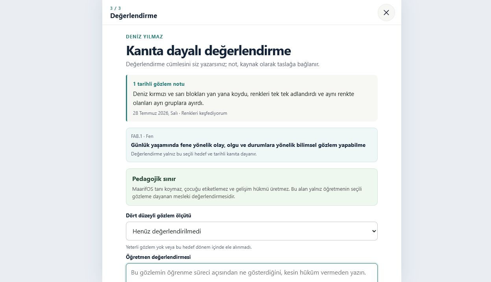

# MaarifOS Mega Gözlem Denetimi

**Tarih:** 28 Temmuz 2026  
**Kapsam:** Sınıf kurulumu → öğrenci ekleme → plan/etkinlik → gözlem → program bağlantısı → değerlendirme  
**Hedef kullanıcı:** Sınıf içinde tek elle, telefondan çalışan okul öncesi öğretmeni  
**Ana hedef:** Nesnel bir gözlemi 15 saniye içinde güvenle kaydetmek; pedagojik sınıflandırmayı daha sakin bir zamanda tamamlamak

## Yönetici kararı

MaarifOS’un sorunu yalnızca gri görünmesi değildir. Asıl sorun, iki farklı
çalışma zamanını tek akışa zorlamasıdır:

1. **Sınıf anı:** Öğretmen çocuğu izlerken kısa ve nesnel kanıtı kaçırmadan
   kaydetmek ister.
2. **Sakin zaman:** Öğretmen daha sonra bağlamı, program ilişkisini,
   değerlendirmeyi ve sonraki adımı düşünür.

Mevcut akış bu iki zamanı birleştiriyor. İlk gözlem notu kaydedilir kaydedilmez
öğretmeni program bağlantısına ve ardından değerlendirmeye götürüyor. Bu
pedagojik olarak kontrollü görünse de sınıf içinde gereksiz karar yükü
oluşturuyor.

**Ürün kararı:** Önce native klavye örtüşme sorunu çözülmeli; ardından
“Hızlı Gözlem 2.0” tek güvenli dikey kullanıcı akışı olarak uygulanmalıdır.

---

## Denetlenen akış

### 1. Sınıf kurulumu — Sağlık: Zayıf



**Güçlü taraflar**

- Çalışma düzeninin eğitim yılı boyunca kalıcı olduğu açık.
- Yaş grubu, program ve çalışma düzeni aynı profil altında tutuluyor.
- TYMM ve EÇE seçimi veri modelinde ayrılmış.

**Sorunlar**

- İlk kullanıcı geliştiriciye yakın “program katalog kimliği” ve “kaynak
  sürümü” alanlarıyla karşılaşıyor.
- Uzun form, öğretmeni ürünün asıl değerine ulaşmadan yoruyor.
- Tamamına yakını beyaz ve gri; başlık ile form alanları arasında duygusal ve
  işlevsel yönlendirme zayıf.

**Karar**

- Öğretmene yalnız sınıf adı, eğitim yılı, yaş grubu, çalışma düzeni ve program
  sorulmalı.
- Katalog kimliği ve sürümü “Gelişmiş program bilgileri” altında otomatik ve
  salt okunur gösterilmeli.
- Kurulum 2 kısa adıma ayrılmalı: “Sınıfım” ve “Programım”.

### 2. Öğrenci ekleme — Sağlık: Orta, mobil klavye riski kritik



**Güçlü taraflar**

- Tek alanla çocuk eklemek kolay.
- Sınıftan ayırma yaklaşımı kayıt silmemeyi destekliyor.

**Sorunlar**

- Sheet’in alt kısmı telefon klavyesine karşı güvenli değil.
- Gerçek iOS/Android klavyesi açıldığında runtime görünür alanı ölçmüyor.
- Öğrenci girişinde daha sonra lazım olacak doğum tarihi, veli bilgisi gibi
  alanları istememesi doğru; ancak “sonra tamamlanabilir profil” fikri
  görünmüyor.

**Kök neden**

- Native modda `KeyboardProvider` klavye yüksekliğini `0` kabul ediyor ve
  görünürlüğü `false` tutuyor.
- `visualViewport.height` ve `visualViewport.offsetTop` değişimleri izlenmiyor.
- Odaklanan alan kendi scroll yüzeyinde klavye üstüne taşınmıyor.
- Sorun `Prototype.css` içine sabit alt boşluk ekleyerek çözülemez; simülatörde
  çift boşluk üretir.

### 3. Plan ve program hedefi seçimi — Sağlık: İşlevsel fakat ağır



**Güçlü taraflar**

- Planlanan hedef ile sonradan ilişkilendirilen kanıt birbirinden ayrılıyor.
- Tüm sınıfa dağıtım “öğrendi/başardı” hükmü üretmiyor.
- Program öğesinin kodu, türü ve kaynağı birlikte gösteriliyor.

**Sorunlar**

- Kısmi katalog düz bir uzun liste olarak sunuluyor.
- Alan, beceri, çıktı ve süreç bileşeni hiyerarşisi görsel olarak yeterince
  ayrılmıyor.
- “Katalog kısmi” uyarısı doğru fakat öğretmenin ana işinden daha baskın.
- Renk, seçimi hızlandıran semantik bir araç olarak kullanılmıyor.

**Karar**

- Program seçici arama + alan sekmeleri + hiyerarşik drill-down kullanmalı.
- TYMM: alan becerisi → öğrenme çıktısı → süreç bileşeni / programlar arası
  bileşen.
- EÇE: gelişim alanı → kazanım → gösterge.
- TYMM ve EÇE aynı düz listeye kesinlikle karıştırılmamalı.

### 4. Gözlem girişi — Sağlık: Kritik derecede yetersiz





**Güçlü taraflar**

- Ham gözlem metni değişmez saklanıyor.
- “Gördüğünüz ve duyduğunuz olayı yorum eklemeden kaydedin” yönlendirmesi doğru.
- Bağlam ve çocuğun özgün sözü ayrı alanlar olarak modellenmiş.

**Kritik sorunlar**

- Öğrenci sessizce ilk uygun çocuk olarak seçiliyor. Yanlış çocuğa kayıt riski
  var.
- İlk ekranda üç ayrı yazı alanı bulunuyor.
- Hazır nötr kalıplar, gözlem türleri, odak kategorileri ve kişiye/etkinliğe
  bağlı öneriler yok.
- Otomatik taslak yok; çağrı gelmesi, uygulamanın kapanması veya ekran
  değişmesi veri kaybına yol açabilir.
- Kaydetme sonrası öğretmen hemen “Program bağlantısı 2/3” adımına zorlanıyor.

**Karar: Hızlı Gözlem 2.0**

İlk ekran yalnız şu sırayı içermeli:

1. **Kimi gözlemlediniz?** — açık öğrenci seçimi, sessiz varsayılan yok.
2. **Ne oldu?** — tek büyük nesnel gözlem alanı.
3. İsteğe bağlı hızlı yardımcılar:
   - gözlem türü,
   - odak kategorisi,
   - nötr kalıp,
   - “Ayrıntı ekle” altında bağlam ve çocuk sözü.
4. Klavyenin hemen üstünde sabit **Kaydet**.
5. Kayıt sonrası doğrudan Bugün ekranı.

Program bağlantısı ve değerlendirme “Tamamlanacaklar” kuyruğunda kalmalı.

### 5. Program bağlantısı — Sağlık: Pedagojik temel güçlü, zamanlaması yanlış



**Güçlü taraflar**

- Bağlantı yalnız planlanan hedeflerle sınırlandırılıyor.
- Öğretmen onayı zorunlu.
- Ham gözlem ve program yorumu ayrı tutuluyor.

**Sorunlar**

- Bu adım sınıf anında zorunlu devam adımı gibi sunuluyor.
- Tek hedef varsa sessiz varsayılan seçim öğretmenin kararını görünmez kılıyor.
- Uzun hedef metni küçük ekranda taramayı zorlaştırıyor.

**Karar**

- Kayıt sonrasında “Şimdi bağla” yalnız ikincil seçenek olmalı.
- Sakin zamanda kanıt kartı solda, yalnız planlanan hedefler sağda/alt sheet’te
  gösterilmeli.
- Her hedef seçiminde “Neden önerildi?” açıklaması bulunmalı; son karar yine
  öğretmene ait olmalı.

### 6. Değerlendirme — Sağlık: Güvenli fakat erken



**Güçlü taraflar**

- Tanı koymama ve çocuğu etiketlememe sınırı açık.
- Değerlendirme seçili kanıta ve programa bağlı.
- “Henüz değerlendirilmedi” gerçek dört düzeyden ayrı.

**Sorunlar**

- Tek gözlemden sonra değerlendirmeye geçmek öğretmende sonuç üretme baskısı
  oluşturuyor.
- Gözlem toplama ile dönemsel mesleki yargı aynı oturumda ele alınıyor.
- Değerlendirme ekranı görsel olarak güvenli fakat metin yoğun.

**Karar**

- Tek gözlemden sonra varsayılan durum “kanıt kaydedildi” olmalı.
- Değerlendirme, yeterli sayıda ve farklı bağlamlarda kanıt olduğunda
  öğretmenin başlattığı ayrı bir çalışma olmalı.
- Sistem “kanıt az” durumunu başarısızlık veya risk olarak yorumlamamalı.

---

## Hızlı Gözlem 2.0 bilgi mimarisi

### Zorunlu alanlar

- `studentId` — açık seçim
- `rawText` — öğretmenin aynen yazdığı nesnel metin
- `activityId` ve `planId` — açık etkinlikten otomatik bağlam
- UTC zaman + Türkiye sivil tarihi

### İsteğe bağlı gözlem türleri

- Kısa not
- Çocuk sözü
- Anekdot
- Sistematik gözlem

### İsteğe bağlı odak kategorileri

Bu kategoriler program hedefi veya değerlendirme hükmü değildir:

- Dil ve iletişim
- Bilişsel öğrenme
- Sosyal-duygusal ve değerler
- Fiziksel gelişim ve sağlık
- Öz bakım ve günlük yaşam
- Sanat ve yaratıcılık
- Oyun ve katılım
- Diğer

### Nötr hazır kalıplar

Kalıp yalnız yazma iskelesidir; olayı veya sonucu sistem uydurmaz:

- “... sırasında ... yaptı / söyledi.”
- “... materyalini kullanırken ...”
- “Akranıyla etkileşiminde ...”
- “Bir sorunla karşılaştığında ...”
- “Yönerge verildiğinde ...”
- “Etkinlik sonunda ...”

Kalıp seçildiğinde metin düzenlenebilir kalmalı ve otomatik kaydedilmemelidir.

### Öğrenciye göre öneri mantığı

Öneriler yalnız cihazdaki yapılandırılmış bağlamdan ve deterministik olarak
üretilmelidir:

- açık etkinlik,
- o etkinlikte planlanan hedefler,
- son kullanılan gözlem türü,
- son gözlemin tarihi,
- henüz kanıtı olmayan planlı takipler.

Yasaklar:

- çocukları sıralamak,
- “geri”, “riskli”, “başarısız” gibi etiketler üretmek,
- kanıt yokluğunu eksiklik saymak,
- başka çocuğun taslağını veya önerisini göstermek,
- öneriyi ham gözlem metniymiş gibi kaydetmek.

---

## Veri sözleşmesi

Mevcut `Observation.rawText`, `context`, `childQuote`, `planId`, `activityId`,
`studentIds` ve değişmezlik ilkesi korunmalıdır.

Genişletilecek alanlar:

```ts
observationType:
  | "quick-note"
  | "child-quote"
  | "anecdotal"
  | "systematic";

focusCategoryIds: string[];
contextPresetId?: string;

captureAssistance?: {
  mode: "free-text" | "template-assisted" | "dictation";
  templateId?: string;
  templateVersion?: number;
};
```

Taslak ayrı ve sürümlü saklanmalıdır:

```ts
ObservationDraft {
  schemaVersion;
  academicYearId;
  classroomId;
  activityId;
  studentId;
  rawText;
  context?;
  childQuote?;
  observationType;
  focusCategoryIds;
  updatedAt;
}
```

Her çocuk için taslak ayrıdır. Öğrenci değişiminde metin başka çocuğa
taşınmaz. Nihai kayıt transaction içinde başarıyla yazılmadan taslak silinmez.
Taslak yedekleme ve geri yükleme kapsamındadır.

`EvidenceObservationSummary`, bugün düşürdüğü `context` ve `childQuote`
alanlarını; ayrıca `observationType` ve `focusCategoryIds` değerlerini
taşımalıdır.

---

## Native klavye düzeltmesi

### Kök çözüm

- `window.visualViewport` için `resize` ve `scroll` değişimleri izlenmeli.
- Örtülen alan:
  `layoutViewportHeight - (visualViewport.height + visualViewport.offsetTop)`
  yaklaşımıyla ölçülmeli.
- Tarayıcı zaten layout’u küçülttüyse ikinci kez inset uygulanmamalı.
- Yalnız metin alanı odaktayken ve anlamlı daralma varken klavye görünür kabul
  edilmeli.
- Odaklanan alan kendi `MobileScroll` yüzeyinde klavye üstünden 12–16 px
  boşlukla görünür konuma taşınmalı.
- Alanlar arası odak geçişinde klavye gereksiz kapanıp açılmamalı.
- Sheet/route kapanınca eski inset temizlenmeli.

### Kabul koşulları

- Android Chrome ve kurulmuş PWA: Gboard ile tüm alanlar görünür.
- iPhone Safari ve ana ekran PWA: tüm alanlar görünür.
- Gesture ve 3-button Android navigasyonunda çift boşluk oluşmaz.
- Yatay/dikey dönüş ve arka plana gidip gelmede eski klavye yüksekliği kalmaz.
- Masaüstü native modda inset `0` kalır.
- Playwright simülasyonu gerçek cihaz kanıtının yerine geçmez.

---

## Görsel sistem: Sıcak Mesleki Atölye

Amaç çocuk oyunu görünümü değil; sıcak, güven veren ve profesyonel öğretmen
çalışma alanıdır.

| Rol | Renk | Kullanım |
|---|---:|---|
| Tuval | `#FFF9F2` | Genel sıcak zemin |
| Yüzey | `#FFFFFF` | Form ve kartlar |
| Logo laciverti | `#0B2A55` | Başlık ve ana metin |
| İkincil metin | `#5B6472` | Açıklamalar |
| Teal | `#0B766E` | Nesnel not ve birincil işlem |
| Amber | `#A94F00` / `#FFF0DA` | Etkinlik ve bağlam |
| Coral | `#A6402C` / `#FCEAE5` | Çocuğun sözü |
| Yaprak yeşili | `#2E7D52` / `#EAF5EE` | Sonraki adım ve tamamlanma |
| Plum | `#66529E` / `#F0ECF8` | Değerlendirme |
| Sıcak çizgi | `#E6DED3` | Kenarlık |

Kurallar:

- Renk yalnız dekor değildir; sabit semantik anlam taşır.
- Her renk ikon, etiket ve seçili durumla birlikte kullanılır.
- Emoji veya çocukça illüstrasyon kullanılmaz.
- Radix ikonları ve yeni MaarifOS logosu korunur.
- Gövde yazısı 15–16 px, input 16 px, yardımcı metin en az 13 px.
- Dokunma alanı en az 44×44 px; ana işlem yüksekliği yaklaşık 52 px.
- Kart radius 14–16 px; çok hafif lacivert gölge ve sıcak kenarlık.
- Belirgin focus halkası; %200 büyütmede yatay taşma yok.

---

## Dünya ürünlerinden alınacak dersler

- Brightwheel gözlemi etkinlik içinden veya bağımsız olarak başlatıyor; not,
  medya ve beceri ilişkisini ayırıyor ve taslak kaydetmeye izin veriyor.
- Storypark sınıf anında hızlı taslak, yerleşik dikte ve çevrimdışı koruma
  sunuyor; daha uzun öğrenme hikâyesini daha sonra tamamlamaya izin veriyor.
- Storypark çocuk notlarında kategori ve farklı kayıtları birbirine bağlama
  yaklaşımını kullanıyor.
- Seesaw kanıt toplamayı portfolyonun doğal girdisi yapıyor; portfolyo için
  öğretmene ikinci kez aynı veriyi yazdırmıyor.

MaarifOS bunları kopyalamamalı. Üstünlük noktası, Türkiye’ye özgü TYMM/EÇE
ontolojisini ham gözlemden ayrı, kaynaklı ve öğretmen onaylı biçimde
işleyebilmesidir.

---

## Uygulama sırası

### K0 — Native klavye, P0

Dar ve bağımsız runtime düzeltmesi. Başka tasarım değişikliğiyle
karıştırılmamalı.

### O1 — Hızlı Gözlem 2.0, P1

Çocuk seç → tek not → isteğe bağlı yardım → kaydet → Bugün’e dön.
Taslak ve yedek güvenliği aynı teslimatta tamamlanmalı.

### O2 — Tamamlama kuyruğu

Program bağlantısı, değerlendirme ve sonraki adımlar sakin zaman akışına
taşınmalı.

### V1 — Sıcak Mesleki Atölye

Seçilmiş mobil mock kaynak kabul edilerek renk tokenları, kart yüzeyleri,
chip’ler ve form hiyerarşisi uygulanmalı.

### C1 — TYMM/EÇE katalog derinliği

Resmî kaynak, sürüm, yaş grubu, hiyerarşi ve arama sözleşmesi genişletilmeli.

---

## Test kapıları

1. Native klavye: `visualViewport`, çift inset, odak görünürlüğü, alanlar arası
   geçiş, route/sheet kapanışı.
2. Gerçek cihaz: Android Chrome/PWA ve iPhone Safari/PWA.
3. Taslak: her yazım sonrası debounce, reload/offline dönüş, öğrenci
   izolasyonu, başarısız kayıt sonrası korunma.
4. Domain: açık öğrenci seçimi, ham metin birebir saklama ve değişmezlik.
5. Yardımcılar: nötr kalıp, otomatik hüküm yok, TYMM/EÇE karışmıyor.
6. Yedek: yeni alanlar ve taslak için round-trip ve bozuk veri fail-closed.
7. E2E: 390×844’te en fazla üç karar noktasıyla hızlı kayıt.
8. Erişilebilirlik: 44 px hedef, focus görünürlüğü, ekran okuyucu etiketleri,
   %200 büyütme ve renk dışı seçili durum.
9. Release: runtime kilidi, tüm kalite testleri, çevrimdışı üretim PWA ve build.

---

## Kanıt sınırları

- Akış canlı sitede yeni ve yalnız denetim tarayıcısında oluşturulan kurgusal
  sınıf/öğrenciyle incelendi; gerçek çocuk verisi kullanılmadı.
- Gerçek telefon OSK’sı ekran görüntüsünde yakalanamadı. Klavye kök nedeni
  kullanıcı raporu, runtime kodu ve `visualViewport` davranışı üzerinden
  doğrulandı; Android/iPhone gerçek cihaz testi hâlâ zorunlu.
- Bu çalışma tam WCAG uygunluğu iddia etmez; görünür arayüz ve kod
  sözleşmesinden riskleri çıkarır.

## Kaynaklar

- MEB TYMM okul öncesi program yapısı:
  <https://tymm.meb.gov.tr/okul-oncesi/unite/442>
- MEB 2024 Okul Öncesi Eğitim Programı:
  <https://tegm.meb.gov.tr/meb_iys_dosyalar/2024_09/20104013_2024programokuloncesionayli.pdf>
- MDN VisualViewport:
  <https://developer.mozilla.org/en-US/docs/Web/API/VisualViewport>
- WCAG 2.2:
  <https://www.w3.org/TR/WCAG22/>
- Brightwheel gözlem akışı:
  <https://help.mybrightwheel.com/en/articles/6968971-learning-log-observations>
- Storypark eğitimci uygulaması:
  <https://ca.storypark.com/feature/educators-app>
- Storypark çocuk notları:
  <https://help.storypark.com/en/articles/56108-what-are-child-notes>
- Seesaw dijital portfolyo:
  <https://seesaw.com/features/digital-portfolio/>
